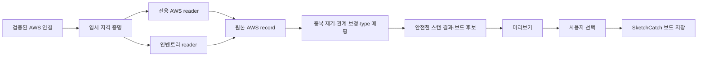

# SketchCatch AWS Reverse Engineering 기술 학습 자료

> 이 문서는 다른 수업이나 기존 문서를 전제로 하지 않는 독립 자료다.  
> 목표는 SketchCatch가 AWS 구조를 어떻게 읽고, 왜 `UNKNOWN`·권한 오류·Cloud Control 제한을 다르게 처리하는지 이해하는 것이다.

## 1. 먼저 결론

Reverse Engineering은 AWS를 바꾸는 기능이 아니다.

1. 검증된 AWS 연결로 현재 리소스를 읽는다.
2. 서로 다른 AWS API의 결과를 하나의 형식으로 합친다.
3. SketchCatch 팔레트 아이콘과 보드 구조로 번역한다.
4. 사용자가 확인했을 때만 SketchCatch 보드에 저장한다.

이 과정에서 Terraform import, Terraform apply/destroy, AWS 리소스 생성·수정·삭제는 실행하지 않는다.



## 2. 핵심 용어

| 용어 | 쉬운 뜻 | 코드에서 보는 곳 |
| --- | --- | --- |
| AWS reader | AWS API를 호출해 특정 종류의 리소스를 읽는 모듈 | `apps/api/src/reverse-engineering/` |
| `AwsDiscoveredResourceRecord` | reader가 모은 내부 원본 리소스 한 건 | `aws-provider-adapter.ts` |
| `providerResourceType` | AWS가 알려 준 원본 타입. 예: `AWS::EC2::VPC` | `DiscoveredResource` |
| `resourceType` | SketchCatch 팔레트 타입. 예: `VPC` | `packages/types/src/resource-definitions.ts` |
| `UNKNOWN` | AWS 리소스는 읽었지만 정확한 팔레트 타입을 아직 찾지 못한 상태 | type 매핑 결과 |
| `coverage` | 이번 스캔에서 읽지 못한 서비스와 지원 범위 제한 | `reverse-engineering-public-errors.ts` |
| 보드 후보(Draft) | 사용자가 적용 전 검토하는 설계도 | `reverseEngineeringDraft` |

가장 중요한 구분은 이것이다.

```text
providerResourceType = AWS의 사실
resourceType         = SketchCatch가 보드에 표시하기 위한 분류
```

보드 아이콘을 더 알맞게 바꿔도 AWS 원본 타입이나 실제 AWS 상태가 바뀌지는 않는다.

## 3. 서버 요청부터 결과 저장까지

### 3-1. API 진입점

파일: [`apps/api/src/routes/reverse-engineering.ts`](apps/api/src/routes/reverse-engineering.ts)

| 요청 | 용도 | 동작 |
| --- | --- | --- |
| `POST /reverse-engineering/scans/preview` | 화면에서 먼저 확인할 미리보기 | 즉시 스캔하고, 만료되는 preview를 만든다. |
| `POST /projects/:projectId/reverse-engineering/scans` | 프로젝트에 남길 스캔 | `running` 상태를 만든 뒤 background job으로 실행한다. |
| `GET /projects/:projectId/reverse-engineering/scans/:scanId` | 저장된 결과 다시 보기 | private 결과를 안전한 public 결과로 바꿔 반환한다. |

### 3-2. 서비스 흐름

파일: [`apps/api/src/reverse-engineering/reverse-engineering-service.ts`](apps/api/src/reverse-engineering/reverse-engineering-service.ts)

주요 함수는 아래 세 개다.

- `createReverseEngineeringPreviewScan()`
  - AWS 연결을 확인한다.
  - 스캔 결과를 preview로 잠시 저장한다.
  - 사용자에게는 안전하게 정리한 결과만 반환한다.

- `createReverseEngineeringScanJob()`
  - Project scan을 `running`으로 만든다.
  - 실제 실행 함수 `run()`을 반환한다.

- `runReverseEngineeringScanJob()`
  - gateway와 adapter를 실행한다.
  - 성공하면 `completed`, 실패하면 `failed` 상태로 저장한다.
  - 스캔 로그도 남긴다.

## 4. AWS를 읽는 방식: 전용 reader + 인벤토리 reader

중심 파일: [`apps/api/src/reverse-engineering/aws-reverse-engineering-gateway.ts`](apps/api/src/reverse-engineering/aws-reverse-engineering-gateway.ts)

`createAwsReverseEngineeringGateway().discoverResources()`가 여러 reader를 병렬로 실행한다. reader 하나만으로 AWS 전체 구조를 정확히 알 수 없기 때문이다.

| reader | 예시 대상 | 왜 필요한가 |
| --- | --- | --- |
| 기본 서비스 reader | VPC, Subnet, EIP, NAT Gateway, Route Table, Security Group, EC2, RDS, S3 | 네트워크·컴퓨팅·저장소의 기본 구조와 관계를 읽는다. |
| 서비스 전용 reader | ELBv2, ECS, EventBridge | 서비스별 의존 관계를 읽는다. |
| 상세 reader | IAM, Lambda, KMS, API Gateway | 목록만으로 부족한 topology와 관리 가능 여부를 읽는다. |
| 배포 지원 reader | ECR, Secrets Manager, CloudFront OAC, Application Auto Scaling | 배포 구성에 필요한 안전한 메타데이터를 읽는다. |
| Resource Explorer | 넓은 리소스 인벤토리 | 전용 reader가 없는 리소스를 놓치지 않기 위한 보조 경로다. |
| Resource Groups Tagging API | 태그와 ARN | 태그·CloudFormation 소유 흔적을 보존하는 보조 경로다. |
| Cloud Control API | 전용 reader가 없는 catalog type | type별 목록·상세 model을 보완하는 generic reader다. |

### 4-1. 각 인벤토리의 한계

- **Resource Explorer**는 View가 있어야 하고, 그 View와 권한이 허용한 범위만 보인다.
- **Tagging API**는 untagged 리소스를 돌려주지 않는다. 따라서 “태그 API에 없으니 AWS에 없다”는 결론은 틀릴 수 있다.
- **Cloud Control**은 type마다 `ListResources` handler 지원 여부가 다르다.

그래서 SketchCatch는 결과를 합친 뒤 `uniqueDiscoveredRecordsByProviderId()`로 중복을 제거한다. 그 후 ECS, CloudFront, EventBridge, NAT Gateway–Elastic IP 관계를 보정한다.

### 4-2. CloudFormation에 대한 흔한 오해

현재 Reverse Engineering은 모든 CloudFormation Stack을 `ListStackResources`로 훑는 방식에 의존하지 않는다. 대신 reader가 가져온 `aws:cloudformation:*` 태그 같은 소유 증거를 보존해, CloudFormation이 관리하는 리소스를 Terraform 자동 관리 대상으로 잘못 올리지 않게 한다.

## 5. 타입 정규화와 팔레트 매핑

중심 파일: [`packages/types/src/resource-definitions.ts`](packages/types/src/resource-definitions.ts)

AWS는 같은 대상을 API마다 다르게 표기할 수 있다.

| 들어온 표기 예시 | 비교용 정규화 결과 | 가능한 팔레트 타입 |
| --- | --- | --- |
| `AWS::EC2::VPC` | `ec2/vpc` | `VPC` |
| `ec2:vpc` | `ec2/vpc` | `VPC` |
| `ec2/vpc` | `ec2/vpc` | `VPC` |

해결 순서는 다음과 같다.

1. `resolveReverseEngineeringAwsProviderResourceType()`가 provider type alias를 찾는다.
2. 못 찾으면 `resolveReverseEngineeringAwsResourceTypeFromArn()`가 ARN의 서비스와 종류를 본다.
3. 둘 다 실패하면 `UNKNOWN`으로 남긴다.
4. 정확한 팔레트 타입이 없지만 가까운 시각 표현이 있으면 `getReverseEngineeringAwsProviderResourceVisualFallback()`을 쓴다.

adapter의 `resolveAwsResourceType()`은 실제로 **provider type → ARN → `UNKNOWN`** 순서를 사용한다.

### 5-1. `UNKNOWN`을 권한 오류로 보면 안 되는 이유

`UNKNOWN`은 아래 둘 중 하나일 수 있다.

- AWS 리소스는 읽었지만 아직 팔레트에 정확한 타입이 없다.
- provider type/ARN 정보가 부족해 현재 매핑할 수 없다.

둘 다 “AWS 권한을 더 주세요”와는 다른 문제다. 원본 `providerResourceType`, 리전, 관계는 계속 남기고, 보드에는 가장 가까운 fallback이나 `기타 AWS 리소스`로 표시한다.

## 6. 안전한 결과 만들기

중심 파일: [`apps/api/src/reverse-engineering/aws-provider-adapter.ts`](apps/api/src/reverse-engineering/aws-provider-adapter.ts)

`createAwsProviderAdapter().scan()`은 reader의 원본 record를 아래 결과로 바꾼다.

```text
AWS reader record
  → DiscoveredResource
  → ArchitectureJson
  → reverseEngineeringDraft
  → findings / analysisExclusions / importSuggestions
```

여기서 지켜야 할 규칙은 다음과 같다.

- AWS 원본 타입, 리전, 관계는 보존한다.
- 공개 응답에서는 ARN·계정 식별자·비밀값·정책 원문처럼 위험한 값을 제거하거나 안전한 marker로 줄인다.
- 세부 정보가 불완전하면 Terraform 자동 관리 대상으로 승격하지 않고 `manual_review`로 남긴다.
- import suggestion은 미래 작업을 위한 정보일 뿐, 이 화면이 Terraform import를 실행한다는 뜻이 아니다.

## 7. 오류를 세 종류로 나누기

중심 파일: [`apps/api/src/reverse-engineering/reverse-engineering-public-errors.ts`](apps/api/src/reverse-engineering/reverse-engineering-public-errors.ts)

### 7-1. 실제 읽기 실패: `coverage.status = partial`

예: EC2 읽기 권한이 없거나, Resource Explorer View가 없거나, API 호출이 일시 실패한 경우.

- 이미 읽은 리소스와 관계는 유지한다.
- 읽지 못한 서비스만 `unavailableServices`로 표시한다.
- 필요한 최소 읽기 action과 재시도/환경설정 이동을 구분한다.
- 권한·연결 설정으로 복구 가능한 경우에만 **AWS 연결 설정** 버튼을 보여 준다.

### 7-2. Cloud Control capability limit: `capabilityLimits`

Cloud Control이 특정 type의 `ListResources`를 지원하지 않을 수 있다.

- `UnsupportedActionException`, `TypeNotFoundException`은 이 범주다.
- 이것은 IAM 권한 부족이 아니다.
- `coverage.status`를 부분 실패로 만들지 않는다.
- 이번 결과에서 실제로 관측된 type과 겹칠 때만 중립적인 안내로 남긴다.

### 7-3. 표시 매핑 문제: `UNKNOWN` 또는 visual fallback

- AWS reader는 성공했을 수 있다.
- 권한 오류·재시도 오류와 합치지 않는다.
- 새 type alias, ARN fallback, visual fallback을 추가할 대상이다.

## 8. 상세 화면이 결과를 설명하는 방식

파일: [`apps/web/features/workspace/ReverseEngineeringResultPanel.tsx`](apps/web/features/workspace/ReverseEngineeringResultPanel.tsx)

상세 정보는 처음에 **가져오기 요약**만 열고 시작한다. 나머지는 접혀 있다.

1. 가져오기 요약 — 리소스 수, 연결 수, 스캔 시간, 전체/부분 성공
2. 가져온 리소스 — 네트워크 / 서버·컴퓨팅 / 데이터·저장소 / 보안·권한 / 애플리케이션·운영 / 기타 AWS 리소스
3. 연결과 구조 — 원본 배치와 정리 배치, 리소스 간 연결
4. AWS 읽기 범위 — 읽지 못한 서비스, 원인, 권한·재시도 방법
5. 확인 사항 — 지원 범위 제한, 추가 검토가 필요한 설정
6. 원본 정보 — AWS 서비스명, 원본 type, 리전, 안전한 식별 정보

검색하면 결과가 있는 카테고리만 자동으로 펼친다. 분류 모델은 [`apps/web/features/workspace/reverse-engineering-detail-model.ts`](apps/web/features/workspace/reverse-engineering-detail-model.ts)에 있다.

## 9. “보드에 적용”이 하는 일과 하지 않는 일

### 하는 일

- 원본 배치 또는 사용자가 고른 정리 배치를 현재 보드에 **교체** 또는 **추가**한다.
- Project Draft와 Architecture Snapshot을 저장한다.
- 스캔 출처 metadata를 보드 노드에 남긴다.

### 하지 않는 일

- Terraform 코드 생성
- Terraform import 실행
- Terraform apply/destroy
- AWS 리소스 생성·수정·삭제
- 기존 Terraform 파일 덮어쓰기

즉 “보드에 적용”은 **AWS 관찰 결과를 SketchCatch 안에 저장하는 것**이다.

## 10. 새 reader 또는 매핑을 추가할 때 체크리스트

1. AWS API pagination을 끝까지 읽고, 한 페이지 실패가 앞 페이지 결과를 지우지 않게 한다.
2. 원본 `providerResourceType`, 리전, provider ID, 관계 evidence를 남긴다.
3. 전용 reader와 generic inventory가 겹쳐도 같은 노드가 두 번 생기지 않게 한다.
4. provider type alias와 ARN fallback 테스트를 추가한다.
5. exact palette type이 없으면 visual fallback을 검토하되 Terraform 가능 여부를 거짓으로 바꾸지 않는다.
6. 권한 실패, 설정 실패, throttling, capability limit를 같은 오류로 뭉개지 않는다.
7. public 응답에서 원문 SDK 오류·비밀값·민감한 AWS 식별자가 새지 않는지 확인한다.
8. 보드 적용 테스트에서 Terraform/AWS 실행이 없는지 확인한다.

## 11. 추천 코드 읽기 순서

1. [`apps/api/src/routes/reverse-engineering.ts`](apps/api/src/routes/reverse-engineering.ts)
2. [`apps/api/src/reverse-engineering/reverse-engineering-service.ts`](apps/api/src/reverse-engineering/reverse-engineering-service.ts)
3. [`apps/api/src/reverse-engineering/aws-reverse-engineering-gateway.ts`](apps/api/src/reverse-engineering/aws-reverse-engineering-gateway.ts)
4. [`apps/api/src/reverse-engineering/aws-provider-adapter.ts`](apps/api/src/reverse-engineering/aws-provider-adapter.ts)
5. [`packages/types/src/resource-definitions.ts`](packages/types/src/resource-definitions.ts)
6. [`apps/api/src/reverse-engineering/reverse-engineering-public-errors.ts`](apps/api/src/reverse-engineering/reverse-engineering-public-errors.ts)
7. [`apps/web/features/workspace/ReverseEngineeringResultPanel.tsx`](apps/web/features/workspace/ReverseEngineeringResultPanel.tsx)

## 12. 직접 확인할 테스트

| 확인할 내용 | 테스트 파일 |
| --- | --- |
| AWS 표기 정규화·palette 매핑 | `packages/types/src/resource-definitions.test.ts` |
| reader plan·generic fallback·부분 실패 | `apps/api/src/reverse-engineering/aws-reverse-engineering-gateway.test.ts` |
| 원본/공개 결과 경계·관리 상태 | `apps/api/src/reverse-engineering/aws-provider-adapter.test.ts` |
| 권한 오류·capability limit·SSO 분류 | `apps/api/src/reverse-engineering/reverse-engineering-public-errors.test.ts` |
| 연결 검증과 preview 안전성 | `apps/api/src/reverse-engineering/reverse-engineering-connection-safety.test.ts` |
| 상세 정보·검색·Terraform 비실행 | `apps/web/features/workspace/ReverseEngineeringResultPanel.test.tsx` |

## 13. 공식 자료

- [AWS Resource Explorer `Search`](https://docs.aws.amazon.com/resource-explorer/latest/apireference/API_Search.html) — View 기반 리소스 검색, 권한과 pagination
- [AWS Resource Groups Tagging API `GetResources`](https://docs.aws.amazon.com/resourcegroupstagging/latest/APIReference/API_GetResources.html) — 태그된 리소스와 untagged 리소스의 차이
- [AWS Cloud Control API `ListResources`](https://docs.aws.amazon.com/cloudcontrolapi/latest/APIReference/API_ListResources.html) — type별 목록 조회와 지원하지 않는 action의 의미

## 14. 짧은 확인 문제

> `AWS::CertificateManager::Certificate`가 Cloud Control `UnsupportedActionException`을 냈다. 권한을 추가해야 할까?

아니다. 먼저 이것이 Cloud Control의 type별 목록 조회 미지원인지 확인한다. `capabilityLimits`라면 IAM 권한 부족과 다르다. 전용 reader나 다른 인벤토리 경로가 있는지 검토해야 한다.

> `UNKNOWN` 노드가 보인다. 스캔을 다시 돌리면 해결될까?

반드시 그렇지 않다. 읽기는 성공했지만 팔레트 매핑이 없을 수 있다. `providerResourceType`, ARN fallback, visual fallback을 먼저 확인해야 한다.

