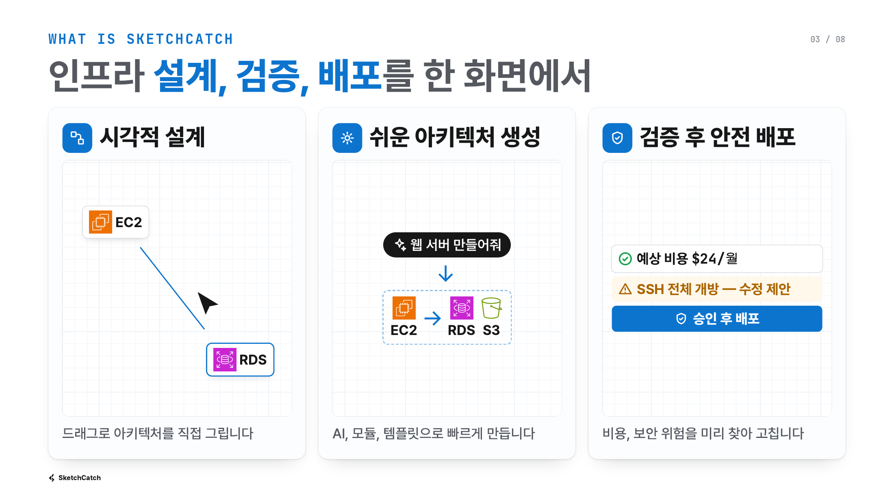
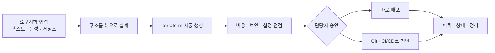
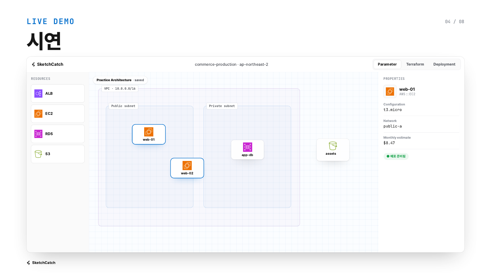
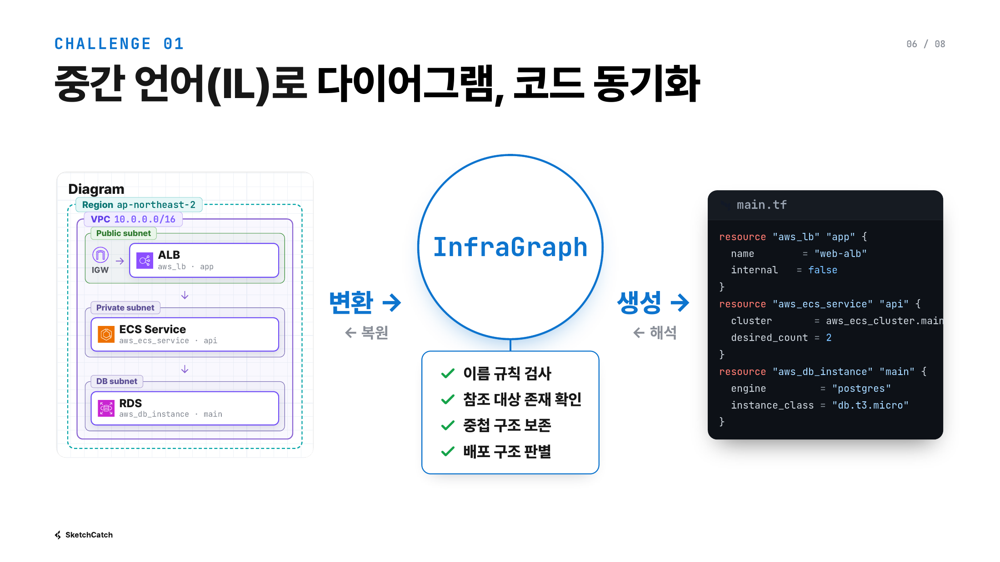
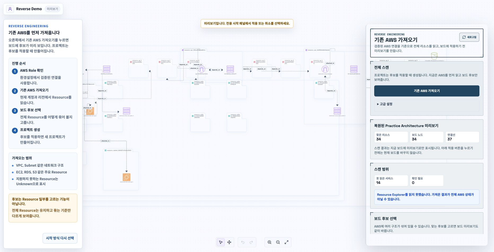
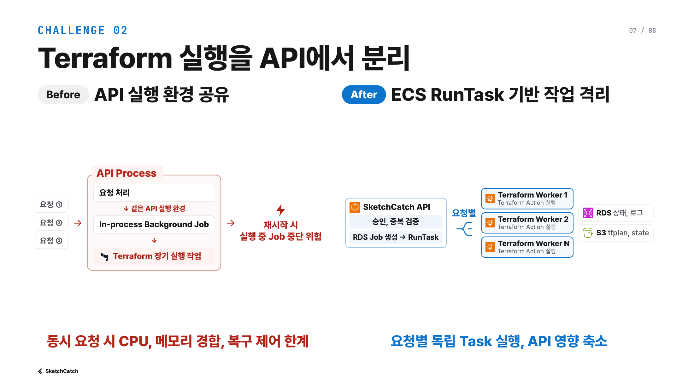
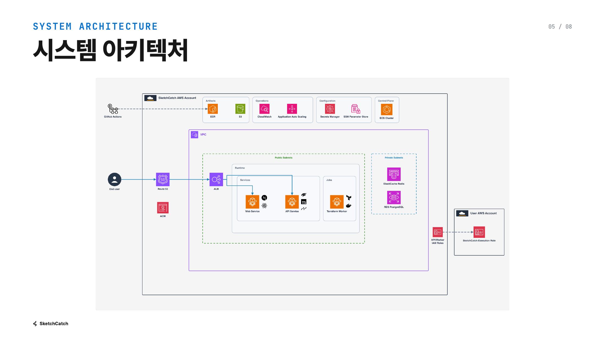
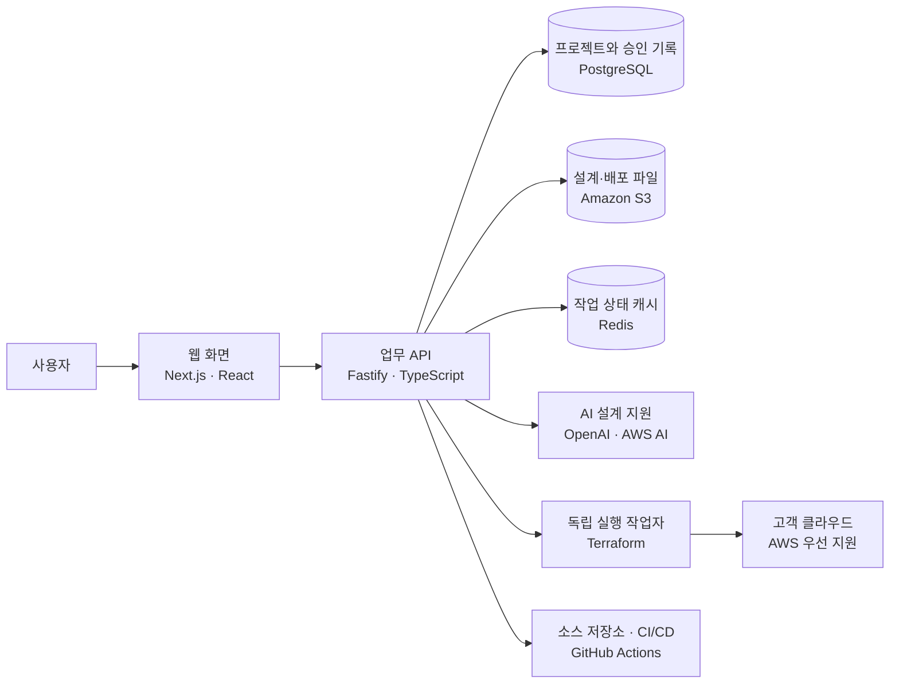

# SketchCatch

<p align="center">
  
</p>

<h3 align="center">클라우드 인프라, 설계부터 검증과 배포까지 한 화면에서</h3>

<p align="center">
  팀의 요구사항을 눈으로 검토할 수 있는 설계와 실행 가능한 Terraform으로 연결합니다.<br />
  복잡한 콘솔 작업과 코드 작성 사이를 오가지 않고, 비용과 보안 위험을 확인한 뒤 승인된 변경만 배포할 수 있습니다.
</p>

<p align="center">
  <a href="https://sketchcatch.net"><strong>서비스 살펴보기</strong></a>
  ·
  <a href="./docs/product.md">제품 소개</a>
  ·
  <a href="./docs/development.md">개발 가이드</a>
</p>

<p align="center">
  
  
  
  
  
</p>



## 인프라 업무의 끊어진 단계를 하나로 연결합니다

클라우드 인프라를 만들려면 요구사항 정리, 구조 설계, 코드 작성, 위험 점검, 배포 승인을 여러 도구에서 반복해야 합니다. SketchCatch는 이 과정을 하나의 검토 가능한 흐름으로 묶어 팀의 소통 비용과 배포 실수를 줄입니다.



## 무엇을 할 수 있나요?

<table>
  <tr>
    <td width="50%">
      
    </td>
    <td width="50%">
      
    </td>
  </tr>
  <tr>
    <td valign="top">
      <strong>1. 설명만으로 설계 초안 만들기</strong><br />
      텍스트나 음성으로 원하는 서비스를 설명하거나 준비된 템플릿을 선택합니다. AI가 초안을 제안하고, 사용자는 화면에서 구성 요소와 연결 관계를 직접 확인하고 수정합니다.
    </td>
    <td valign="top">
      <strong>2. 그림과 Terraform을 함께 관리하기</strong><br />
      화면에서 바꾼 설계는 Terraform 코드에 반영되고, 가져온 Terraform도 다시 구조로 해석할 수 있습니다. 설계 문서와 실제 코드가 따로 노는 문제를 줄입니다.
    </td>
  </tr>
</table>

<table>
  <tr>
    <td width="50%">
      
    </td>
    <td width="50%">
      
    </td>
  </tr>
  <tr>
    <td valign="top">
      <strong>3. 기존 클라우드 환경을 한눈에 파악하기</strong><br />
      이미 운영 중인 클라우드 자원과 연결 관계를 읽어 구조도로 복원합니다. 전체 결과를 먼저 미리 보고, 필요한 설계에만 적용할 수 있습니다.
    </td>
    <td valign="top">
      <strong>4. 검토와 승인 후 안전하게 배포하기</strong><br />
      예상 비용, 공개 접근, 과도한 권한 같은 위험을 배포 전에 확인합니다. 승인된 작업은 독립된 실행 환경에서 처리하고 결과와 로그를 기록합니다.
    </td>
  </tr>
</table>

### 팀 운영까지 이어지는 핵심 기능

| 필요한 일 | SketchCatch가 제공하는 방식 |
| --- | --- |
| 빠르게 시작하기 | 자연어·음성 요구사항, 템플릿, 기존 소스 저장소에서 설계 초안을 만듭니다. |
| 함께 검토하기 | 구성 요소, 네트워크 관계, 주요 설정을 시각적으로 확인하고 수정합니다. |
| 코드로 전환하기 | 검토한 설계를 Terraform 파일과 실행 계획으로 바꿉니다. |
| 배포 전 확인하기 | 비용 추정과 보안·설정 위험을 보여주고 실제 변경 내용을 미리 검토합니다. |
| 팀 절차에 맞춰 배포하기 | 승인 후 바로 실행하거나 Git Pull Request와 CI/CD 파이프라인으로 전달합니다. |
| 운영 결과 남기기 | 배포 상태, 로그, 출력값, 변경 이력을 기록하고 필요할 때 자원을 정리합니다. |

## 서비스는 이렇게 구성됩니다

웹 화면, 업무 API, 배포 실행 환경을 분리했습니다. 사용자가 보는 화면은 클라우드 권한이나 Terraform 명령을 직접 다루지 않으며, 승인된 작업만 별도의 실행 환경으로 전달됩니다.





현재는 AWS와 Terraform을 우선 지원합니다. 설계 데이터와 클라우드 실행 부분을 분리해 두어, 같은 업무 흐름을 다른 클라우드로 확장할 수 있는 구조입니다.

## 어떤 기술이 들어갔나요?

기술 이름보다 각 기술이 맡은 역할을 중심으로 정리했습니다.

| 영역 | 기술 | 하는 일 |
| --- | --- | --- |
| 사용자 화면 | Next.js, React, TypeScript | 설계 편집, 코드 미리보기, 검토와 승인 화면을 제공합니다. |
| 업무 API | Fastify, TypeScript | 프로젝트, 설계, 배포 요청과 권한 경계를 관리합니다. |
| 데이터 | PostgreSQL, Drizzle ORM | 프로젝트 상태, 승인, 배포 이력과 운영 기록을 저장합니다. |
| 파일 보관 | Amazon S3 | Terraform 파일, 실행 계획, 상태 파일과 생성 결과물을 보관합니다. |
| 인프라 자동화 | Terraform | 검토한 설계를 반복 실행 가능한 인프라 코드로 만듭니다. |
| AI 지원 | OpenAI API, AWS Bedrock, Amazon Q | 요구사항 해석, 설계 제안, 설명과 위험 검토를 보조합니다. |
| 실행 환경 | Docker, Amazon ECS/Fargate, ALB | 웹·API·배포 작업을 분리해 운영하고 트래픽을 전달합니다. |
| 자동 배포 | GitHub Actions, Amazon ECR | 코드 검증, 컨테이너 이미지 생성과 서비스 배포를 자동화합니다. |
| 상태와 관측 | Redis, Amazon CloudWatch | 긴 작업의 진행 상태를 빠르게 전달하고 실행 로그와 지표를 수집합니다. |

## AI가 마음대로 배포하지 않습니다

AI는 요구사항을 해석하고 설계와 수정 방향을 제안하는 역할만 합니다. 실제 변경은 정해진 검증과 사용자 승인을 통과해야 실행됩니다.

- 설계와 Terraform의 구조 및 참조 관계를 규칙으로 검사합니다.
- 공개 저장소, 전체 공개 SSH, 공개 데이터베이스, 과도한 권한을 배포 전에 찾습니다.
- 승인 시점의 코드, 실행 계획, 대상 계정과 리전이 달라지면 실행하지 않습니다.
- 클라우드 자격 증명과 민감한 출력값을 화면·응답·로그에 노출하지 않습니다.
- 실패한 작업도 상태와 근거를 남겨 복구 또는 정리 여부를 판단할 수 있게 합니다.

## 로컬에서 실행하기

<details>
<summary>개발 환경 실행 방법 보기</summary>

Docker와 저장소에 지정된 pnpm 버전이 필요합니다.

```bash
pnpm install
cp .env.example .env
docker compose -f infra/local/docker-compose.yml up -d
pnpm dev
```

기본 주소는 Web `http://localhost:3000`, API `http://localhost:4000`입니다. 환경 변수 기준은 [`.env.example`](./.env.example)에서 확인할 수 있습니다.

</details>

<details>
<summary>검증 명령 보기</summary>

```bash
pnpm harness:check
pnpm lint
pnpm typecheck
pnpm build
pnpm test
```

</details>

## 더 알아보기

- [제품 범위와 로드맵](./docs/product.md)
- [시스템 아키텍처](./docs/architecture.md)
- [데이터 모델](./docs/data-models.md)
- [개발 가이드](./docs/development.md)
- [배포와 안전 정책](./docs/deployment.md)

---

<p align="center">
  <strong>설계 문서가 실제 배포 코드와 어긋나지 않도록.</strong><br />
  SketchCatch는 팀이 클라우드 변경을 더 쉽게 이해하고, 함께 검토하고, 안전하게 실행하도록 돕습니다.
</p>

## 팀 기여

아래 내용은 로컬에서 접근 가능한 전체 Git ref의 non-merge 커밋과 변경 경로를 기준으로 요약했습니다.

| 팀원 | 주요 영역 | 핵심 기여 |
| --- | --- | --- |
| 송채강 | Frontend · Backend | Direct Deployment·Live Observation 흐름과 Architecture Board·Repository UX 구현 |
| 시원 | Infrastructure · CI/CD · Backend | AWS ECS/Fargate·RDS·S3 기반과 배포·관측 안전 흐름 구축 |
| 이경근 | Frontend · Backend · 공용 타입 | Architecture Board·Workspace AI, Reverse Engineering과 Terraform·Template 매핑 구현 |
| 고윤서 | Frontend · Backend · Database | 로그인/JWT·회원·프로젝트 계정 흐름과 Settings·AWS 연결 UX 구현 |
| 이정현 | Frontend · Backend · CI/CD | Git/CI/CD handoff·readiness·setup 자동화와 Delivery UI·Project Draft 흐름 구현 |
