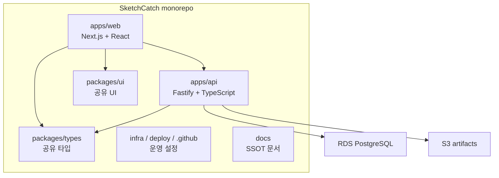
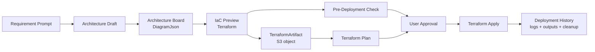

# 아키텍처

SketchCatch는 pnpm workspace와 Turborepo 기반 모노레포다. MVP는 AWS + Terraform 기준으로 구현하지만, 구조는 Terraform Provider 확장을 통한 멀티 클라우드 지원을 전제로 한다.

## 저장소 구조

주요 디렉터리:

- `apps/web`: Architecture Board, IaC Preview, Pre-Deployment Check, Deployment 화면
- `apps/api`: 인증, 프로젝트, draft, Terraform 생성/검증, Deployment API
- `packages/types`: API와 프론트가 공유하는 도메인 타입
- `packages/ui`: 공유 presentational UI
- `infra`, `deploy`, `.github`: 운영 배포와 AWS 운영 설정
- `docs`: 제품/데이터/아키텍처/개발/배포 SSOT

## 기술 스택

| 영역 | 선택한 기술 | 기준 |
| --- | --- | --- |
| 패키지 관리 | pnpm workspace | 모노레포 패키지 연결 |
| 빌드 | Turborepo | 앱/패키지 빌드 순서 관리 |
| 프론트엔드 | Next.js, React, TypeScript | 작업 화면과 API 연동 |
| API 서버 | Fastify, TypeScript | 명확한 route/service 분리 |
| DB | RDS PostgreSQL | 프로젝트, 설계, 배포 이력 저장 |
| ORM | Drizzle ORM | 타입 안전 DB schema와 migration |
| 파일 저장 | S3 | Terraform, export, image, tfplan, state/output artifact |
| IaC | Terraform | MVP 기준 IaC, 멀티 클라우드 확장 기반 |
| 운영 배포 | Docker, EC2, SSM, Nginx | SSH 없는 운영 배포 |
| CI/CD | GitHub Actions, OIDC | 장기 AWS key 없는 운영 배포 |

## 실행 경계

| 책임 | 위치 | 금지 |
| --- | --- | --- |
| UI 표시와 사용자 승인 | `apps/web` | AWS SDK 직접 호출, Terraform CLI 실행 |
| Terraform 생성/검증 API | `apps/api` | 프론트에 실행 책임 위임 |
| Terraform Plan/Apply/Destroy | `apps/api` 또는 future worker | 승인 없는 apply/destroy |
| AWS 연결 확인 | `apps/api` 또는 future worker | credential 응답/로그 노출 |
| 파일 artifact 저장 | S3 + RDS metadata | Terraform 원문 RDS 영구 저장 |

프론트엔드는 버튼과 상태를 보여줄 뿐 실제 클라우드 변경을 직접 수행하지 않는다. 실제 리소스 변경은 backend/worker에서 승인 게이트, 로그 마스킹, cleanup 경로를 갖춘 뒤 실행한다.

## 데이터 저장 기준

| 데이터 | 저장 위치 |
| --- | --- |
| 사용자, refresh token hash | RDS |
| 프로젝트 정보 | RDS |
| `ArchitectureJson` snapshot | RDS |
| `ProjectDraft.diagramJson` | RDS + 브라우저 복구 상태 |
| Deployment, Plan summary, 로그 metadata | RDS |
| S3 파일 metadata | RDS |
| Terraform 파일 | S3 |
| `tfplan`, state, output artifact | S3 |
| 다이어그램 이미지, export zip, thumbnail | S3 |

RDS는 원천 데이터와 metadata를 저장한다. S3는 파일성 산출물을 저장한다.

## MVP E2E 흐름

4일 데모에서는 EC2 + S3 + VPC 계열 Golden Path를 우선한다.

## API 범위

현재 API 범위는 구현 상태에 따라 바뀔 수 있지만, 공통 원칙은 아래와 같다.

- 인증된 사용자는 프로젝트를 생성하고 조회한다.
- 프로젝트는 `ArchitectureSnapshot`과 `ProjectDraft`를 가진다.
- Terraform 생성 API는 `DiagramJson`을 입력으로 받는다.
- Pre-Deployment Check는 비용/보안/설정 위험을 반환한다.
- Deployment API는 생성, init, plan, approval, apply, logs, destroy 흐름으로 확장한다.
- 실제 AWS credential과 Terraform 실행 세부는 프론트에 노출하지 않는다.

API DTO와 모델명은 [데이터 모델](./data-models.md)을 따른다.

## 멀티 클라우드 확장 방향

MVP는 AWS Provider 기준이다. 장기적으로는 아래처럼 확장한다.

| 단계 | 범위 |
| --- | --- |
| MVP | AWS + Terraform |
| 이후 | AzureRM Provider, Google Provider |
| 장기 | 클라우드별 비용 비교, 클라우드별 아키텍처 리뷰 |

문서와 코드에서 SketchCatch를 AWS 전용 서비스로 표현하지 않는다. 단, MVP 구현과 4일 데모는 AWS 기준으로 고정한다.

## 기술 결정 기록

### ADR-001: pnpm workspace와 Turborepo를 사용한다

`apps/web`, `apps/api`, `packages/types`, `packages/ui`가 같은 도메인 타입을 공유하므로 모노레포로 시작한다.

### ADR-002: API 서버는 Fastify로 시작한다

Fastify는 route/service 분리가 쉽고, MVP API와 Zod 검증에 충분하다.

### ADR-003: RDS에는 원천 데이터, S3에는 파일 아티팩트를 저장한다

프로젝트와 설계 JSON은 RDS에 저장하고, Terraform 파일, tfplan, export zip은 S3에 저장한다.

### ADR-004: 운영 배포는 Docker + EC2 + SSM으로 한다

Docker image 단위 배포와 SSM Run Command를 사용해 SSH 없는 운영 배포를 유지한다.

### ADR-005: MVP는 Terraform 우선으로 간다

Terraform은 diff, plan, apply, state, provider 확장 측면에서 제품 방향과 맞는다. CloudFormation은 AWS 참고 또는 향후 호환 대상으로만 둔다.
