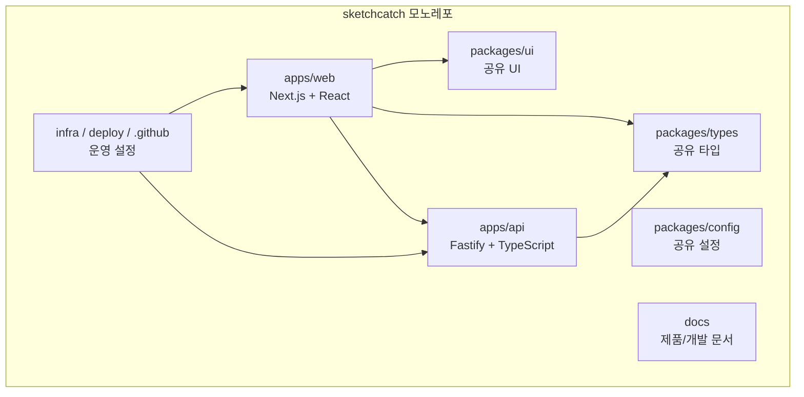
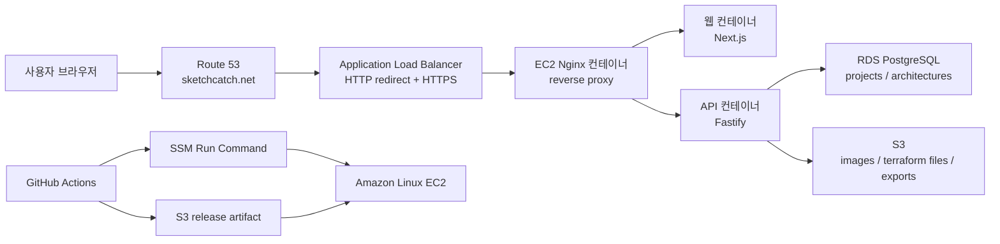

# 아키텍처

SketchCatch는 pnpm workspace와 Turborepo 기반 모노레포다. 프론트엔드, 백엔드, 공유 타입, 공유 UI, 설정 패키지를 분리해 팀원이 동시에 작업해도 충돌을 줄이는 구조를 목표로 한다.

## 저장소 구조

주요 디렉터리:

- `apps/web`: Next.js 프론트엔드
- `apps/api`: Fastify API 서버
- `packages/types`: API와 프론트가 공유하는 도메인 타입
- `packages/ui`: 공유 UI
- `packages/config`: 공유 설정
- `infra`, `deploy`, `.github`: 운영/배포 설정
- `docs`: 제품/개발/배포 문서

## 기술 스택

| 영역 | 선택한 기술 | 이유 |
| --- | --- | --- |
| 패키지 관리 | pnpm workspace | 빠른 설치, 모노레포 패키지 연결, 디스크 효율 |
| 빌드 오케스트레이션 | Turborepo | 앱/패키지 빌드 순서와 캐시 관리 |
| 프론트엔드 | Next.js, React, TypeScript | 라우팅, React 생태계, 타입 안정성 |
| API 서버 | Fastify, TypeScript | 빠른 Node API 서버, 스키마 검증과 플러그인 구조 |
| DB | RDS PostgreSQL | 프로젝트/아키텍처 JSON/배포 이력 같은 관계형 데이터에 적합 |
| ORM | Drizzle ORM, drizzle-kit | SQL에 가까운 타입 안전 ORM, 마이그레이션 관리 |
| 파일 저장 | S3 presigned upload | 이미지, IaC 파일, export zip 저장에 적합 |
| 배포 | Docker, EC2, SSM, Nginx | Docker 단위 배포, SSH 없는 운영 배포 |
| HTTPS | ALB, ACM, Route 53 | AWS 표준 HTTPS 진입 구조 |
| CI/CD | GitHub Actions, OIDC | 장기 AWS Access Key 없이 배포 권한 위임 |
| 코드 품질 | ESLint, Prettier, TypeScript | 팀 코드 스타일 통일, 타입 오류 조기 발견 |

## 데이터 저장 기준

RDS와 S3는 역할을 분리한다.

| 데이터 | 저장 위치 |
| --- | --- |
| 익명 workspace | RDS |
| 프로젝트 정보 | RDS |
| 아키텍처 JSON | RDS |
| S3 파일 메타데이터 | RDS |
| 향후 배포 이력/비용 정보 | RDS |
| PNG/SVG 다이어그램 | S3 |
| Terraform 파일과 향후 호환 IaC 파일 | S3 |
| 프로젝트 export zip | S3 |
| 썸네일 이미지 | S3 |

공유 도메인 모델은 [데이터 모델](./data-models.md)에 정리한다. TypeScript/API/프론트 필드는 `camelCase`, PostgreSQL 컬럼은 `snake_case`를 사용하고, 아키텍처 보드 상태는 버전이 있는 `ArchitectureSnapshot`의 `ArchitectureJson`으로 저장한다.

## 운영 배포 구조

운영 배포는 Docker Compose가 아니라 Docker image + EC2 + SSM + Nginx + GitHub Actions 방식이다. HTTPS는 ALB, ACM, Route 53 조합을 기준으로 준비되어 있다.

운영 절차 상세는 [배포 운영 문서](./deployment.md)에 둔다.

## 현재 구현된 API

- `GET /health`
- `GET /health/db`
- `POST /api/projects`
- `GET /api/projects/:id`
- `POST /api/projects/:id/architectures`
- `POST /api/projects/:id/assets/presigned-upload`

인증, AI 생성, Terraform 실행, 실제 AWS 리소스 생성은 아직 구현하지 않았다.

## 기술 결정 기록

### ADR-001: pnpm workspace와 Turborepo를 사용한다

`apps/web`, `apps/api`, `packages/types`, `packages/ui`가 같은 도메인 타입을 공유하므로 모노레포로 시작한다. Turborepo는 패키지 간 `build`, `lint`, `typecheck` 순서를 관리한다.

### ADR-002: API 서버는 Fastify로 시작한다

Fastify는 스키마/플러그인 구조가 명확하고, MVP API, health check, DB check, presigned URL 발급에 충분하다. NestJS는 초기 보일러플레이트가 크고, Express는 장기 모듈 경계가 흐려지기 쉽다.

### ADR-003: RDS에는 원천 데이터, S3에는 파일 아티팩트를 저장한다

프로젝트와 아키텍처 JSON은 조회와 관계가 중요하므로 RDS에 저장한다. 다이어그램 이미지, IaC 파일, export zip은 파일 객체이므로 S3에 저장한다.

### ADR-004: 배포는 Docker + EC2 + SSM으로 한다

Docker image 단위 배포라 로컬/CI/운영 실행 단위가 명확하다. SSM을 쓰면 GitHub Actions에서 EC2 SSH 접속을 직접 열지 않아도 된다.

### ADR-005: 마이그레이션은 자동 배포에서 분리한다

DB migration은 배포 워크플로에서 자동 실행하지 않고, 수동 GitHub Actions 워크플로로 실행한다. 스키마 변경은 배포보다 위험도가 높기 때문이다.

### ADR-006: HTTPS는 ALB + ACM + Route 53으로 간다

AWS에서 표준적인 HTTPS 진입 구조이고, 인증서 자동 갱신과 security group 제한이 쉽다.

### ADR-007: MVP는 Terraform 우선으로 간다

Terraform은 실무 IaC 학습, 버전 관리, diff, rollback, GitHub 연동, 멀티 클라우드 확장성 측면에서 제품 방향과 가장 잘 맞는다. CloudFormation은 AWS 학습 참고나 향후 호환 대상으로 검토하되, MVP 기본 구현은 Terraform을 우선한다.

## 앞으로 검토할 것

- CloudWatch Logs와 알람 운영 기준 정리
- ALB target health, API latency, DB connection 알람 추가
- RDS 백업, 스냅샷, 접근 제한 정리
- S3 lifecycle policy로 임시 실습 파일 자동 만료
- dev/staging/prod 환경 분리
- Terraform 또는 CDK로 인프라 전체를 코드화
