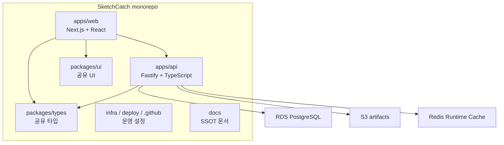
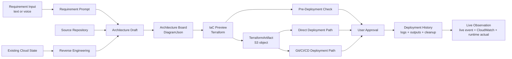

# 아키텍처

SketchCatch는 pnpm workspace와 Turborepo 기반 모노레포다. MVP는 AWS + Terraform 기준으로 구현하지만, 구조는 Provider Adapter와 Terraform Provider 확장을 통한 멀티 클라우드 지원을 전제로 한다.

## 저장소 구조



주요 디렉터리:

- `apps/web`: Architecture Board, IaC Preview, Pre-Deployment Check, Deployment 화면
- `apps/api`: 인증, 프로젝트, draft, Terraform 생성/검증, Deployment API
- `packages/types`: API와 프론트가 공유하는 도메인 타입
- `packages/ui`: 공유 presentational UI
- `infra`, `deploy`, `.github`: 운영 배포와 AWS 운영 설정
- `docs`: 제품/데이터/아키텍처/개발/배포 SSOT

## 기술 스택

| 영역 | 선택한 기술 | 기준 |
| --- | --- | --- |
| 패키지 관리 | pnpm workspace | 모노레포 패키지 연결 |
| 빌드 | Turborepo | 앱/패키지 빌드 순서 관리 |
| 프론트엔드 | Next.js, React, TypeScript | 작업 화면과 API 연동 |
| API 서버 | Fastify, TypeScript | 명확한 route/service 분리 |
| DB | RDS PostgreSQL | 프로젝트, 설계, 배포 이력 저장 |
| ORM | Drizzle ORM | 타입 안전 DB schema와 migration |
| 파일 저장 | S3 | Terraform, export, image, tfplan, state/output artifact |
| Runtime Cache | Redis | Deployment, Reverse Engineering, Git/CI/CD 상태와 15분 Live Observation 세션·집계 보조 |
| IaC | Terraform | MVP 기준 IaC, 멀티 클라우드 확장 기반 |
| AI 계층 | Bedrock, Amazon Q, Amazon Transcribe | 추천, 설명, Guardrails, AWS 특화 reasoning, 음성 전사 |
| 운영 배포 | ECS/Fargate, ALB, ECR | API/web 분리 서비스와 path routing |
| CI/CD | GitHub Actions, OIDC | 장기 AWS key 없는 운영 배포 |

## 실행 경계

| 책임 | 위치 | 금지 |
| --- | --- | --- |
| UI 표시와 사용자 승인 | `apps/web` | AWS SDK 직접 호출, Terraform CLI 실행 |
| Architecture Board Compiler 제안 계산 | 초기에는 `apps/web`의 순수 in-process Module | DB 직접 변경, 승인 없는 Board mutation, Deployment Safety Gate 우회 |
| Terraform 생성/검증 API | `apps/api` | 프론트에 실행 책임 위임 |
| Terraform Plan/Apply/Destroy | `apps/api` 또는 ECS RunTask worker | 승인 없는 apply/destroy |
| SketchCatch production infra Plan/Import/Apply | 승인된 GitHub Actions/운영자 경로 | product API/worker에서 호출, 승인 없는 state/resource mutation |
| AWS 연결 확인 | `apps/api` 또는 ECS RunTask worker | credential 응답/로그 노출 |
| Provider Adapter와 Reverse Engineering | `apps/api` 또는 ECS RunTask worker | provider별 credential/raw state 프론트 노출 |
| Git/CI/CD handoff와 상태 추적 | `apps/api` 또는 ECS RunTask worker | 승인 없는 commit/apply, secret 저장 |
| Runtime Cache 사용 | `apps/api` 또는 ECS RunTask worker | 사용자 Practice Architecture Resource로 노출 |
| Live Observation UI | `apps/web` | AWS SDK 호출, ASG desired capacity 직접 변경, 사용자 입력 target URL |
| Live Observation 세션·관측 | `apps/api`의 provider-neutral service + AWS adapter | token 로그/RDS 저장, 실패 시 sample AWS 상태 생성 |
| 파일 artifact 저장 | S3 + RDS metadata | Terraform 원문 RDS 영구 저장 |

프론트엔드는 버튼과 상태를 보여줄 뿐 실제 클라우드 변경을 직접 수행하지 않는다. 실제 리소스 변경은 backend/worker에서 승인 게이트, 로그 마스킹, cleanup 경로를 갖춘 뒤 실행한다.

음성 Requirement Input은 Amazon Transcribe로 전사한 뒤 사용자 확인을 거쳐 Requirement Prompt가 된다. AI, Bedrock, Amazon Q Assistance는 추천과 설명을 보강하지만 Practice Architecture, IaC Preview, Git 변경, Deployment 실행을 사용자 수락 없이 변경하지 않는다.

오류 분석과 에이전트 리뷰의 AWS credit provider 체인은 `apps/api`가 소유한다. Web은 provider를 직접 호출하거나 선택하지 않고, API가 반환한 최종 설명과 비밀값이 제거된 provider 시도 metadata만 표시한다.

Architecture Board Compiler는 Resource·관계·설정·소속·시각 표현을 모두 바꾼 제안을 계산할 수 있고 입력 요구사항이나 Provider·Terraform 유효성과 충돌하는 후보도 허용한다. 이 권한은 제안 계산에만 적용하며, Compiler Interface는 결과와 전체 diff·diagnostics·Compilation Distance를 반환할 뿐 현재 Board를 직접 저장하지 않는다.

## SketchCatch production infrastructure 관리 경계

SketchCatch 자체 production infrastructure Terraform은 사용자가 만드는 Practice Architecture와 Direct Deployment/Git/CI/CD Deployment state에서 분리합니다.

```text
SketchCatch product Deployment
-> 사용자 project별 artifact/state
-> API 또는 ECS RunTask worker

SketchCatch production infrastructure
-> infra/aws/terraform (runtime)
-> infra/aws/production/edge
-> infra/aws/production/data
-> infra/aws/production/legacy-rollback
-> 운영자 승인 GitHub Environment
```

production infrastructure는 S3 backend의 group별 key와 native lockfile을 사용합니다. 기존 ECS runtime root와 `production/ecs-foundation/terraform.tfstate` key는 state migration 승인 전까지 유지합니다. Route53/ACM, S3/RDS/Redis, cold rollback은 서로 다른 state로 격리하고, high-risk root에는 discovery, backup, ownership, zero-change plan 검토 전 resource/import block을 추가하지 않습니다.

production runtime은 cutover를 마쳤으며 ALB가 API/health path를 API service로, 나머지 path를 web service로 직접 전달합니다. legacy nginx ECS service와 target group, 기존 EC2와 ALB는 삭제되어 warm rollback은 제공하지 않습니다.

CloudFormation이 소유한 resource는 stack이 남아 있는 동안 Terraform으로 중복 소유하지 않습니다. import도 state를 변경하는 live operation이므로 plan-only workflow와 별도 승인 경계를 통과한 후에만 수행합니다.

## 데이터 저장 기준

| 데이터 | 저장 위치 |
| --- | --- |
| 사용자, refresh token hash | RDS |
| 프로젝트 정보 | RDS |
| Source Repository 연결, Board Repository Analysis 출처와 마지막 인증 분석 요약 | RDS |
| `ArchitectureJson` snapshot | RDS |
| `ProjectDraft.diagramJson`, working `terraformFiles` | RDS + 브라우저 복구 상태 |
| Deployment, Plan summary, 로그 metadata | RDS |
| Deployment 완료 알림, outbox, Inbox 읽음 상태 | RDS |
| Web Push subscription | RDS, endpoint hash + AES-256-GCM encrypted payload |
| S3 파일 metadata | RDS |
| Terraform 파일 | S3 |
| `tfplan`, state, output artifact | S3 |
| versioned Plan optimization evidence | S3, `tfplan`과 같은 수명 |
| ApplicationArtifact identity, digest, provider location, claim/lease | RDS |
| 사용자 application artifact byte | 사용자 ECR/S3 또는 provider storage |
| 다이어그램 이미지, export zip, thumbnail | S3 |
| Redis Runtime Cache 데이터 | Redis, 짧은 TTL |
| Live Observation session, receipt dedup, 1초 bucket | Redis, 최대 15분 TTL |

RDS는 원천 데이터와 metadata를 저장한다. SketchCatch S3는 Terraform, tfplan, export처럼 서비스가 생성한 파일성 산출물을 저장한다. 사용자 application artifact byte는 사용자 ECR/S3 또는 provider storage에 남기고 SketchCatch production ECR/S3로 복사하지 않는다.
Redis는 Deployment, Reverse Engineering, Git/CI/CD Integration처럼 오래 걸리는 workflow 상태와 streaming-friendly metadata를 보조한다. Live Observation은 예외적으로 15분 세션, public token SHA-256 lookup, receipt dedup, 원자 count, 1초 bucket을 Redis에만 저장하며 영구 Deployment 기록으로 승격하지 않는다. Redis 데이터는 원천 기록이 아니며, 최종 기록은 RDS/S3에 남긴다.

## 핵심 서비스 흐름



Representative Use Journey는 위 실제 서비스 흐름을 증명하는 발표/리허설 경로다. 별도 데모 전용 기능을 만들지 않는다.

## Deployment 최적화 경계

Runtime Convergence는 IaC desired-state 재사용 및 ApplicationArtifact 재사용 다음의 독립 계층이다.
`artifactFingerprint`는 repository/build identity를, `deploymentTargetFingerprint`는 project/account/
region과 orchestrator/compute/capacity/rollout/health 구성을 식별한다. 둘 중 하나라도 다르면 같은
digest여도 runtime no-op으로 보지 않는다.

API의 deep module은 provider-neutral adapter registry와 `RuntimeProviderGateway` port만 소유한다.
각 adapter는 provider current state를 read-only로 읽고 target, artifact marker, digest/reference,
health를 검증한 뒤 `already_active` 또는 안전한 rollout fallback을 반환한다. ECS, EC2, EKS,
Kubernetes, Lambda, Static adapter 객체는 서로 분리하며 특히 EKS/Kubernetes를 ECS 구현에
포함하지 않는다. 현재 Direct ECS gateway와 생성된 GitHub Actions의 ECS/Lambda/EC2 ASG/Static
preflight는 실제 AWS 상태를 읽고, 나머지 canonical adapter는 같은 port와 test double 계약으로
확장한다.

RDS와 Runtime Cache는 provider state의 대체물이 아니다. current state 조회가 실패하거나
project/account/region, marker, config, digest, health 중 하나를 검증할 수 없으면 no-op을 금지한다.
기존 Approval, Plan hash, Terraform artifact hash, state lineage/serial, rollback/cleanup/retention
검증은 Runtime Convergence 바깥의 선행·후행 gate로 그대로 유지한다.

Deployment 최적화의 지원 여부는 `packages/types`의 provider-neutral `ResourceDefinition.capabilities.deployment`를 source of truth로 삼는다. Terraform managed resource는 검증된 desired-state 재사용을 지원하고, data source, `UNKNOWN`, catalog-only definition은 명시적으로 제외한다. AWS와 Kubernetes를 포함한 provider adapter는 같은 계약을 소비한다.

최적화는 한 종류의 cache가 아니라 세 계층으로 분리한다.

| 계층 | identity | 현재 범위 |
| --- | --- | --- |
| IaC desired state | Terraform bundle + provider lock/identity + target + state lineage/serial | v1 구현 |
| application artifact | repository/commit + normalized build config/contract + platform + secret-free input + immutable digest | Direct/GitOps 공통 Registry v1 구현 |
| runtime release | deployment target fingerprint + ApplicationArtifact fingerprint/digest + provider actual state + health evidence | Runtime Convergence Adapter v1 구현 |

IaC 계층은 canonical Terraform bundle과 provider lock을 재사용하되 account, region, state lineage/serial, drift TTL을 함께 검증한다. 안전한 pending Plan 재사용은 실제 `tfplan`, S3 optimization evidence, Plan summary, Pre-Deployment result가 모두 같은 경우에만 허용한다. 동일 process의 같은 Deployment Plan은 single-flight로 합치고, API route는 이미 실행 중인 동일 Plan에 합류한다. RDS의 Deployment/job 제약은 process 간 중복 실행을 막는 영구 경계이며 Redis는 이 결정의 source of truth가 아니다.

Application artifact 계층은 `application_artifacts`의 project-scoped fingerprint와 heartbeat로 갱신하는 build claim/lease로 Direct Deployment와 Git/CI/CD의 중복 build를 조정한다. 재사용 전 provider adapter가 존재 여부, exact digest, account, region, 승인된 namespace/reference, ownership scope를 read-only로 다시 확인한다. RDS row나 Redis hit만으로 재사용하지 않으며 검증 실패는 artifact를 `invalid`로 전환하고 정상 build로 fallback한다. release는 nullable `artifactId`로 artifact identity와 분리해 v1 evidence와 legacy record를 유지하고, 복합 `(artifactId, projectId)` FK로 cross-project 연결을 차단한다.

Plan 준비에서는 Terraform artifact, connection, architecture, current Plan, workspace를 병렬로 읽고 정적 안전 검사를 먼저 통과한 뒤 credential, provider lock, 프로젝트의 최신 Terraform state baseline을 준비한다. baseline Deployment ID, S3 key, lineage hash, serial은 RDS Plan artifact에 저장하며 Apply 전에 다시 비교한다. 검증 실패, 오래된 drift evidence, 손상된 sidecar는 정상 Plan으로 안전하게 fallback한다. 실제 Terraform Plan이 no-change를 반환하고 승인 snapshot/hash/account/region과 sidecar TTL이 다시 검증된 경우에만 Terraform Apply를 생략한다. no-change `full_stack`도 일반 release와 같은 lease fence, AbortSignal, partial/cancel terminal 규칙을 사용한다. 코드 fingerprint만으로 cloud no-change를 추론하지 않으며, 부분 최적화를 위해 `terraform apply -target`을 사용하지 않는다.

최적화 결과는 `execute`, `reuse`, `no_change`, `fallback_execute`, `unsupported`와 제한된 reason enum으로 기록한다. duration, provider lock/state cache hit·miss, resource address별 bounded action은 Deployment log에 남기되 credential, 변수 값, token, raw Terraform JSON은 기록하지 않는다.

## API 범위

현재 API 범위는 구현 상태에 따라 바뀔 수 있지만, 공통 원칙은 아래와 같다.

- 인증된 사용자는 프로젝트를 생성하고 조회한다.
- 프로젝트는 `ArchitectureSnapshot`과 `ProjectDraft`를 가진다.
- Terraform 생성 API는 `DiagramJson`을 입력으로 받는다.
- Pre-Deployment Check는 비용/보안/설정 위험을 반환한다.
- Deployment API는 생성, init, plan, approval, apply, logs, destroy 흐름으로 확장한다.
- Live Observation API는 valid v2 manifest와 현재 verified connection을 가진 성공 Deployment에서만 15분 Store 세션을 만들고 인증 snapshot/SSE, capability-free audience URL, 제한된 public bootstrap/request를 제공한다.
- Git/CI/CD Integration API는 Source Repository 연결, Terraform handoff, PR 생성, pipeline 상태 추적 흐름으로 확장한다.
- Repository Analysis API는 repository 원문을 실행하거나 저장하지 않는다. Board 생성 출처는 프로젝트당 현재 `repository_analysis_records` 한 건에 저장하고, 인증된 Source Repository의 마지막 AI Handoff는 `source_repositories`에 저장한다.
- Public Repository Analysis 응답은 선택 branch의 실제 head SHA를 `repositoryRevision`으로 반환한다. GitHub App project state는 분석 target owner/name과 일회성 resume key를 서명하며 callback은 다른 repository로 fallback하지 않는다.
- `GET /api/projects/:projectId/delivery-profile`은 GitHub installation, Board 분석 출처, active Source Repository, monitoring, 배포 타깃과 read-only readiness를 조합한다. 이 조회는 provider 설정, PR, Pipeline, cloud Resource와 배포 타깃을 변경하지 않는다.
- Reverse Engineering API는 Provider Adapter를 통해 기존 cloud Resource를 스캔하고 Practice Architecture와 import suggestion을 반환한다.
- 실제 AWS credential과 Terraform 실행 세부는 프론트에 노출하지 않는다.

API DTO와 모델명은 [데이터 모델](./data-models.md)을 따른다.

Repository Analysis UI의 GitHub 왕복 복귀 상태는 Web `sessionStorage`에만 저장하는 30분짜리 schema v1 record다. callback은 서명 target과 exact owner/name이 일치하는 Repository만 연결하고 이 record의 key를 안전한 query로 돌려준다. 비공개 Repository는 복귀 뒤 인증 분석을 실행하고, 공개 분석 결과가 있으면 project, resume key와 target이 모두 일치할 때 상태를 복원한다. 배포 타깃과 monitoring은 callback에서 저장하지 않고 Workspace Delivery에서 사용자가 별도로 확인한다. GitHub JWT state, installation token, credential과 원본 evidence 파일 내용은 browser storage에 저장하지 않는다.

## Deployment/CI/CD 콘솔 상태 경계

Workspace는 Direct Deployment 실행 modal과 독립 `Delivery` panel을 구분한다. Direct 화면은 `Deployment`, Plan, Terraform Output과 Deployment log를 읽고, Delivery는 프로젝트 GitHub 연결, Source Repository, monitoring, 배포 타깃, readiness와 GitHub workflow run별 `GitCicdPipelineRun`을 함께 보여준다. 배포 modal의 CI/CD tab은 조회 요약과 `Delivery 열기`만 제공하며 같은 설정 editor를 중복 소유하지 않는다. 같은 commit SHA의 App·Infra run도 서로 다른 실행 기록이다. 이 UI 선택은 Deployment나 Pipeline Run 상태를 변경하지 않는다.

Git/CI/CD 관측의 영구 source of truth는 RDS다.

- `git_cicd_monitoring_configs`는 Source Repository별 활성 여부, branch, 명시적인 app/infra path, validation 상태와 시각을 저장한다.
- `git_cicd_pipeline_runs`는 `(source_repository_id, github_workflow_run_id, github_workflow_run_attempt)`별 App 또는 Infra run 하나와 execution kind, 최종 상태, start/end/refresh 시각, 적용 가능한 accepted handoff에서 가져온 비민감 Web/API URL을 저장한다.
- `git_cicd_pipeline_stages`는 Detect, app Build, infra Plan/Apply, app Deploy, Verify 상태를 run별로 저장한다.
- `git_cicd_pipeline_logs`는 마스킹된 stage message를 run별 증가 `sequence`로 저장한다.
- `handoff_id`는 승인된 Git/CI/CD handoff와 연결할 때만 사용하며, 기존 handoff record를 Pipeline Run으로 변환하지 않는다.

Web은 화면이 보일 때 active Pipeline Run이 있으면 5초, 모두 terminal이면 30초 간격으로 인증 API를 polling한다. 자동 console polling은 RDS 목록만 읽고, 사용자의 수동 새로고침은 project-scoped discovery를 실행한다. CI/CD Logs는 선택한 run의 마지막 `sequence` 이후만 증분 조회한다. `logRevision`이 바뀌는 rerun에서는 sequence와 표시 log를 함께 초기화한다. Workspace-level observer는 콘솔을 닫아도 같은 project가 mount된 동안 project-scoped discovery를 먼저 실행하고 RDS 목록을 읽어 Direct/Pipeline terminal 전환을 같은 5초/30초 정책으로 관측한다. discovery가 stale이면 기존 observer baseline을 보존한다. document가 숨겨진 동안 화면 refresh와 log fetch는 provider 호출을 진행하지 않는다.

API refresh는 GitHub Actions, job, commit file과 마스킹된 log를 read-only로 조회해 RDS record를 idempotent하게 갱신한다. Project discovery는 모든 enabled/valid target을 처리하며, branch run 목록은 최대 2 page와 최근 10 workflow run까지만 hydrate한다. 특정 run refresh는 GitHub workflow run ID와 attempt를 전달해 같은 commit의 다른 run을 함께 갱신하지 않는다. 같은 Source Repository와 monitoring target branch에서 가장 최근에 생성된 non-draft/non-cancelled `GitCicdHandoff`가 있으면, 사용자 수락 설정인 `staticSiteUrl`과 `apiBaseUrl`을 각각 Pipeline Run의 `appUrl`과 `apiUrl` provenance로 연결한다. `handoffId`, `appUrl`, `apiUrl`은 하나의 provenance tuple이다. 적용 가능한 handoff가 없으면 기존 tuple 전체를 보존하고, handoff가 있으면 두 URL이 null이어도 들어온 tuple 전체로 교체한다. URL은 username/password, query, fragment가 없는 절대 HTTP(S) entry/base URL만 허용하며 path와 port는 보존한다. 거부된 값은 Pipeline Run에 저장하지 않는다. provider 조회가 실패하면 마지막으로 저장된 status와 `lastRefreshedAt`을 보존하고 stale 응답을 반환한다. Redis Runtime Cache는 handoff/pipeline status의 짧은 보조 cache로 사용할 수 있지만 Pipeline Run, stage, log의 최종 기록을 대체하지 않는다.

각 provider snapshot은 workflow run ID, attempt, execution kind, 갱신 시각으로 만든 `upstreamOrderingToken`과 로그 소유권을 나타내는 별도 `logRevision`을 가진다. RDS conditional upsert는 더 오래된 token과 같은 revision의 terminal-to-non-terminal 역행을 원자적으로 거부하고, 거부 시 stage/log write도 수행하지 않는다. 따라서 늦게 도착한 refresh가 완료 상태나 rerun log를 과거 상태로 되돌리지 않는다.

모니터링 설정 변경에는 `userAcceptedChangeId`가 필요하며, enabled 상태는 branch와 app/infra path가 GitHub에서 검증되어야 한다. Pipeline refresh와 조회는 Git commit, workflow 설정, repository settings, AWS Resource를 변경하지 않는다. Git/CI/CD handoff, GitHub App 기반 repository settings 적용, AWS role diff 적용은 각각 기존의 명시적 사용자 승인 경계를 유지한다. 로그인용 GitHub OAuth credential은 Repository 작업에 전달하지 않는다.

`POST /api/projects/:projectId/git-cicd/readiness/refresh`는 RDS의 Deployment, Source Repository,
monitoring 설정, Terraform Output과 S3의 승인 Plan artifact를 읽어 현재 준비 상태를 계산한다. 검증된
Terraform Output으로 복원할 수 있는 경우에는 같은 RDS transaction 안에서 프로젝트 Deployment Target
metadata만 idempotent하게 동기화한다. 이 endpoint는 Terraform Plan/Apply/Destroy를 실행하지 않고,
AWS Resource나 Source Repository를 변경하지 않으며, Git/CI/CD handoff 승인이나 PR 생성도 수행하지
않는다. S3 또는 RDS evidence를 일시적으로 읽지 못하면 준비 항목을 완료로 추측하지 않고 503으로
응답한다.

Git/CI/CD handoff가 승인된 Apply Plan을 다시 검증할 때 S3 object missing/404 또는 SHA-256 불일치만
해당 후보가 유효하지 않은 것으로 처리한다. timeout, network 오류, S3 5xx처럼 검증 결과를 확정할 수
없는 오류는 과거 Apply 후보로 fallback하지 않고
`GIT_CICD_HANDOFF_PLAN_VERIFICATION_UNAVAILABLE` 409로 중단하며 provider를 호출하지 않는다.

완료 알림의 source of truth는 RDS Inbox와 idempotent outbox다. Direct Deployment와 GitOps Pipeline Run의
성공·실패·취소 terminal transition이 원본 상태 변경 transaction 안에서 사용자 알림과 outbox를 한 번만
만든다. 인증 SSE는 활성 화면에 같은 notification을 전달하고, background dispatcher는 암호화된
subscription을 복호화해 Service Worker Web Push로 전달한다. 브라우저 저장소나 polling snapshot은 중복
방지 기준으로 사용하지 않는다. Push 권한 거부·미지원·만료·전달 실패가 있어도 영속 Inbox는 유지된다.
endpoint와 subscription key 원문은 RDS와 로그에 남기지 않으며 알림과 비활성 subscription은 90일 후
정리한다.

CI/CD Logs는 GitHub Actions의 build/deploy workflow 증거이며 Runtime application log가 아니다. Runtime Log 동작은 Live Observation으로 이동할 뿐 Pipeline Run status를 변경하지 않는다. Direct Deployment 링크는 non-sensitive Terraform Output에서 분류하지만, CI/CD 링크는 위 accepted handoff 설정에서 유래한 `appUrl`/`apiUrl`이 credential/query/fragment 없는 HTTP(S) 검증을 통과한 경우에만 조건부로 표시한다.

## Live Observation 실행 경계

공개 audience page는 URL에 capability를 넣지 않고 session-bound bootstrap credential을 메모리에만 보유한다. 여러 audience client는 같은 active session에서 bootstrap을 반복할 수 있다. 실제 요청은 ACM custom hostname의 CNAME이 manifest의 public AWS ALB DNS와 정확히 일치하는지 다시 조회하고, ALB의 모든 A/AAAA 응답이 public address인지 검증한 뒤 선택한 IP로 HTTPS 연결을 고정한다. DNS와 HTTPS는 하나의 3초 wall-clock deadline을 공유하고 HTTPS는 남은 시간만 explicit destroy timer로 사용한다. TLS SNI와 Host는 custom hostname을 유지하며 POST와 redirect 미허용 조건으로 전송하고, status headers를 받는 즉시 response/socket을 destroy하여 body를 drain하지 않으며 성공한 2xx 뒤에만 Store receipt를 반영한다. DNS 불일치, 빈 응답, 하나라도 private·loopback·link-local·metadata·multicast·reserved address가 포함된 응답은 upstream 연결 전에 generic unavailable로 차단한다. IPv6는 native global unicast만 허용하고 IETF special assignment, 6to4, 반환된 6bone, documentation, IPv4-mapped 범위를 차단한다. public write endpoint는 `/requests` 하나뿐이며 IP별 전역 한도는 ALB가 추가한 client IP의 SHA-256 fingerprint로만 집계한다.

API의 Live Observation service는 session/receipt/snapshot 계산을 소유하고 provider-neutral snapshot port만 호출한다. URL의 Deployment ID와 Store session의 Deployment ID가 같은지 lease 전에 확인하고, verified manifest와 현재 verified AWS connection의 partition/region/account가 모두 일치할 때만 AWS target을 만든다. AWS adapter는 선택된 Target Group 범위의 CloudWatch `HTTPCode_Target_2XX_Count`, `HTTPCode_Target_3XX_Count`, `HTTPCode_Target_4XX_Count`, `HTTPCode_Target_5XX_Count`, `TargetResponseTime` p95, ASG `InService` 또는 ECS running capacity, ELB target health, bounded CloudWatch Logs를 조회한다. 각 CloudWatch query result가 유일하고 `StatusCode=Complete`일 때만 사용하며 `PartialData`, `InternalError`, `Forbidden`, 누락 status는 unavailable이다. request 수는 p95가 선택한 완료 period를 각 response class의 전체 finite point에서 정확히 찾아 합산하고, 같은 period에 하나 이상의 다른 response class가 있어 period 존재가 증명된 sparse class만 0으로 취급한다. latency만 있거나 response class가 완전히 비어 있거나 다른 period의 class만 있으면 합치지 않으며 freshness는 period 종료 시각부터 계산한다. 동일 observation/target read는 settlement 이후 10초 동안 bounded cache하고 pending read는 TTL로 중복 시작하지 않는다. cache가 pending으로 가득 차면 fail-closed하고 STS와 모든 AWS read는 하나의 5초 abort deadline을 공유한다. observer lease와 fencing token을 획득한 service만 Store의 latest observation을 갱신한다. Store 장애는 GET의 `LIVE_OBSERVATION_CACHE_UNAVAILABLE` 503 또는 SSE의 단일 sanitized error event로 반환한다. SSE는 1초 snapshot, 15초 heartbeat를 제공하고 Web은 연결 실패 시 인증 GET snapshot 후 exponential backoff로 재연결한다. `unavailable`은 정량값 없이 반환한다. `delayed`는 이전의 완전한 관측값을 재사용할 수 있지만 Web은 이를 최신 상태나 정상 판단으로 사용하지 않고 확인 중으로 표시한다. Web Signal Dashboard는 이 provider-neutral snapshot만 읽어 최대 세 개의 결정론적 신호를 만들며, 외부 AI 호출·새 polling·자동 Terraform/Deployment 변경을 만들지 않는다.

## 멀티 클라우드 확장 방향

MVP는 AWS Provider Adapter 기준이다. `Resource`, `Practice Architecture`, `InfrastructureGraph`, `Reverse Engineering`은 provider-neutral 모델을 유지하고, provider별 차이는 adapter에 둔다. 장기적으로는 아래처럼 확장한다.

| 단계 | 범위 |
| --- | --- |
| MVP | AWS + Terraform |
| 이후 | AzureRM Provider, Google Provider |
| 장기 | 클라우드별 비용 비교, 클라우드별 아키텍처 리뷰 |

문서와 코드에서 SketchCatch를 AWS 전용 서비스로 표현하지 않는다. 단, MVP 구현은 AWS-first로 진행한다.

## 기술 결정 기록

### ADR-001: pnpm workspace와 Turborepo를 사용한다

`apps/web`, `apps/api`, `packages/types`, `packages/ui`가 같은 도메인 타입을 공유하므로 모노레포로 시작한다.

### ADR-002: API 서버는 Fastify로 시작한다

Fastify는 route/service 분리가 쉽고, MVP API와 Zod 검증에 충분하다.

### ADR-003: RDS에는 원천 데이터, S3에는 파일 아티팩트를 저장한다

프로젝트와 설계 JSON은 RDS에 저장하고, Terraform 파일, tfplan, export zip은 S3에 저장한다.

### ADR-004: 운영 배포는 staged ECS/Fargate와 ALB path routing을 사용한다

API와 web을 독립 Fargate service로 병렬 배포합니다. web은 permissionless task role과 별도 security group을 사용해 API의 RDS allowlist와 AWS runtime 권한에서 분리합니다. 각 service는 비용 우선으로 Application Auto Scaling `min=1`, `max=2`를 사용하고 deployment circuit breaker, `minimumHealthyPercent=100`, `maximumPercent=200`을 유지합니다. legacy ECS service와 기존 EC2/SSM/docker run 경로는 삭제되었고, 장애 복구는 암호화된 sanitized AMI와 검증 image artifact를 사용하는 cold rollback만 제공합니다.

Terraform 실행은 API process가 아니라 ECS RunTask one-off worker가 담당합니다. worker는 전용 task definition, execution role, task role, no-ingress security group을 사용하고, API에는 해당 worker를 dispatch·조회·중단·tag·PassRole하는 최소 권한만 둡니다. `SIGTERM`/`SIGINT`는 operation `AbortSignal`로 전달하고 ECS `stopTimeout=120` 동안 Terraform child 종료와 partial state checkpoint를 기다립니다. 기존 사용자 execution role trust를 worker principal로 재검증하기 전에는 worker dispatch를 활성화하지 않습니다.

### ADR-005: MVP는 Terraform 우선으로 간다

Terraform은 diff, plan, apply, state, provider 확장 측면에서 제품 방향과 맞는다. CloudFormation은 AWS 참고 또는 향후 호환 대상으로만 둔다.

### ADR-006: SketchCatch production infrastructure state를 관리 group별로 분리한다

ECS/ALB/ECR/IAM/CloudWatch runtime은 기존 state key를 유지하고, Route53/ACM은 `edge`, S3/RDS/Redis는 `data`, opt-in cold restore는 `legacy-rollback` state로 격리한다. 모든 state는 versioned S3 backend와 native lockfile을 사용한다. 사용자 Deployment state와 production infrastructure state는 어떤 실행 경로도 공유하지 않는다.

### ADR-007: Repository build와 application activation의 실행 권한을 분리한다

웹 포함 ECS/Fargate의 사용자 AWS CodeBuild는 active SourceRepository의 확정 commit을 checkout해 API OCI
archive와 frontend archive를 한 번 만들고 SketchCatch 내부 Artifact S3에 업로드하는 build-only 경계다.
CodeBuild service role에는 사용자 배포용 ECR, ECS, 서비스 S3, CloudFront, `iam:PassRole` 권한을 주지 않으며 permissions
boundary를 반드시 적용한다. Docker layer 재사용을 위해 사용자 AWS 계정의 프로젝트 전용 build-cache ECR Repository에만 정확한 layer read/write 권한을 허용한다. Repository의 Dockerfile과 package lifecycle script는 이 제한된 경계에서만 실행한다.

SketchCatch API는 프로젝트 단위 lease와 fencing version을 저장하고 CodeBuild 시작·상태 조회·중단을 소유한다. Direct, App release-run, Infra workflow는 같은 lease를 재사용하며 충돌 시 대기열 없이 고정된 문구로 즉시 차단한다.
Terraform Apply 뒤 실제 ECR/ECS/S3/CloudFront 변경은 trusted ECS RunTask worker가 승인된 output과 resource
inventory를 재검증한 exact-resource 세션으로 수행한다. App GitHub Actions는 AWS를 직접 변경하지 않고 SketchCatch release-run API만 호출한다. 사용자가 `workflow_dispatch`로 명시적으로 승인한 Infra GitHub Actions는 OIDC로 한정된 AWS role을 획득해 같은 checkout·job에서 Terraform Plan과 해당 binary `tfplan` Apply를 수행한다. GitHub Environment는 OIDC subject scope에 사용할 수 있지만 별도 수동 approval gate를 추가하지 않는다. 이 구조는 App에서 승인한 candidate를 재빌드하지 않고 그대로 배포하며, stale build나 worker의
AWS mutation과 결과 저장을 차단한다.

최초 ECS/Fargate API·frontend 활성화는 Direct Deployment가 담당한다. CI/CD handoff API는 승인된 인프라 Apply 증거와 현재 target에 일치하는 성공 Direct `ApplicationRelease`를 같은 서버 predicate로 다시 확인한 뒤에만 설치 PR provider를 호출한다. 설치 PR은 후속 push용 Workflow와 설정만 추가하며, PR merge 자체는 최초 앱 릴리즈나 AWS mutation을 시작하지 않는다.

lease row는 terminal 뒤에도 `released` 상태로 남겨 fencing generation을 단조 증가시킨다. worker task가 중단되면
API는 ECS task의 terminal 상태를 확인한 뒤 recovery-mode trusted worker를 dispatch하고, durable release step과
AWS의 실제 ECS/Target Group 상태를 대조해 완료 또는 rollback을 기록한다. API 프로세스 자체는 사용자 runtime을
변경하는 fallback을 실행하지 않는다. 프로젝트와 AWS connection 삭제도 DB deletion claim을 먼저 획득하므로 새
lease/build-environment 준비와 managed Resource cleanup이 동시에 진행되지 않는다.
