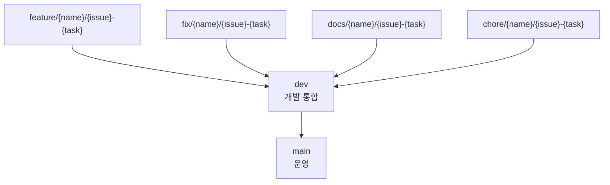

# 개발 가이드

이 문서는 로컬 개발, 코드 컨벤션, Git 흐름, 필수 체크를 한 곳에 모은다.

## 설치

```bash
pnpm install
```

`pnpm`이 PATH에 없으면 Corepack 또는 npm exec를 사용한다.

```bash
corepack enable
corepack prepare pnpm@11.8.0 --activate
```

```bash
npm exec --package=pnpm@11.8.0 -- pnpm install
```

## 실행

전체 개발 서버:

```bash
pnpm dev
```

웹 앱:

```bash
pnpm --filter @sketchcatch/web dev
```

웹 앱은 `http://localhost:3000`에서 실행된다.

API 앱:

```bash
pnpm --filter @sketchcatch/api dev
```

API 앱은 `http://localhost:4000`에서 실행된다.

```bash
curl http://localhost:4000/health
```

## 로컬 PostgreSQL

```bash
docker compose -f infra/local/docker-compose.yml up -d
```

API에서 DB가 필요한 엔드포인트를 실행하려면 `DATABASE_URL`을 설정한다.

```bash
pnpm --filter @sketchcatch/api db:generate
pnpm --filter @sketchcatch/api db:migrate
```

Project thumbnail과 API 경유 Terraform artifact upload는 local development와 test에서 기본적으로 filesystem을 사용한다. Browser는 storage provider와 관계없이 기존 same-origin `upload-content` endpoint에 PUT한다.

```text
PROJECT_ASSET_STORAGE_BACKEND=
PROJECT_ASSET_STORAGE_ROOT=.local-data/project-assets
```

`PROJECT_ASSET_STORAGE_BACKEND`를 비워 두면 `development`와 `test`는 `filesystem`, `production`은 `s3`를 선택한다. `PROJECT_ASSET_STORAGE_ROOT`가 상대 경로이면 API process의 `process.cwd()` 기준으로 해석하고, 절대 경로도 허용한다. 기본 root는 `<process.cwd()>/.local-data/project-assets`이며 Git에서 제외된다.

로컬에서 S3 동작을 명시적으로 확인할 때만 `PROJECT_ASSET_STORAGE_BACKEND=s3`와 `S3_BUCKET_NAME`을 함께 설정한다. `NODE_ENV=production`은 filesystem 설정을 거부하고 `S3_BUCKET_NAME`이 없는 경우 startup을 실패시킨다.

다른 AWS 연동 기능에는 다음 환경 변수가 필요할 수 있다.

```text
AWS_REGION=ap-northeast-2
S3_BUCKET_NAME=<bucket-name>
SKETCHCATCH_AWS_CALLER_PRINCIPAL_ARN=<SketchCatch backend IAM Role ARN>
SKETCHCATCH_PUBLIC_BASE_URL=<public SketchCatch API/web base URL>
CLOUDFORMATION_TEMPLATE_TOKEN_SECRET=<32자 이상 CloudFormation template URL 서명 secret>
```

## 루트 스크립트

- `pnpm dev`: Turborepo로 개발 서버 실행
- `pnpm build`: 전체 앱/패키지 빌드
- `pnpm lint`: 전체 린트
- `pnpm typecheck`: 전체 타입 체크
- `pnpm test`: 테스트 실행
- `pnpm format`: Prettier 포맷
- `pnpm docker:build`: 운영용 Docker image 로컬 빌드

## 코드 컨벤션

- 디렉터리와 패키지 이름은 `kebab-case`를 사용한다.
- React 컴포넌트와 TypeScript 타입은 `PascalCase`를 사용한다.
- 변수, 함수, 객체 필드는 `camelCase`를 사용한다.
- PostgreSQL 컬럼은 `snake_case`를 사용한다.
- TypeScript strict 설정을 유지한다.
- 공유 패키지 API는 명시적으로 export한 타입을 선호한다.
- 제품 요구가 확정되기 전에는 placeholder 타입을 작게 유지한다.

## 팀 AI 협업 절차

팀원이 모두 AI를 활용해 작업할 때 가장 큰 위험은 각 AI가 서로 다른 계약을 전제로 구현하는 것이다. 기능 구현 전 각 담당자는 아래 SSOT 순서를 따른다.

1. [문서 안내](./README.md)에서 작업에 필요한 canonical 문서를 확인한다.
2. [제품 방향](./product.md)에서 현재 MVP 목표와 기능 우선순위를 확인한다.
3. [데이터 모델](./data-models.md)에서 필요한 공유 타입, DTO, enum, status, id 필드를 확인한다.
4. `packages/types/src/index.ts`에 계약이 있는지 확인한다.
5. API가 필요하면 `apps/api`의 Zod schema와 route/service 경계를 확인한다.
6. 프론트 연결이 필요하면 `apps/web`에서 API 응답과 상태 이름을 shared type에 맞춘다.
7. 다른 팀원 기능을 입력으로 쓰는 경우, 그 팀원의 Codex에게 아래 형식으로 확인 질문을 보낸다.

```text
내가 소비할 계약:
- 입력:
- 출력:
- 참조할 id:
- 내가 만들지 않을 것:

확인해줄 것:
- 이 필드명/enum 값 그대로 써도 되는지
- 네 쪽에서 필수로 필요한 추가 필드가 있는지
- mock/fallback으로 먼저 붙여도 되는지
```

Codex 작업자는 아래 행동을 하지 않는다.

- 문서에 없는 `ResourceType`, status, category 문자열을 임의로 만들지 않는다.
- `ArchitectureJson`, `DiagramJson`과 별개의 보드 그래프 구조를 새로 만들지 않는다.
- 공통 API 응답 형식이 정해졌다고 가정하지 않는다. 코드에 없으면 팀장에게 확인한다.
- 다른 팀원이 맡은 실제 AWS apply, Terraform 실행, 인증/권한 저장을 자신의 구현에서 열지 않는다.
- "나중에 맞추면 됨"으로 shared type과 Zod schema 불일치를 방치하지 않는다.
- AI, Bedrock, Amazon Q, Voice Requirement Input 결과를 사용자 확인 없이 ?명봽???ㅺ퀎, IaC Preview, Git 변경, Deployment 실행에 반영하지 않는다.
- Representative Use Journey를 위해 실제 서비스 흐름과 다른 데모 전용 상태나 우회 API를 만들지 않는다.

## 역할별 SSOT 체크

| 담당 축 | 구현 전 확인할 SSOT | 특히 확인할 계약 |
| --- | --- | --- |
| `Requirement Input` + `AI Architecture Recommendation` + Bedrock/Amazon Q | `docs/product.md`, `docs/data-models.md`, `apps/api/AGENTS.md`, `apps/web/AGENTS.md` | `RequirementInput`, `ArchitectureDraft`, `LlmExplanation`, `UserAcceptedChange`, Voice Requirement Input 확인 흐름 |
| `Architecture Board` + `Infrastructure Graph` + `IaC Preview` | `docs/data-models.md`, `docs/architecture.md`, `apps/web/AGENTS.md`, `apps/api/AGENTS.md` | `DiagramJson`, `InfrastructureGraph`, `DiagramNode.parameters`, Terraform generate/validate/sync DTO |
| `Deployment` + `CI/CD Integration` + `Runtime Cache` | `docs/deployment.md`, `docs/data-models.md`, `docs/architecture.md`, `apps/api/AGENTS.md` | `Deployment`, `DeploymentLog`, `GitCicdHandoff`, approval, cleanup, Redis Runtime Cache |
| `Reverse Engineering` + `Cost Analysis` + `Deployment Safety Gate` | `docs/product.md`, `docs/data-models.md`, `docs/architecture.md`, `apps/api/AGENTS.md` | `ProviderAdapter`, `ReverseEngineeringScan`, `CheckFinding`, `CostAnalysis`, `DeploymentSafetyGate` |
| 팀장 | canonical 문서 전체 | DB schema, API 응답, shared type 충돌 조정 |

담당자별 문서는 참고 자료다. 공통 계약은 반드시 canonical 문서와 shared type에 반영한 뒤 구현한다.

## PR 체크리스트

PR 본문에는 아래 항목을 적는다.

PR 제목과 본문은 사용자가 다른 언어를 명시하지 않는 한 반드시 한글로 작성한다. PR 제목은 `타입: 제목` 형식을 사용한다. 이슈 번호는 필요한 경우에만 제목에 포함한다. 코드 식별자, 명령어, 파일 경로, API 경로, 패키지명은 원문 그대로 둔다.

- 변경한 기능이 [제품 방향](./product.md)의 어느 목표에 해당하는지
- 변경한 shared type, DTO, enum, DB schema가 있는지
- `docs/data-models.md` 또는 다른 canonical 문서 갱신이 필요한지
- 다른 담당자 기능과 연결되는 입력/출력 계약
- 실행한 체크: `pnpm lint`, `pnpm typecheck`, `pnpm build`
- 실제 AWS 리소스를 만들거나 삭제하는 경우 사용한 계정, region, cleanup 결과

## 환경 변수와 비밀값

- 로컬 기본값은 `.env.example`에만 둔다.
- `.env` 파일은 커밋하지 않는다.
- 로컬 AWS 개발은 가능하면 `AWS_PROFILE`을 사용한다.
- AWS access key, DB 비밀번호, private key는 저장소에 커밋하지 않는다.
- 비밀값이 실수로 커밋되면 즉시 제거하고 자격 증명을 교체한다.

## Git 흐름

기본 브랜치 흐름:



원칙:

- `main`은 운영 배포 브랜치다.
- `dev`는 개발 통합 브랜치다.
- 일반 작업은 항상 `dev`에서 분기한다.
- 작업 브랜치는 PR로 `dev`에 합친다.
- 배포 시점에만 `dev`에서 `main`으로 PR을 만든다.
- `main`, `dev` 직접 푸시는 금지한다.

작업 시작:

이슈 작업을 시작할 때는 GitHub issue의 `Development`에 브랜치가 연결되도록 `gh issue develop`을 사용한다. 팀원이 Codex에게 브랜치 생성을 맡길 때도 반드시 아래 흐름으로 요청한다.

```text
이슈 #번호 시작할 거야. gh issue develop으로 dev 기준 linked branch 만들어줘.
```

```bash
gh issue develop 12 \
  --repo NearthYou/SketchCatch \
  --name feature/sw/12-login \
  --base dev \
  --checkout
```

이슈 번호가 없으면 먼저 GitHub 이슈를 만든다. 예외적으로 초기 설정 작업처럼 이슈가 없는 경우에는 팀 합의 후 `0`을 사용할 수 있다.

```bash
git checkout dev
git pull origin dev
git checkout -b chore/sw/0-project-setup
```

GitHub Actions에서 만들 수도 있다. `Actions > Create Linked Issue Branch > Run workflow`를 실행하고 `issue_number`, 필요한 경우 `branch_name`, `base_branch`를 입력한다. 이 workflow도 내부에서 `gh issue develop`을 사용하므로 브랜치가 issue의 `Development`에 연결된다.

그냥 `git checkout -b`로 issue 브랜치를 만들면 Project 상태 자동화는 브랜치명에서 이슈 번호를 읽어 일부 동작할 수 있지만, GitHub `Development` 연결은 보장되지 않는다.

브랜치 이름:

```text
feature/{name}/{issue-number}-{task-name}
fix/{name}/{issue-number}-{task-name}
refactor/{name}/{issue-number}-{task-name}
docs/{name}/{issue-number}-{task-name}
chore/{name}/{issue-number}-{task-name}
hotfix/{name}/{issue-number}-{task-name}
```

커밋 메시지:

```text
Feat: 로그인 기능 구현
Fix: 토큰 만료 오류 수정
Refactor: UserService 구조 개선
Docs: README 수정
```

사용 가능한 타입:

- `Feat`
- `Fix`
- `Refactor`
- `Style`
- `Docs`
- `Chore`
- `Remove`
- `Init`

PR 제목:

PR 제목은 사용자가 다른 언어를 명시하지 않는 한 반드시 한글로 작성하고, `타입: 제목` 형식을 사용한다. 이슈 번호는 필요한 경우에만 포함한다.

```text
Feat: 로그인 기능 구현
Fix: 토큰 만료 오류 수정
Docs: README 수정
```

일반 작업 PR:

```text
base: dev
compare: feature/sw/12-login
```

배포 PR:

```text
base: main
compare: dev
```

## 필수 체크

PR 전 로컬에서 실행한다.

```bash
pnpm lint
pnpm typecheck
pnpm build
```

로컬에서 `pnpm`이 PATH에 없으면 다음 중 하나를 사용한다.

```bash
corepack pnpm lint
npm exec --package=pnpm@11.8.0 -- pnpm lint
```

## 브랜치 보호 권장 설정

`main` 권장 설정:

- 병합 전 PR을 필수로 설정한다.
- 승인 인원은 1명 이상으로 설정한다.
- 병합 전 상태 체크 통과를 필수로 설정한다.
- 필수 체크는 `checks`로 설정한다.
- 병합 전 대상 브랜치 최신화를 요구한다.
- 위 설정 우회를 허용하지 않는다.
- 브랜치 삭제를 제한한다.
- 강제 푸시를 차단한다.

`dev` 권장 설정:

- 병합 전 PR을 필수로 설정한다.
- 승인 인원은 1명 이상으로 설정한다.
- 병합 전 상태 체크 통과를 필수로 설정한다.
- 필수 체크는 `checks`로 설정한다.
- 강제 푸시를 차단한다.
- 브랜치 삭제를 제한한다.

## 예외 처리

긴급 운영 장애는 `hotfix/{name}/{issue}-{task}` 브랜치를 사용한다.

```text
hotfix/sw/42-nginx-healthcheck
```

hotfix도 가능하면 PR을 거친다. 정말로 직접 푸시가 필요하면 작업 후 반드시 팀에 사유와 변경 내용을 공유한다.
