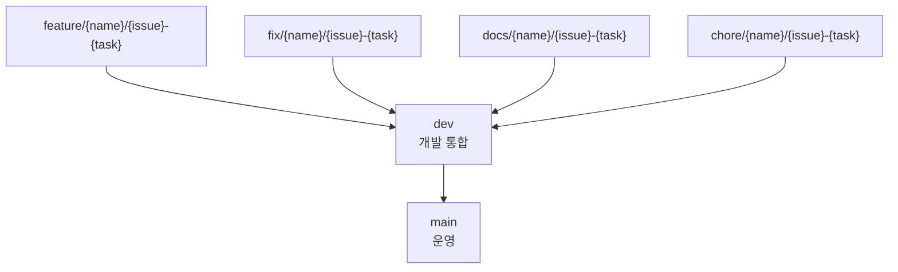

# 개발 가이드

이 문서는 로컬 개발, 코드 컨벤션, Git 흐름, 필수 체크를 한 곳에 모은다.

## 설치

```bash
pnpm install
```

`pnpm`이 PATH에 없으면 Corepack 또는 npm exec를 사용한다.

```bash
corepack enable
corepack prepare pnpm@11.8.0 --activate
```

```bash
npm exec --package=pnpm@11.8.0 -- pnpm install
```

## 실행

전체 개발 서버:

```bash
pnpm dev
```

웹 앱:

```bash
pnpm --filter @sketchcatch/web dev
```

웹 앱은 `http://localhost:3000`에서 실행된다.

API 앱:

```bash
pnpm --filter @sketchcatch/api dev
```

API 앱은 `http://localhost:4000`에서 실행된다.

```bash
curl http://localhost:4000/health
```

## 로컬 PostgreSQL

```bash
docker compose -f infra/local/docker-compose.yml up -d
```

API에서 DB가 필요한 엔드포인트를 실행하려면 `DATABASE_URL`을 설정한다.

```bash
pnpm --filter @sketchcatch/api db:generate
pnpm --filter @sketchcatch/api db:migrate
```

S3 presigned upload 기능은 다음 환경 변수가 필요하다.

```text
AWS_REGION=ap-northeast-2
S3_BUCKET_NAME=<bucket-name>
```

## 루트 스크립트

- `pnpm dev`: Turborepo로 개발 서버 실행
- `pnpm build`: 전체 앱/패키지 빌드
- `pnpm lint`: 전체 린트
- `pnpm typecheck`: 전체 타입 체크
- `pnpm test`: 테스트 실행
- `pnpm format`: Prettier 포맷
- `pnpm docker:build`: 운영용 Docker image 로컬 빌드

## 코드 컨벤션

- 디렉터리와 패키지 이름은 `kebab-case`를 사용한다.
- React 컴포넌트와 TypeScript 타입은 `PascalCase`를 사용한다.
- 변수, 함수, 객체 필드는 `camelCase`를 사용한다.
- PostgreSQL 컬럼은 `snake_case`를 사용한다.
- TypeScript strict 설정을 유지한다.
- 공유 패키지 API는 명시적으로 export한 타입을 선호한다.
- 제품 요구가 확정되기 전에는 placeholder 타입을 작게 유지한다.

## 환경 변수와 비밀값

- 로컬 기본값은 `.env.example`에만 둔다.
- `.env` 파일은 커밋하지 않는다.
- 로컬 AWS 개발은 가능하면 `AWS_PROFILE`을 사용한다.
- AWS access key, DB 비밀번호, private key는 저장소에 커밋하지 않는다.
- 비밀값이 실수로 커밋되면 즉시 제거하고 자격 증명을 교체한다.

## Git 흐름

기본 브랜치 흐름:



원칙:

- `main`은 운영 배포 브랜치다.
- `dev`는 개발 통합 브랜치다.
- 일반 작업은 항상 `dev`에서 분기한다.
- 작업 브랜치는 PR로 `dev`에 합친다.
- 배포 시점에만 `dev`에서 `main`으로 PR을 만든다.
- `main`, `dev` 직접 푸시는 금지한다.

작업 시작:

```bash
git checkout dev
git pull origin dev
git checkout -b feature/sw/12-login
```

이슈 번호가 없으면 먼저 GitHub 이슈를 만든다. 예외적으로 초기 설정 작업처럼 이슈가 없는 경우에는 팀 합의 후 `0`을 사용할 수 있다.

```bash
git checkout -b chore/sw/0-project-setup
```

브랜치 이름:

```text
feature/{name}/{issue-number}-{task-name}
fix/{name}/{issue-number}-{task-name}
refactor/{name}/{issue-number}-{task-name}
docs/{name}/{issue-number}-{task-name}
chore/{name}/{issue-number}-{task-name}
hotfix/{name}/{issue-number}-{task-name}
```

커밋 메시지:

```text
Feat: 로그인 기능 구현
Fix: 토큰 만료 오류 수정
Refactor: UserService 구조 개선
Docs: README 수정
```

사용 가능한 타입:

- `Feat`
- `Fix`
- `Refactor`
- `Style`
- `Docs`
- `Chore`
- `Remove`
- `Init`

PR 제목:

```text
[Feat] #12 로그인 기능 구현
[Fix] #21 토큰 만료 오류 수정
[Docs] #35 README 수정
```

일반 작업 PR:

```text
base: dev
compare: feature/sw/12-login
```

배포 PR:

```text
base: main
compare: dev
```

## 필수 체크

PR 전 로컬에서 실행한다.

```bash
pnpm lint
pnpm typecheck
pnpm build
```

로컬에서 `pnpm`이 PATH에 없으면 다음 중 하나를 사용한다.

```bash
corepack pnpm lint
npm exec --package=pnpm@11.8.0 -- pnpm lint
```

## 브랜치 보호 권장 설정

`main` 권장 설정:

- 병합 전 PR을 필수로 설정한다.
- 승인 인원은 1명 이상으로 설정한다.
- 병합 전 상태 체크 통과를 필수로 설정한다.
- 필수 체크는 `checks`로 설정한다.
- 병합 전 대상 브랜치 최신화를 요구한다.
- 위 설정 우회를 허용하지 않는다.
- 브랜치 삭제를 제한한다.
- 강제 푸시를 차단한다.

`dev` 권장 설정:

- 병합 전 PR을 필수로 설정한다.
- 승인 인원은 1명 이상으로 설정한다.
- 병합 전 상태 체크 통과를 필수로 설정한다.
- 필수 체크는 `checks`로 설정한다.
- 강제 푸시를 차단한다.
- 브랜치 삭제를 제한한다.

## 예외 처리

긴급 운영 장애는 `hotfix/{name}/{issue}-{task}` 브랜치를 사용한다.

```text
hotfix/sw/42-nginx-healthcheck
```

hotfix도 가능하면 PR을 거친다. 정말로 직접 푸시가 필요하면 작업 후 반드시 팀에 사유와 변경 내용을 공유한다.
