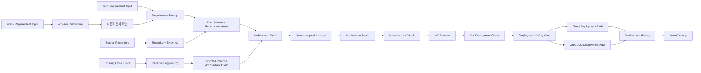

# 피치덱

# SketchCatch 상세 기획서

이 문서는 기획자와 개발자가 SketchCatch를 같은 서비스 단위로 이해하기 위한 상세 기획서다. `docs/product.md`, `docs/data-models.md`, `docs/architecture.md`, `docs/deployment.md`를 읽기 쉬운 실행 계획으로 풀어쓴 문서이며, 계약이 충돌하면 canonical 문서를 우선한다.

## 1. 서비스 정의

SketchCatch는 자연어/음성 요구사항, Source Repository, 기존 cloud state를 입력으로 받아 provider-neutral Practice Architecture를 만들고, 이를 Architecture Board, IaC Preview, Pre-Deployment Check, Direct Deployment Path, Git/CI/CD Deployment Path, Reverse Engineering, Deployment History, Auto Cleanup까지 연결하는 multi-cloud-ready IaC 운영 서비스다.

MVP 구현은 AWS-first, Terraform-first로 간다. 그러나 제품 설명과 도메인 모델은 AWS-only가 아니다. AWS는 첫 번째 Provider Adapter이며, Azure/GCP 같은 다른 provider는 같은 `Resource`, `Practice Architecture`, `InfrastructureGraph`, `Provider Adapter` 경계를 확장해 붙인다.

## 2. 문제 정의

SketchCatch가 해결하려는 문제는 "클라우드 다이어그램을 예쁘게 그리는 것"이 아니라, 사용자가 인프라 요구사항을 안전하게 운영 가능한 IaC 흐름으로 바꾸기 어렵다는 점이다.

| 문제 | 사용자에게 생기는 어려움 | SketchCatch의 해결 방향 |
| --- | --- | --- |
| 요구사항을 Resource 조합으로 바꾸기 어렵다 | "작은 웹 서비스 배포" 같은 말이 VPC, Subnet, EC2, S3, Security Group으로 어떻게 바뀌는지 모른다 | Requirement Prompt를 AI Architecture Recommendation으로 구조화하고 Architecture Draft로 제안한다 |
| 다이어그램과 Terraform이 따로 논다 | 화면에서 본 구조와 실제 배포 코드가 다를 수 있다 | Architecture Board, Infrastructure Graph, IaC Preview가 같은 Resource identity를 공유한다 |
| AI 자동화는 편하지만 위험하다 | 잘못된 설계가 조용히 반영되거나 바로 배포될 수 있다 | AI/Bedrock/Amazon Q는 제안과 설명만 하고, 상태 변경은 User-Accepted Change로 제한한다 |
| 실제 배포는 실패와 비용 사고가 무섭다 | Terraform apply 실패, public 접근, 남은 리소스 비용이 걱정된다 | Pre-Deployment Check, Deployment Safety Gate, 승인된 Plan, Deployment History, Auto Cleanup을 제공한다 |
| 기존 cloud state를 이해하기 어렵다 | 이미 만들어진 AWS 리소스가 어떤 서비스 구조인지 파악하기 어렵다 | Provider Adapter 기반 Reverse Engineering으로 Practice Architecture와 import suggestion을 만든다 |
| 팀 운영 흐름과 개인 실습 흐름이 다르다 | 빠른 검증은 직접 해보고 싶고, 운영 배포는 PR/CI/CD로 관리해야 한다 | Direct Deployment Path와 Git/CI/CD Deployment Path를 둘 다 제공한다 |

## 3. 대상 사용자

| 사용자 | 상황 | 핵심 가치 |
| --- | --- | --- |
| 애플리케이션 개발자 | 서비스 요구사항을 인프라 설계와 IaC로 빠르게 옮겨야 함 | 요구사항이 Resource와 Terraform으로 바뀌는 과정을 확인하고 안전하게 출발한다 |
| 백엔드 개발자 | 애플리케이션은 만들지만 인프라 경험이 부족함 | 배포 가능한 기본 구조를 빠르게 만들고 위험을 확인한다 |
| 사이드프로젝트 팀 | 인프라 전담자가 없고 비용에 민감함 | 저비용 구조를 만들고 실습 후 cleanup까지 확인한다 |
| 초기 스타트업 | MVP 출시를 위해 실용적인 인프라 초안이 필요함 | 설계, IaC, PR, 배포 기록을 한 흐름으로 관리한다 |
| 플랫폼/DevOps 엔지니어 | 기존 cloud state 분석, Terraform 전환, 운영 배포 흐름 정리가 필요함 | Reverse Engineering, import suggestion, Git/CI/CD handoff, 위험 요약을 한곳에서 확인한다 |
| 기술 리드/SRE | 팀원의 인프라 변경과 운영 위험을 검토해야 함 | 보안/비용/운영 위험과 승인 흐름을 확인한다 |

## 4. 현재 구현 상태

이 표는 2026-07-02 기준 repo에 구현되어 있거나 문서로 확정된 상태를 구분한다. "구현 기반 있음"은 코드/API/UI/테스트가 이미 존재하는 축이고, "확장 필요"는 상세 기획에는 포함하지만 추가 구현이 필요한 축이다.

| 영역 | 현재 상태 | 다음 구현 방향 |
| --- | --- | --- |
| 인증/사용자/프로젝트 | 회원가입, 로그인, OAuth, password reset, refresh token, 프로젝트 CRUD, project draft, asset upload 기반이 있다 | 프로젝트별 서비스 여정에서 Source Repository, Reverse Engineering, Git/CI/CD 상태를 연결한다 |
| Architecture Board | workspace, diagram editor, resource palette, parameter input, board draft 저장, resource metadata 기반이 있다 | AI 제안을 사용자가 확인한 뒤 보드에 반영하는 흐름을 더 명확히 만든다 |
| AI Architecture Recommendation | prompt 기반 Architecture Draft, public GitHub repository evidence 기반 draft, pre-deployment analysis, design simulation, Terraform error/preview explanation API가 있다 | Bedrock AI Layer와 Amazon Q Assistance를 추천/검토/설명 계층으로 붙인다 |
| Terraform/IaC Preview | `DiagramJson -> Terraform`, 정적 diagnostics, `Terraform -> DiagramJson` sync API가 있다 | Infrastructure Graph 경계를 더 선명하게 하고 provider-neutral 확장성을 유지한다 |
| AWS 연결 | AWS Role 연결 metadata, CloudFormation template/Quick Create URL, STS 검증 흐름이 있다 | Git/CI/CD와 Reverse Engineering에서도 Provider Adapter credential 경계로 재사용한다 |
| Direct Deployment Path | Deployment 생성, init, plan, approval, apply, destroy plan, destroy, cancel, logs, log stream, outputs, deployed resources, retention 기반이 있다 | High Security Risk gate와 Cost Risk gate를 Deployment 승인 화면에 더 강하게 연결한다 |
| Pre-Deployment Check | AI/rule 기반 비용, 보안, 설정 finding과 checklist 기반이 있다 | High는 차단, Medium/Low는 경고/명시 승인으로 정책을 고정한다 |
| Git/CI/CD Deployment Path | 제품 방향과 데이터 모델이 확정되어 있다 | Source Repository 연결, Terraform PR 생성, pipeline template/status tracking, handoff record를 구현한다 |
| Reverse Engineering | Provider Adapter 기반 방향과 데이터 모델이 확정되어 있다 | AWS adapter부터 기존 Resource scan, Practice Architecture 복원, import suggestion을 구현한다 |
| Voice Requirement Input | 제품 결정이 확정되어 있다 | Amazon Transcribe로 전사하고, 사용자 확인 후 Requirement Prompt로 확정하는 UI/API를 구현한다 |
| Bedrock/Amazon Q | 제품 결정이 확정되어 있다 | Bedrock은 추천/검토/Guardrails/추론 계층, Amazon Q는 AWS 특화 설명/검토 보조로 연결한다 |
| Redis Runtime Cache | 내부 인프라 역할이 확정되어 있다 | Deployment, Reverse Engineering, Git/CI/CD 상태 추적과 로그 streaming 보조에 사용한다 |

## 5. 제품 원칙

1. SketchCatch는 IaC 운영 서비스다. 시각화는 핵심 화면이지만 제품의 끝이 아니다.
2. 모든 상태 변경은 User-Accepted Change여야 한다.
3. AI, Bedrock, Amazon Q, Voice Requirement Input은 추천/설명/검토 계층이다. 보드 수정, Git 변경, Deployment 실행을 자동 확정하지 않는다.
4. Voice Requirement Input은 Amazon Transcribe로 전사하고, 사용자가 확인한 텍스트만 Requirement Prompt가 된다.
5. Direct Deployment Path와 Git/CI/CD Deployment Path는 선택지 경쟁이 아니라 다른 사용 맥락이다.
6. Reverse Engineering은 provider-adapter 기반이다. MVP는 AWS adapter부터 구현하지만 개념은 AWS resource list가 아니다.
7. Redis는 내부 Runtime Cache다. 사용자 Practice Architecture Resource로 제공하지 않는다.
8. 실시간 공동 편집은 MVP 범위에서 제외한다.
9. 날짜별 목표 대신 서비스 역량 단위로 우선순위를 잡는다.

## 6. 핵심 서비스 여정

이 여정은 발표용 데모 스크립트가 아니라 실제 서비스가 만족해야 하는 대표 사용 흐름이다. 발표나 리허설에서는 Representative Use Journey로 이 흐름을 검증하되, 데모 전용 기능을 따로 만들지 않는다.

## 7. 기능 요구사항

### 7.1 Requirement Input

| 항목 | 기획 의도 | 개발 기준 | 완료 기준 |
| --- | --- | --- | --- |
| 텍스트 입력 | 사용자가 "Node.js API 서버와 저렴한 DB가 필요해"처럼 말하면 설계 시작점이 된다 | `RequirementInput.mode = "text"`로 받고 `RequirementPrompt`로 정규화한다 | 빈 입력, 모호한 입력, 비용/보안 조건을 구분해 안내한다 |
| 음성 입력 | 사용자가 타이핑 없이 요구사항을 말할 수 있다 | Amazon Transcribe로 음성을 전사하고 transcript를 사용자에게 보여준다 | 전사 결과를 수정/확정해야만 Requirement Prompt가 생성된다 |
| 입력 확정 | AI가 바로 보드를 바꾸지 못하게 한다 | `confirmedByUser` 또는 User-Accepted Change 기록을 남긴다 | 확정 전에는 Architecture Board, IaC Preview, Deployment 상태가 바뀌지 않는다 |

### 7.2 AI Architecture Recommendation

| 항목 | 기획 의도 | 개발 기준 | 완료 기준 |
| --- | --- | --- | --- |
| Architecture Draft 생성 | 자연어를 Resource와 관계로 구조화한다 | `ArchitectureJson` 또는 `DiagramJson` 변환 가능한 draft를 만든다 | 사용자는 draft 제목, 설명, 가정, trade-off를 확인할 수 있다 |
| Bedrock AI Layer | 추천/검토/Guardrails/추론을 managed AI 계층으로 분리한다 | Bedrock 호출 실패 시 deterministic fallback이 있어야 한다 | 실패해도 사용자는 rule 기반 결과와 fallback reason을 본다 |
| Amazon Q Assistance | AWS-first MVP에서 AWS 특화 설명과 Well-Architected 검토를 강화한다 | Amazon Q 결과는 설명/검토/해석으로만 사용한다 | Amazon Q가 만든 제안은 사용자 수락 전 상태를 바꾸지 않는다 |
| Architecture Suggestion | Check Finding에 대한 수정 제안을 보여준다 | `ArchitectureSuggestion`은 action, target, expected impact를 가진다 | 사용자는 제안을 적용/무시할 수 있고 자동 적용은 없다 |

### 7.3 Source Repository 입력

| 항목 | 기획 의도 | 개발 기준 | 완료 기준 |
| --- | --- | --- | --- |
| Repository evidence | 기존 애플리케이션 코드를 근거로 설계를 추천한다 | README, package metadata, Dockerfile 등 제한된 evidence를 추출한다 | evidence 출처와 해석 가정을 사용자에게 보여준다 |
| Git Integration | IaC 변경을 팀의 Source Repository로 보낸다 | repository 연결 metadata와 권한 경계를 분리한다 | token/secret 원문을 DB, 로그, shared type에 저장하지 않는다 |
| Git/CI/CD handoff | 운영 배포는 PR과 pipeline으로 검토한다 | Terraform artifact, PR URL, pipeline run URL, status를 `GitCicdHandoff`로 기록한다 | 사용자는 PR 생성, pipeline 상태, 실패 원인을 SketchCatch에서 확인한다 |

### 7.4 Architecture Board

| 항목 | 기획 의도 | 개발 기준 | 완료 기준 |
| --- | --- | --- | --- |
| Resource 편집 | 사용자가 AI 초안을 직접 조정한다 | `DiagramJson.nodes`, `DiagramJson.edges`, `node.parameters`를 저장한다 | Resource 추가/삭제/이동/설정 변경이 draft 저장과 Terraform 생성에 반영된다 |
| Provider-neutral 표현 | AWS-first 구현이어도 제품 모델은 멀티 클라우드로 확장된다 | `Resource`와 `InfrastructureGraph`는 provider-neutral 개념으로 유지한다 | AWS-only 문자열을 공통 모델에 무분별하게 추가하지 않는다 |
| User-Accepted Change | AI 제안이 보드를 조용히 바꾸지 않는다 | draft 적용, suggestion 적용, Git handoff, Deployment action마다 승인 지점을 둔다 | 사용자는 "무엇이 바뀌는지" 확인하고 수락해야 한다 |

### 7.5 IaC Preview

| 항목 | 기획 의도 | 개발 기준 | 완료 기준 |
| --- | --- | --- | --- |
| Terraform 생성 | 보드 설계를 배포 가능한 IaC로 전환한다 | `DiagramJson -> InfrastructureGraph -> Terraform` 흐름을 유지한다 | Terraform code preview와 diagnostics를 함께 보여준다 |
| Terraform 역동기화 | 사용자가 Terraform을 수정했을 때 보드와 동기화한다 | 안전하게 해석 가능한 HCL subset만 `DiagramJson`에 반영한다 | 해석 불가능한 block은 보드 변경 없이 diagnostic으로 반환한다 |
| Artifact 저장 | 배포 기준 코드를 안정적으로 보관한다 | Terraform 파일은 S3, metadata는 RDS에 저장한다 | Deployment 승인 시 artifact hash를 고정해 plan/apply 불일치를 막는다 |

### 7.6 Pre-Deployment Check와 Deployment Safety Gate

| 위험 수준 | 정책 | 예시 |
| --- | --- | --- |
| High | 기본 차단한다 | public RDS, Redis public 접근, SSH `0.0.0.0/0`, S3 public access, 과도한 IAM 권한, 승인 없는 destroy/apply |
| Medium | Check Finding과 Architecture Suggestion으로 보여주고 명시 승인 시 진행 가능 | 단일 AZ 구성, 비용 증가 가능성이 큰 instance type, 불명확한 backup 설정 |
| Low | 정보성 경고와 개선 제안으로 보여준다 | naming convention, tag 누락, minor cost note |

High Security Risk는 Deployment Safety Gate에서 막는다. Medium/Low는 사용자가 이해하고 명시적으로 승인하면 진행할 수 있다. 단, "사용자 승인"은 단순 페이지 방문이 아니라 어떤 finding을 알고 진행하는지 기록 가능한 행위여야 한다.

여기서 Redis public 접근은 SketchCatch 내부 Runtime Cache 또는 향후 provider-managed cache가 외부에 노출되는 위험을 뜻한다. MVP에서 Redis를 사용자가 보드에 올리는 Practice Architecture Resource로 제공한다는 의미가 아니다.

### 7.7 Direct Deployment Path

Direct Deployment Path는 빠른 검증, sandbox, practice run을 위해 SketchCatch가 Terraform 실행을 관리하는 경로다.

| 단계 | 사용자 경험 | 개발 기준 |
| --- | --- | --- |
| AWS 연결 선택 | 검증된 AWS account/region을 선택한다 | `AwsConnection` metadata만 저장하고 credential 원문은 저장하지 않는다 |
| Deployment 생성 | 현재 Architecture와 Terraform artifact로 실행 단위를 만든다 | 한 프로젝트에 동시에 하나의 `RUNNING` Deployment만 허용한다 |
| Init/Plan | Terraform 실행 전 변경 요약을 만든다 | `tfplan`은 S3에 저장하고 Plan summary는 RDS에 저장한다 |
| Approval | 계정, region, 변경 수, 위험 요약을 확인한다 | 승인 시 artifact hash, tfplan hash, account, region을 고정한다 |
| Apply | 승인된 plan만 실제 실행한다 | 승인 snapshot과 현재 값이 다르면 실행하지 않는다 |
| Logs/Outputs | 실행 상태, 로그, output, 생성 리소스를 확인한다 | sensitive output과 credential은 응답/로그에서 마스킹한다 |
| Cleanup | 생성 리소스를 정리한다 | destroy도 `plan -destroy -> 승인 -> destroy apply` 순서만 허용한다 |

MVP live apply 기본 범위는 VPC, Public Subnet, Internet Gateway, Route Table, Security Group, EC2, S3 Bucket으로 제한한다. RDS처럼 생성/삭제 시간과 비용 리스크가 큰 Resource는 기본 live apply에서 제외할 수 있다.

### 7.8 Git/CI/CD Deployment Path

Git/CI/CD Deployment Path는 운영 배포와 팀 리뷰를 위한 경로다. SketchCatch는 IaC Preview를 Source Repository에 넘기고, 외부 pipeline 상태를 추적한다.

| 기능 | 기획 의도 | 개발 기준 | 완료 기준 |
| --- | --- | --- | --- |
| Terraform PR 생성 | 인프라 변경을 코드 리뷰 대상으로 만든다 | Terraform artifact를 branch/commit/PR로 handoff한다 | PR에는 IaC Preview, Plan summary, Pre-Deployment Check, Cost Analysis 요약이 연결된다 |
| Pipeline template | 팀이 바로 CI/CD를 구성할 수 있게 한다 | provider와 repository에 맞는 template을 생성한다 | template에는 plan, policy check, approval, apply job 경계가 보인다 |
| Pipeline status tracking | SketchCatch에서도 운영 진행 상태를 본다 | external pipeline run URL과 status를 polling/cache한다 | 상태는 Runtime Cache로 빠르게 보여주되 최종 기록은 RDS에 남긴다 |
| 권한 경계 | Git token과 CI secret 사고를 막는다 | secret 원문은 저장/로그/응답하지 않는다 | 권한 실패는 사용자에게 수정 가능한 메시지로 보여준다 |

### 7.9 Reverse Engineering

Reverse Engineering은 기존 cloud state를 읽어 Practice Architecture로 복원하고 IaC 전환 경로를 제안하는 기능이다.

| 기능 | 기획 의도 | 개발 기준 | 완료 기준 |
| --- | --- | --- | --- |
| Provider Adapter scan | 어떤 provider든 같은 제품 모델로 복원할 수 있게 한다 | MVP는 AWS adapter부터 구현하고 provider별 API 차이는 adapter에 둔다 | scan 결과는 `ReverseEngineeringScan` status로 추적된다 |
| Practice Architecture 복원 | resource list가 아니라 서비스 구조를 만든다 | resource identity, relationship, region, dependency를 그래프로 변환한다 | 사용자는 복원된 Architecture Draft를 확인한 뒤 보드에 반영한다 |
| Import suggestion | 기존 리소스를 Terraform 관리 대상으로 전환하는 길을 보여준다 | Terraform import 후보와 위험을 제안한다 | import suggestion은 사용자 확인 전 기존 프로젝트 상태를 덮어쓰지 않는다 |
| Multi-cloud readiness | AWS 이후 Azure/GCP를 확장할 수 있어야 한다 | 공통 모델은 provider-neutral, provider 특화 값은 adapter-local로 둔다 | 새 provider 추가 시 shared type/API/UI 확장 지점을 문서화한다 |

### 7.10 Cost Analysis

Cost Analysis는 단순 가격표가 아니라 Cost Risk 관리 기능이다.

| 시점 | 보여줄 것 |
| --- | --- |
| Practice Architecture | 선택한 Resource 조합의 월 비용 추정, 비용 drivers, 과한 Resource 경고 |
| IaC Preview | Terraform resource 변경으로 인한 비용 변화 가능성 |
| Deployment Plan | 생성/변경/삭제 대상 기준 비용 위험 |
| Deployment History | 실제 생성된 리소스와 cleanup 상태 기반 잔여 비용 위험 |

### 7.11 Runtime Cache

Redis Runtime Cache는 내부 인프라다. 사용자가 보드에 추가하는 Redis Resource가 아니며, `ResourceType`에 Redis를 넣지 않는다.

우선순위는 아래와 같다.

1. Deployment job status, log streaming, polling 부담 완화
2. Reverse Engineering scan status와 중간 결과 cache
3. Git/CI/CD pipeline status polling/cache
4. AI result cache는 2순위이며 deterministic validation과 safety gate를 대체하지 않는다

Runtime Cache 데이터는 짧은 TTL을 가진 보조 상태다. 최종 기록은 RDS/S3에 남긴다.

## 8. 화면 요구사항

| 화면/패널 | 사용자 목적 | 핵심 상태 |
| --- | --- | --- |
| Project 목록/상세 | 작업할 Practice Architecture를 찾고 생성한다 | 프로젝트, 최신 draft, 최근 Deployment 상태 |
| Workspace Start | 텍스트/음성/Source Repository/Reverse Engineering 중 시작 방식을 고른다 | 입력 방식, 확인 상태 |
| Architecture Board | Resource와 관계를 보고 수정한다 | `DiagramJson`, selection, parameters, save status |
| AI Panel | Architecture Draft, Suggestion, 설명을 검토한다 | draft result, LLM explanation, stale state |
| Terraform Preview | 생성된 Terraform과 diagnostics를 확인한다 | terraformCode, diagnostics, sync result |
| Pre-Deployment Check | 비용/보안/설정 위험을 확인한다 | `CheckFinding`, checklist, suggestions |
| Deployment Panel | Direct Deployment Path를 실행하고 기록을 확인한다 | Deployment, plan summary, approval state, logs, resources, outputs |
| Git/CI/CD Panel | PR과 pipeline 상태를 본다 | GitCicdHandoff, PR URL, pipeline status |
| Reverse Engineering Panel | 기존 cloud state scan과 복원 결과를 본다 | ReverseEngineeringScan, imported draft, import suggestions |

## 9. API/데이터 계약 요약

상세 필드명은 `docs/data-models.md`와 `packages/types/src/index.ts`를 따른다.

| 계약 | 책임 |
| --- | --- |
| `RequirementInput` | 텍스트/음성 입력과 사용자 확인 여부 |
| `ArchitectureJson` | 저장된 Practice Architecture의 도메인 그래프 |
| `DiagramJson` | Architecture Board 편집 상태와 Terraform 변환 입력 |
| `InfrastructureGraph` | Board와 Terraform 사이의 정규화된 중간 그래프 |
| `AiArchitectureDraftResult` | AI가 제안한 미확정 Architecture Draft |
| `CheckFinding` | 비용/보안/설정/권한/성능/가용성 단일 finding |
| `ArchitectureSuggestion` | finding에 대한 미적용 수정 제안 |
| `TerraformArtifact` | S3에 저장된 Terraform 파일 metadata |
| `Deployment` | 승인된 Terraform 실행 단위 |
| `DeploymentPlanArtifact` | 승인 가능한 `tfplan` metadata |
| `GitCicdHandoff` | Source Repository PR과 external pipeline handoff 기록 |
| `ReverseEngineeringScan` | Provider Adapter scan 작업과 결과 metadata |

## 10. 4인 책임 분배

역할은 사람 이름보다 책임 축을 기준으로 나눈다. 각 인원은 AI를 적극 활용하되, 공통 계약은 문서와 shared type에 먼저 반영한다.

| 축 | 책임 | 주요 산출물 | 맞물리는 계약 |
| --- | --- | --- | --- |
| 1. Requirement Input + AI Architecture Recommendation + Bedrock/Amazon Q | 텍스트/음성 요구사항, Transcribe 확인, Bedrock/Q 기반 추천/설명/Guardrails | Requirement Prompt, Architecture Draft, LLM explanation, Architecture Suggestion | `RequirementInput`, `AiArchitectureDraftResult`, `CheckFinding`, `ArchitectureSuggestion` |
| 2. Architecture Board + Infrastructure Graph + IaC Preview | 보드 편집, Resource parameter, Diagram/Terraform 동기화, Terraform Preview | Board UI, `DiagramJson`, `InfrastructureGraph`, Terraform generator/sync | `DiagramJson`, `InfrastructureGraph`, `TerraformDiagnostic`, `TerraformArtifact` |
| 3. Deployment + Git/CI/CD Integration + Runtime Cache | Direct Deployment, Git handoff, pipeline status, Redis Runtime Cache | Deployment API/UI, PR handoff, pipeline tracker, log/status streaming | `Deployment`, `DeploymentPlanArtifact`, `DeploymentLog`, `GitCicdHandoff` |
| 4. Reverse Engineering + Cost Analysis + Deployment Safety Gate | Provider Adapter scan, Cost Risk, Security Risk, safety blocking | Reverse scan API/UI, cost cards, high-risk blocker, import suggestion | `ProviderAdapter`, `ReverseEngineeringScan`, `CheckFinding`, `DeploymentSafetyGate` |

파트 간 handoff 기준:

- AI 파트가 만든 draft는 Board 파트가 소비할 수 있는 `ArchitectureJson` 또는 `DiagramJson` 변환 가능한 구조여야 한다.
- Board 파트가 만든 Terraform artifact는 Deployment 파트가 hash와 S3 metadata로 고정할 수 있어야 한다.
- Safety/Cost 파트의 finding은 Deployment approval 화면에서 차단/경고 정책으로 연결되어야 한다.
- Git/CI/CD와 Reverse Engineering은 모두 provider credential과 secret을 UI에 노출하지 않아야 한다.

## 11. Representative Use Journey

이 여정은 서비스 검증용 대표 흐름이다. 데모에 집착하기 위한 스크립트가 아니라, SketchCatch가 실제 서비스로서 이어져야 하는 최소 happy path와 safety path를 보여준다.

1. 사용자가 로그인하고 새 프로젝트를 만든다.
2. 사용자가 텍스트 또는 음성으로 "저비용 Node.js API 서버를 배포하고, 정적 파일은 S3에 두고, SSH는 제한하고 싶다"라고 입력한다.
3. 음성 입력이면 Amazon Transcribe 결과를 보여주고 사용자가 수정/확정한다.
4. Bedrock AI Layer와 Amazon Q Assistance가 Architecture Draft, 가정, 보안/비용 trade-off를 설명한다.
5. 사용자가 Architecture Draft를 확인하고 Architecture Board에 반영한다.
6. 사용자가 보드에서 VPC, Public Subnet, Security Group, EC2, S3 설정을 수정한다.
7. SketchCatch가 IaC Preview를 생성하고 Terraform diagnostics를 보여준다.
8. Pre-Deployment Check가 Cost Risk와 Security Risk를 보여준다.
9. SSH `0.0.0.0/0` 같은 High Security Risk가 있으면 Deployment Safety Gate가 차단한다.
10. 사용자가 수정하거나 Medium/Low finding을 명시 승인한다.
11. Direct Deployment Path에서는 검증된 AWS 연결을 선택하고 Plan을 실행한다.
12. 사용자가 Plan summary, account, region, cost/security summary를 확인하고 승인한다.
13. SketchCatch가 승인된 `tfplan`만 Apply하고 로그, outputs, 생성 리소스를 Deployment History에 남긴다.
14. 실습이 끝나면 Destroy Plan을 만들고 사용자가 승인한 뒤 Auto Cleanup을 실행한다.
15. 운영 경로가 필요한 경우 Git/CI/CD Deployment Path로 Terraform PR과 pipeline handoff를 만든다.
16. 기존 cloud state에서 시작하는 경우 Reverse Engineering scan으로 Practice Architecture와 import suggestion을 만든다.

## 12. 보안/운영 정책

- 실제 Terraform apply/destroy는 사용자 승인 없이는 실행하지 않는다.
- `terraform apply`는 항상 `terraform plan -out=tfplan`과 승인 snapshot을 거친다.
- 승인 시점의 Terraform artifact hash, `tfplan` hash, AWS account, region이 Apply 직전 값과 다르면 실행하지 않는다.
- `destroy`도 `plan -destroy -> 사용자 승인 -> 승인된 destroy tfplan apply`만 허용한다.
- High Security Risk는 기본 차단한다.
- Medium/Low risk는 finding과 suggestion으로 보여주고 사용자가 명시 승인하면 진행한다.
- AWS credential, Git token, CI secret, DB password, sensitive output은 DB/shared type/log/API 응답에 저장하지 않는다.
- 프론트엔드는 AWS SDK, Terraform CLI, deployment mutation logic을 직접 실행하지 않는다.
- 서버 재시작 후 남은 running workflow는 RDS/S3 원천 기록을 기준으로 복구하거나 실패 처리한다.
- Redis Runtime Cache가 비어도 최종 기록은 RDS/S3에서 복구 가능해야 한다.

## 13. 비지원 범위

MVP에서 하지 않는다.

- 실시간 공동 편집
- CloudFormation을 기본 IaC target으로 사용하는 것
- Azure/GCP 실제 배포
- Azure/GCP 실제 Reverse Engineering
- AI가 만든 변경의 무승인 보드 반영
- 음성 입력의 무확인 보드 수정 또는 Deployment 실행
- 승인 없는 Terraform apply/destroy
- Redis를 사용자 Practice Architecture Resource로 제공
- 정교한 부하 테스트/트래픽 시뮬레이터
- 템플릿 마켓플레이스
- 운영 조직 정책을 우회하는 자동 apply

## 14. 성공 기준

| 기준 | 성공 신호 |
| --- | --- |
| 서비스 흐름 | Requirement Input, Source Repository, Reverse Engineering 중 하나에서 시작해 Practice Architecture, IaC Preview, Pre-Deployment Check, 실행/hand off까지 이어진다 |
| 안전성 | High Security Risk가 실제 Deployment 전에 차단된다 |
| 신뢰성 | 승인한 Plan과 Apply 대상이 hash/account/region 기준으로 일치한다 |
| 운영성 | Deployment History에서 로그, outputs, 생성 리소스, cleanup 상태를 확인할 수 있다 |
| 확장성 | AWS-first 구현이어도 Provider Adapter 경계가 유지된다 |
| 협업성 | Git/CI/CD Path에서 PR과 pipeline 상태를 서비스 안에서 추적할 수 있다 |
| 학습성 | 사용자는 AI 설명, Q/Bedrock reasoning, Terraform Preview를 통해 왜 이런 Resource가 필요한지 이해한다 |

## 15. 검증 전략

가장 높은 검증 seam은 Representative Use Journey smoke다. 실제 AWS apply/destroy는 사용자 승인과 cleanup plan 없이는 실행하지 않는다.

| 검증 대상 | 방식 |
| --- | --- |
| Requirement Input | 텍스트/음성 전사 확인, 사용자 확정 전 상태 변경 없음 |
| AI Recommendation | deterministic fallback, LLM explanation fallback, guardrail warning |
| Board/IaC | `DiagramJson -> Terraform`, diagnostics, Terraform sync |
| Safety Gate | High risk block, Medium/Low acknowledgement |
| Deployment | init/plan/approve/apply/destroy/cancel/log stream API 테스트 |
| Git/CI/CD | PR handoff record, pipeline status polling/cache, secret masking |
| Reverse Engineering | Provider Adapter fixture scan, imported draft, import suggestion |
| Runtime Cache | Redis 장애 시 RDS/S3 기록으로 복구 가능한지 확인 |

## 16. 주요 리스크와 대응

| 리스크 | 영향 | 대응 |
| --- | --- | --- |
| AI 추천 부정확 | 잘못된 Resource 조합 | Golden Path, deterministic fallback, 사용자 승인 |
| 음성 전사 오류 | 다른 요구사항으로 설계될 수 있음 | transcript 확인/수정/확정 필수 |
| Terraform 생성 오류 | Plan/Apply 실패 | diagnostics, validate, Terraform error explanation |
| 비용 사고 | 실습 리소스 방치 | Cost Risk, live apply whitelist, Auto Cleanup |
| 보안 사고 | public access, 과도한 IAM | High risk block, medium/low acknowledgement |
| Git 권한 오남용 | Source Repository secret 노출 | token 원문 저장 금지, 최소 권한, log masking |
| Reverse Engineering 오해석 | 기존 cloud state와 설계 불일치 | adapter 범위 명시, import suggestion 사용자 확인 |
| Redis 의존성 과다 | cache 장애 시 상태 손실 | Runtime Cache는 보조 계층, 최종 기록은 RDS/S3 |
| AWS-only로 오해 | 멀티 클라우드 확장성 약화 | Provider Adapter와 provider-neutral 용어 유지 |

## 17. 개발자가 바로 잡아야 할 구현 순서

날짜별 목표는 두지 않는다. 대신 서비스가 끊기지 않는 순서로 구현한다.

1. 현재 구현된 Board, AI, Terraform Preview, Deployment Path를 하나의 Representative Use Journey로 묶는다.
2. Pre-Deployment Check의 High/Medium/Low 정책을 Deployment approval과 연결한다.
3. Voice Requirement Input을 Amazon Transcribe 확인 흐름으로 추가한다.
4. Bedrock AI Layer와 Amazon Q Assistance를 기존 LLM explanation/AI service 경계에 붙인다.
5. Redis Runtime Cache를 Deployment log/status streaming부터 도입한다.
6. Git/CI/CD Handoff를 Source Repository, PR, pipeline status 단위로 구현한다.
7. Reverse Engineering은 AWS Provider Adapter fixture scan부터 시작해 실제 scan으로 확장한다.
8. Cost Analysis를 Architecture, IaC Preview, Plan, History 단계에 연결한다.
9. Provider Adapter 계약을 문서/타입/API/UI에 맞춰 Azure/GCP 확장 지점을 남긴다.