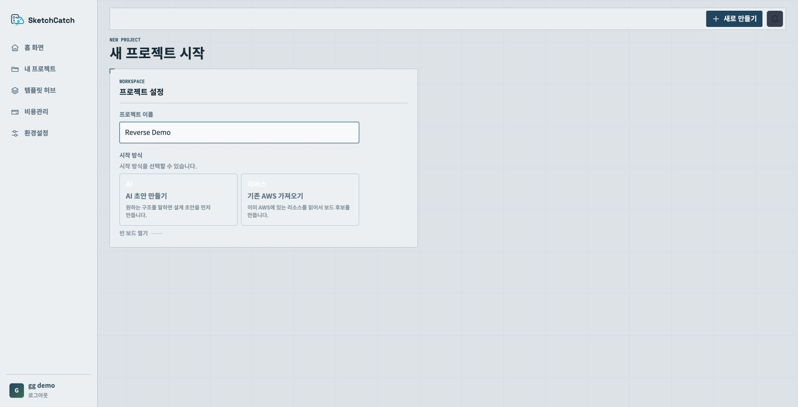
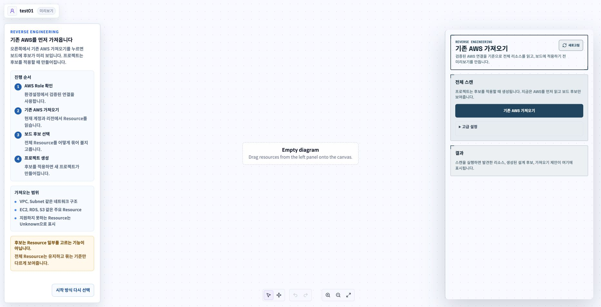
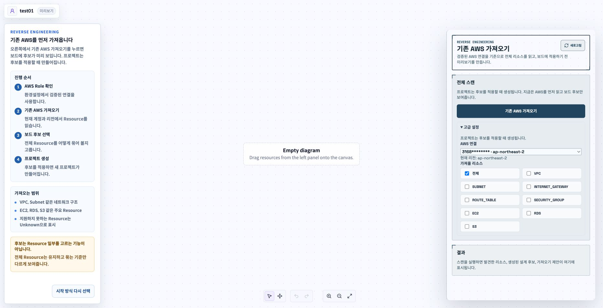
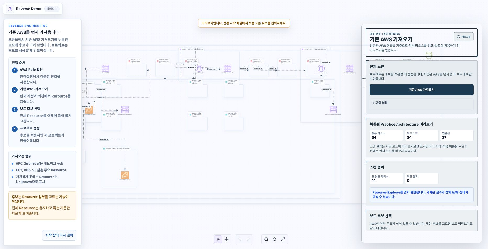
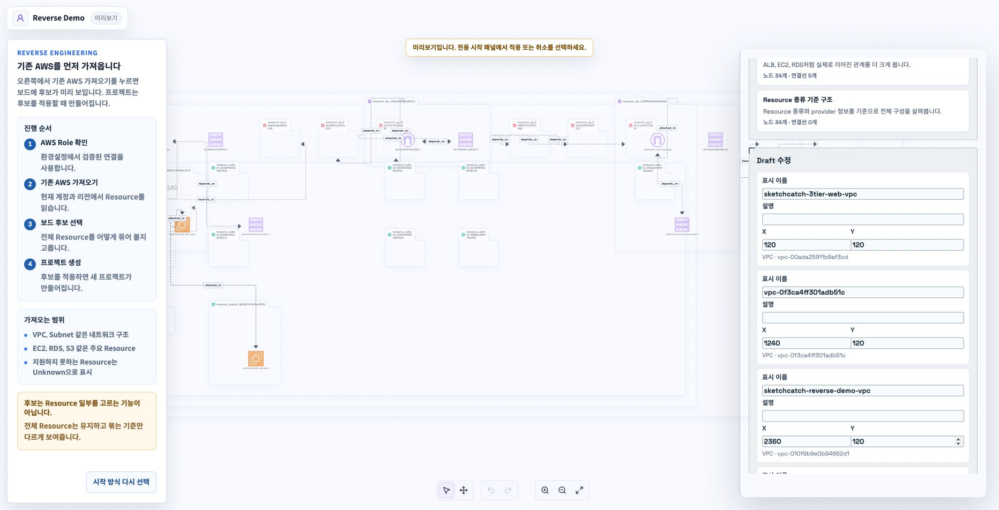
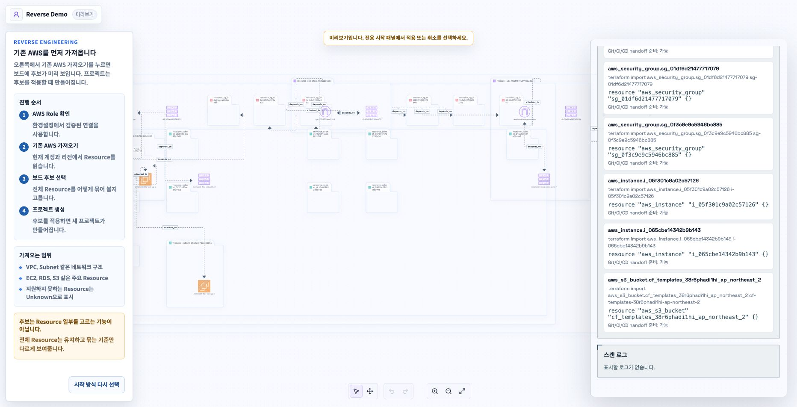

# Reverse 가져오기 화면 기능 설명

이 문서는 `feat/gg/202-reverse-entry-ux` 브랜치에서 프론트 화면에 추가된 기능을 설명합니다.

쉽게 말하면 이 브랜치는 **기존 AWS를 읽어와서 바로 프로젝트로 저장하지 않고, 먼저 보드 후보로 확인하는 화면**을 만든 작업입니다.

## 1. 새 프로젝트 시작에서 Reverse 선택

새 프로젝트를 만들 때 시작 방식을 고를 수 있습니다.

프로젝트 이름을 입력하면 두 가지 시작 방식이 보입니다.

- `AI 초안 만들기`
- `기존 AWS 가져오기`

`기존 AWS 가져오기`를 고르면 새 프로젝트를 바로 만들지 않고, Reverse 전용 화면으로 이동합니다.

이 화면의 의미는 간단합니다.

기존에는 새 프로젝트를 만들고 나서 작업을 시작하는 느낌이었다면, 이제는 **기존 AWS를 먼저 읽고, 마음에 드는 후보를 고른 뒤 프로젝트를 만드는 흐름**이 생겼습니다.

## 2. Reverse 전용 시작 화면

`기존 AWS 가져오기`로 들어오면 일반 Workspace 오른쪽 패널이 아니라, Reverse 전용 화면이 열립니다.

왼쪽에는 사용자가 지금 뭘 해야 하는지 설명하는 안내 패널이 있습니다.
가운데는 아직 비어 있는 보드입니다.
오른쪽에는 AWS를 읽어오는 패널이 있습니다.

여기서 중요한 점은 이겁니다.

아직 프로젝트가 저장된 상태가 아닙니다.

오른쪽에서 `기존 AWS 가져오기`를 눌러도 바로 프로젝트가 만들어지는 게 아니라, 먼저 미리보기 후보만 보입니다.

## 3. 왼쪽 안내 패널

왼쪽 패널은 사용자가 헷갈리지 않도록 Reverse 흐름을 설명합니다.

흐름은 이렇게 보입니다.

1. AWS Role 확인
2. 기존 AWS 가져오기
3. 보드 후보 선택
4. 프로젝트 생성

또 가져오는 범위도 같이 알려줍니다.

- VPC, Subnet 같은 네트워크 구조
- EC2, RDS, S3 같은 주요 리소스
- 아직 지원하지 못하는 리소스는 Unknown으로 표시

그리고 중요한 문장도 들어갔습니다.

**후보는 Resource 일부를 고르는 기능이 아닙니다.**

이 말은, 후보를 바꾼다고 AWS 리소스가 빠지는 게 아니라는 뜻입니다.
같은 리소스를 어떻게 묶어서 보여줄지만 바뀝니다.

## 4. 기본 화면은 단순하게

오른쪽 패널의 기본 화면은 아주 단순합니다.

사용자가 처음 보는 버튼은 사실상 하나입니다.

`기존 AWS 가져오기`

이 브랜치에서 의도한 방향은 이겁니다.

기본 사용자는 복잡한 리소스 체크박스를 먼저 보지 않습니다.
그냥 기존 AWS를 가져오면 됩니다.

## 5. 고급 설정은 접어두기

리소스 종류를 직접 고르거나 AWS 연결을 확인하는 값은 `고급 설정` 안으로 들어갔습니다.

고급 설정 안에서 볼 수 있는 것은 이겁니다.

- AWS 연결
- 현재 리전
- 가져올 리소스 종류

기본값은 `전체`입니다.

즉 사용자는 처음부터 VPC, Subnet, EC2, RDS를 하나하나 고르지 않아도 됩니다.

## 6. 스캔 후에는 바로 적용하지 않고 미리보기

`기존 AWS 가져오기`를 누르면 보드에 바로 저장하지 않습니다.

먼저 미리보기로 보여줍니다.

화면 위쪽에 이런 안내가 나옵니다.

`미리보기입니다. 전용 시작 패널에서 적용 또는 취소를 선택하세요.`

이 말은 지금 보이는 보드는 아직 확정된 프로젝트가 아니라는 뜻입니다.

사용자가 결과를 보고 나서 적용해야 프로젝트가 만들어집니다.

## 7. 결과 요약

스캔이 끝나면 오른쪽 패널에 요약이 나옵니다.

예시 화면에서는 이렇게 나왔습니다.

- 찾은 리소스: 34개
- 보드 노드: 34개
- 연결선: 37개
- 못 읽은 서비스: 14개
- 확인 필요: 0개

여기서 `못 읽은 서비스`가 보이는 이유는 권한이 없거나 아직 완전히 지원하지 못하는 AWS 서비스가 있을 수 있기 때문입니다.

중요한 건 실패를 숨기지 않는다는 점입니다.

## 8. 보드 후보 선택

스캔 결과에는 보드 후보가 생깁니다.

보드 후보는 여러 리소스 중 일부만 고르는 기능이 아닙니다.

같은 AWS 리소스를 기준만 다르게 묶어서 보여주는 기능입니다.

예를 들면 이런 식입니다.

- 전체 연결을 자세히 보여주는 후보
- 리소스 종류 기준으로 단순하게 보여주는 후보
- 네트워크 중심으로 묶어 보는 후보

후보를 고르면 가운데 보드 미리보기도 같이 바뀝니다.

## 9. Draft 수정

스캔 결과를 그대로 적용하기 전에 표시 이름, 설명, 위치를 바꿀 수 있습니다.

여기서 바꾸는 값은 AWS 자체를 바꾸는 게 아닙니다.

보드에 어떻게 보일지만 바꾸는 값입니다.

예를 들면:

- 표시 이름
- 설명
- X 위치
- Y 위치

## 10. Terraform import 제안

아래쪽에는 Terraform import에 쓸 수 있는 제안도 보입니다.

각 카드에는 이런 값이 보입니다.

- Terraform import 명령어
- Terraform resource block 초안
- Git/CI/CD handoff 준비 가능 여부

즉 Reverse Engineering은 단순히 그림만 만드는 게 아니라, 나중에 Terraform 쪽으로 넘길 단서도 같이 보여줍니다.

## 11. 이 브랜치에서 생긴 핵심 변화

이 브랜치의 핵심은 네 가지입니다.

1. 새 프로젝트 시작 방식에 `기존 AWS 가져오기`가 추가됐습니다.
2. Reverse 전용 전체 화면이 생겼습니다.
3. AWS 전체 스캔이 기본 흐름이 되고, 리소스 필터는 고급 설정으로 들어갔습니다.
4. 스캔 결과를 바로 저장하지 않고, 보드 후보와 미리보기로 먼저 확인하게 됐습니다.

## 12. 내가 설명할 때 이렇게 말하면 됨

팀원에게는 이렇게 말하면 됩니다.

> 이번 작업은 기존 AWS를 가져오는 첫 화면을 정리한 작업입니다.
> 사용자는 새 프로젝트에서 `기존 AWS 가져오기`를 선택할 수 있고,
> 그러면 바로 프로젝트가 만들어지는 게 아니라 Reverse 전용 미리보기 화면으로 갑니다.
> 거기서 전체 AWS를 먼저 읽고, 보드 후보를 확인한 다음, 마음에 드는 후보를 적용하면 프로젝트가 만들어지는 흐름입니다.

더 짧게 말하면:

> 기존 AWS를 딸깍 한 번에 읽고, 바로 저장하지 말고, 먼저 보드 후보로 확인하게 만든 화면 작업입니다.
