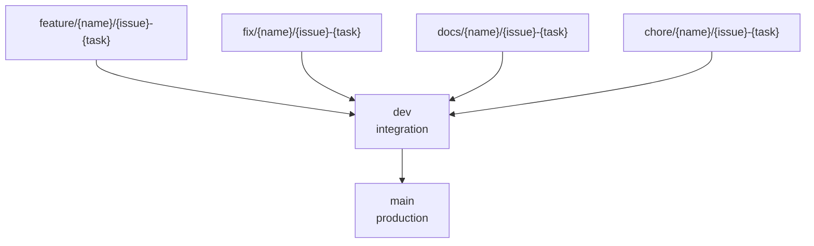

# Git Flow 운영 문서

이 문서는 SketchCatch의 브랜치, 이슈, PR 운영 기준을 정리합니다.

## 기본 원칙



- `main`은 운영 배포 브랜치입니다.
- `dev`는 개발 통합 브랜치입니다.
- 일반 작업은 항상 `dev`에서 분기합니다.
- 작업 브랜치는 PR로 `dev`에 합칩니다.
- 배포 시점에만 `dev`에서 `main`으로 PR을 만듭니다.
- `main`, `dev` 직접 push는 금지합니다.

## 작업 시작

```bash
git checkout dev
git pull origin dev
git checkout -b feature/sw/12-login
```

이슈 번호가 없으면 먼저 GitHub Issue를 만듭니다. 예외적으로 초기 설정 작업처럼 이슈가 없는 경우에는 팀 합의 후 `0`을 사용할 수 있습니다.

```bash
git checkout -b chore/sw/0-project-setup
```

## 커밋

```bash
git add .
git commit -m "Feat: 로그인 기능 구현"
```

사용 가능한 타입:

- `Feat`
- `Fix`
- `Refactor`
- `Style`
- `Docs`
- `Chore`
- `Remove`
- `Init`

## PR

일반 작업 PR:

```text
base: dev
compare: feature/sw/12-login
```

배포 PR:

```text
base: main
compare: dev
```

PR 제목:

```text
[Feat] #12 로그인 기능 구현
[Fix] #21 토큰 만료 오류 수정
[Docs] #35 README 수정
```

## 필수 체크

PR 전 로컬에서 실행합니다.

```bash
pnpm lint
pnpm typecheck
pnpm build
```

로컬에서 `pnpm`이 PATH에 없으면 다음 중 하나를 사용합니다.

```bash
corepack pnpm lint
npm exec --package=pnpm@11.8.0 -- pnpm lint
```

## GitHub branch protection 권장 설정

GitHub UI에서 설정합니다.

경로:

```text
GitHub Repository
-> Settings
-> Branches
-> Add branch ruleset 또는 Add branch protection rule
```

`main` 권장 설정:

- Require a pull request before merging
- Require approvals: 1명 이상
- Require status checks to pass before merging
- Required checks: `checks`
- Require branches to be up to date before merging
- Do not allow bypassing the above settings
- Restrict deletions
- Block force pushes

`dev` 권장 설정:

- Require a pull request before merging
- Require approvals: 1명 이상
- Require status checks to pass before merging
- Required checks: `checks`
- Block force pushes
- Restrict deletions

## 예외 처리

긴급 운영 장애는 `hotfix/{name}/{issue}-{task}` 브랜치를 사용합니다.

```text
hotfix/sw/42-nginx-healthcheck
```

hotfix도 가능하면 PR을 거칩니다. 정말로 직접 push가 필요하면 작업 후 반드시 팀에 사유와 변경 내용을 공유합니다.
