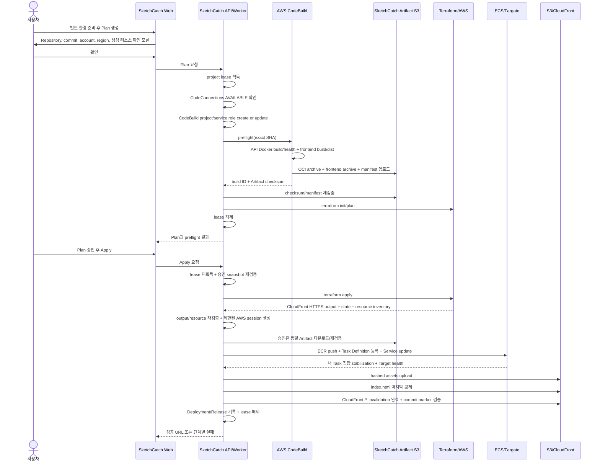
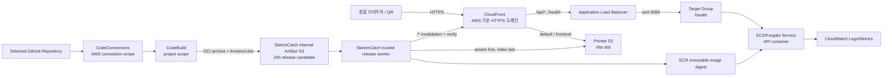

# GitHub · CodeBuild · S3 · ECS/Fargate 통합 배포 구현 계획

## 0. 문서 상태

- 작성일: 2026-07-15
- 대상 브랜치: `codex/demo-repository-owner-parity`
- 대상 사용자 여정: Repository 분석 → 웹 포함 ECS/Fargate Architecture Board → 코드 사전 검증 → Terraform Plan 승인 → Terraform Apply → ECS API 릴리즈 → S3 웹 릴리즈 → HTTPS URL/QR → Live Observation
- 구현 우선순위: 이번 데모에서는 S3 + CloudFront + ALB + ECS/Fargate 웹 포함 경로만 end-to-end로 완성한다.
- 문서 성격: 사람에게는 결정 근거를 설명하고, 구현 AI에게는 작업 순서·계약·완료 조건을 제공하는 실행 계획이다.
- 2026-07-15 필수 리뷰 반영: build/deploy 권한 분리, immutable Artifact 재사용, GitHub release-run API, 상태 전이·취소, scope, 삭제 FK, CloudFront exact release 검증 계약을 확정했다.

### 0.1 구현 상태 표기 기준 (2026-07-16)

- `[x]`는 현재 브랜치의 코드, migration, source-contract 또는 focused test로 구현 근거가 확인된 항목이다.
- 실제 AWS 계정의 CodeConnections 승인, CodeBuild 실행, Terraform Apply, ECS/S3/CloudFront 배포, 장애 주입,
  Destroy는 비용과 cloud mutation이 있으므로 코드가 구현돼도 `[ ] 승인 필요`로 남긴다.
- 현재 저장된 HTTP-only 데모 프로젝트를 웹 포함 Board로 다시 만드는 작업은 특정 사용자 프로젝트 데이터를
  변경하므로 제품 코드가 자동 수행하지 않는다. 리허설 전에 사용자가 Repository 분석부터 다시 생성해야 한다.
- 외부 Demo Repository의 README 수정은 이 저장소 구현과 분리한다. Repository 구조는 commit
  `23a87399cbe3456f3f427140f88b8d199ace34f9`에서 정적 확인했지만, 외부 Repository 쓰기와 실제 build는 별도
  권한·검증 단계다.

이 계획은 데모만을 위한 가짜 성공 상태를 만들지 않는다. 실제 GitHub Repository, 사용자 AWS 계정의 CodeConnections·CodeBuild·S3·CloudFront·ECR·ECS/Fargate·ALB, 실제 Terraform Plan/Apply와 실제 Health Check를 연결한다.

## 1. 최종 목표

사용자는 GitHub Repository 하나와 검증된 AWS 연결 하나만 선택한다. SketchCatch는 나머지 안전한 기본값과 AWS 관리형 빌드 환경을 준비하고, 사용자가 승인한 commit과 Terraform Plan만 실제 배포한다.

완료된 데모의 결과는 다음과 같아야 한다.

1. `https://github.com/whiskend/audience-live-check.git`과 `https://github.com/jh-9999/audience-live-check.git`은 owner가 달라도 Repository evidence가 같으면 같은 ECS/Fargate 추천 절차를 밟는다.
2. 사용자가 선택한 Repository만 GitHub App과 AWS CodeConnections의 대상이 된다.
3. AWS 연결이 없으면 GitHub 빌드 연결을 시작하지 않고 AWS 연결 안내 모달을 표시한다.
4. AWS 연결이 있으면 SketchCatch가 CodeConnections와 프로젝트별 CodeBuild 설정을 자동 생성하고, 사용자는 AWS 콘솔의 필수 GitHub 승인만 수행한다.
5. 코드 사전 검증이 실패하면 Terraform Plan/Apply를 시작하지 않는다.
6. 코드 사전 검증이 성공하면 Terraform Plan을 생성하고 사용자 승인을 기다린다.
7. 코드 사전 검증은 API OCI image와 frontend `dist`를 한 번만 만들고, digest/manifest와 함께 SketchCatch 내부 Artifact S3에 24시간 보관한다.
8. Apply 이후에는 재빌드하지 않는다. SketchCatch trusted release worker가 승인된 동일 Artifact를 사용자 ECR/ECS와 frontend S3에 배포하고 ECS health를 먼저 확인한다.
9. ECS가 healthy일 때만 같은 release candidate의 frontend를 S3에 올리고, `index.html`을 마지막에 교체한 뒤 CloudFront `/*` invalidation 완료와 최종 HTTPS commit marker를 검증한다.
10. ECS 애플리케이션 실패는 RDS의 직전 정상 release를 AWS에서 재검증한 뒤 그 ECS Task Definition으로 자동 복구한다.
11. ECS 성공 뒤 S3/CloudFront 단계가 실패하면 ECS를 되돌리지 않고 `부분 실패`로 기록하며 동일 frontend Artifact로 웹 릴리즈 단계만 재시도한다.
12. 인프라 실패는 이전 성공 Terraform 버전을 이용한 새 rollback Plan을 만들고 사용자 승인을 받는다.
13. 성공하면 CloudFront HTTPS URL을 배포 이력, 복사 버튼, 새 탭, QR, Live Observation에 제공한다. frontend 부분 실패 중에도 기존 URL·QR·Live Observation은 유지하되 웹이 이전 버전일 수 있음을 명시한다.
14. Direct Deployment와 GitHub Actions CI/CD가 겹치면 두 번째 실행을 대기열에 숨기지 않고 명확히 차단한다.

## 2. 확정된 제품 결정

| 항목 | 확정 결정 |
| --- | --- |
| AWS 선행 조건 | GitHub 빌드 연결 전에 verified AWS 연결이 반드시 필요하다. |
| AWS 미연결 UX | `AWS 연결이 먼저 필요합니다` 모달과 `취소`, `AWS 연결하러 가기`를 제공한다. |
| CodeConnections 소유 범위 | verified `AwsConnection` 하나당 SketchCatch 관리 CodeConnections 하나를 만든다. 여러 프로젝트가 공유한다. |
| GitHub 승인 | AWS가 요구하는 GitHub handshake만 사용자가 AWS 콘솔에서 수행한다. ARN·이름·region은 입력하지 않는다. |
| Repository 범위 | 사용자가 선택한 Repository만 연결한다. 계정의 모든 Repository를 자동 선택하지 않는다. |
| CodeBuild 소유 범위 | Source Repository를 사용하는 SketchCatch 프로젝트마다 CodeBuild project 하나를 만든다. |
| CodeBuild 생성 시점 | Repository 분석만으로 만들지 않는다. 배포 콘솔에서 첫 Plan을 만들 때 lazy creation한다. |
| 첫 버튼 | `빌드 환경 준비 후 Plan 생성`을 사용한다. 준비 완료 뒤에는 `Plan 생성`을 사용한다. |
| Runtime 범위 | 이번 데모의 완성 범위는 웹 포함 ECS/Fargate다. 정적 웹은 S3/CloudFront, API는 ALB/ECS가 담당한다. Lambda·EC2/ASG의 확장 seam은 보존한다. |
| 코드 검증 순서 | API·frontend 코드 사전 검증 → Terraform Plan → 사용자 승인 → Terraform Apply → ECS API 릴리즈 → S3 웹 릴리즈 순서다. |
| 사전 검증 | exact commit checkout, API Dockerfile 존재/build, 임시 container port/health, frontend dependency/build, `dist` 생성 확인만 필수다. |
| 테스트 실행 | Repository의 unit/integration/E2E 또는 임의 test script는 기본 실행하지 않는다. |
| Artifact 단일 생성 | 사전 검증에서 API OCI image와 frontend `dist`를 한 번만 만들고 SketchCatch 내부 Artifact S3에 저장한다. Apply/release에서는 재빌드하지 않고 승인한 동일 bytes만 사용한다. |
| 실행 권한 경계 | Repository 코드는 배포 권한이 없는 CodeBuild에서만 실행한다. ECR/ECS와 서비스용 S3/CloudFront 변경은 SketchCatch trusted release worker만 수행한다. |
| GitHub Actions 역할 | GitHub Actions는 OIDC로 SketchCatch release-run API만 호출하고 CodeBuild `StartBuild`나 AWS runtime 변경을 직접 수행하지 않는다. |
| Artifact 보관 | 승인 대기는 생성 후 24시간, frontend 부분 실패 Artifact는 실패 시점부터 24시간 보관한다. 성공 후 큰 임시 파일은 삭제하고 digest/manifest/배포 evidence는 유지한다. 만료 시 자동 재빌드하지 않고 새 사전 검증을 요구한다. |
| commit 고정 | Plan이 commit `A` 기준이면 승인 전에 `B`가 올라와도 현재 실행은 `A`만 배포한다. `B`는 새 검증·Plan이 필요하다. |
| Output URL | 사용자가 입력하지 않는다. Terraform Apply 결과의 CloudFront HTTPS URL을 자동 저장한다. |
| CloudFront routing | default behavior와 frontend route는 private S3 origin으로, `/api/*`와 `/health`는 ALB/ECS origin으로 전달한다. |
| 릴리즈 순서 | ECS stabilization과 health가 성공하기 전에는 S3의 활성 `index.html`을 바꾸지 않는다. |
| S3 안전 활성화 | hash가 포함된 JS/CSS/assets를 먼저 업로드하고 `index.html`을 마지막에 교체한다. 데모에서는 기존 정적 asset을 삭제하지 않는다. |
| 앱 rollback | ECS 실패는 이전 정상 Task Definition으로 자동 rollback하고 실제 health 회복까지 검증한다. S3 실패에는 자동 rollback을 실행하지 않는다. |
| 부분 실패 | ECS 성공 뒤 S3 upload/index/invalidation이 실패하면 ECS는 유지하고 웹 단계만 재시도한다. 기존 URL·QR·Live Observation은 유지하되 이전 웹일 수 있다는 경고를 표시한다. |
| 실행 취소 | ECS 변경 전에는 즉시 취소한다. ECS 변경 뒤에는 직전 정상 revision과 health를 복구한 후 취소 완료로 처리한다. frontend 활성화 뒤 취소는 S3 자동 rollback 없이 `부분 취소`로 기록한다. |
| 배포 scope | `full_stack`만 preflight → Plan/Apply → app release를 실행한다. `infrastructure`는 app preflight/release를, `application`은 Terraform init/plan/apply를 생략한다. frontend 재시도는 S3/CloudFront 단계만 실행한다. |
| 인프라 rollback | 직전 성공 인프라 버전만 제안하고, 현재 state에 대한 새 Terraform Plan을 만든 뒤 승인받는다. |
| 동시 실행 | Direct와 GitHub CI/CD는 하나의 CodeBuild를 재사용하고 프로젝트 단위 lease를 공유한다. 두 번째 실행은 즉시 차단한다. |
| AWS 연결 삭제 | 실패 이력의 존재만으로 막지 않는다. 실제 리소스/state가 남았거나 실행 중이거나 성공 배포가 미파기 상태일 때만 막는다. |
| 기존 개발 AWS 연결 | 권한 업데이트 UI를 만들지 않는다. 개발자는 연결을 삭제하고 최신 CloudFormation으로 다시 연결한다. |
| 기존 CodeConnections | 외부에서 만든 연결을 탐색·재사용하지 않는다. SketchCatch 관리 연결을 별도로 만든다. |
| UI 디자인 | 기존 Settings card, modal, button, badge, spacing, color token을 재사용하고 responsive/accessibility 상태를 제공한다. |
| 기존 아키텍처 스펙 | 현재 strict Repository overlay의 S3 + CloudFront + ALB + ECS 구성을 유지·표준화한다. HTTP-only로 저장된 현재 데모 프로젝트만 Repository 분석부터 웹 포함 스펙으로 다시 생성한다. |

## 3. 범위 밖

- 사용자 임의 Dockerfile 또는 shell command 생성·실행
- 사용자의 모든 GitHub Repository 자동 승인
- 사용자 보유 CodeConnections 탐색 및 재사용
- 기존 개발 AWS 연결용 권한 upgrade wizard
- Lambda, EC2/ASG의 end-to-end build environment 자동 생성과 ECS/Fargate 이외 조합의 정적 사이트 배포
- custom domain, Route53 hosted zone, 사용자 ACM certificate 입력
- 오래된 여러 인프라 버전 중 임의 버전을 고르는 UI
- queue 기반 다중 배포 실행
- 배포 승인 없이 Terraform Apply, Destroy, rollback Apply 실행
- AI의 자동 코드 수정 또는 자동 Plan 승인
- S3와 ECS를 하나의 시점으로 되돌리는 완전한 동시 rollback
- 과거 S3 정적 버전을 선택하거나 자동 복원하는 UI
- 사용자 AWS 계정에 별도 release Artifact bucket을 만들거나 사용자가 bucket/ARN을 입력하는 흐름

## 4. 현재 구현 상태와 차이

### 4.1 재사용할 구현

| 현재 구현 | 위치 | 재사용 방향 |
| --- | --- | --- |
| Repository owner/name 정규화와 두 fork 동등성 | `apps/api/src/routes/ai.ts`, Repository recommendation tests | owner allowlist 없이 evidence 기반 추천을 유지한다. |
| exact commit을 CodeBuild `sourceVersion`으로 전달 | `apps/api/src/deployments/aws-codebuild-direct-application-release-gateway.ts` | preflight-build가 승인 SHA만 checkout하고 candidate/Plan/ApplicationRelease가 그 SHA와 digest를 고정하도록 확장한다. |
| CodeBuild project source/auth 사전 조회 | 같은 gateway의 `BatchGetProjects` 경로 | 관리 build environment 검증에 사용한다. |
| ECS release, health, rollback evidence | Direct gateway와 evidence verifier | AWS CLI 명령 자체는 재사용하지 않고, 오류 code와 AWS evidence 검증 규칙만 trusted release worker로 옮긴다. |
| Apply 이후 Terraform output/state/resource 저장 | `deployment-apply-service.ts` | URL 연결 뒤 앱 release를 실행하는 순서를 유지한다. |
| HTTPS `api_base_url` reconciliation | `ecs-fargate-output-reconciliation.ts`, `direct-application-release-service.ts` | CloudFront output을 source of truth로 사용한다. |
| S3/OAC/CloudFront와 ALB/ECS 분리 아키텍처 | `apps/api/src/services/aiArchitectureDrafts.ts`의 strict Repository overlay | 삭제하지 않고 웹 포함 ECS/Fargate의 표준 생성 규칙으로 유지한다. |
| CloudFront ordered cache behavior Terraform 렌더링 | `apps/api/src/services/terraform/diagram-to-terraform.ts` | `/api/*`뿐 아니라 `/health`도 ALB origin으로 렌더링·인식하도록 보강한다. |
| GitHub Actions의 S3 upload/invalidation 계약 | `apps/api/src/git-cicd/git-cicd-workflows.ts`와 관련 workflow 생성 코드 | upload/invalidation 명령은 workflow에서 제거하고, 안전한 활성화 순서와 evidence 규칙만 trusted release worker로 옮긴다. |
| Application Release ledger | `apps/api/src/releases/project-release-ledger-service.ts` | Direct/GitOps의 URL, commit, digest, rollback evidence를 공통 기록한다. |
| 배포 이력 URL 링크 | `apps/web/features/workspace/DirectDeploymentScreen.tsx` | 성공 카드, 복사, QR 진입점을 추가한다. |
| QR와 Live Observation UI | `LiveObservationModal.tsx`, `live-observation.ts` | CloudFront URL과 새 manifest 검증을 연결한다. |
| 프로젝트당 RUNNING Deployment partial unique index | `deployments_project_running_unique` | Direct 내부 중복 방어로 유지하되 GitOps까지 포괄하는 공용 lease를 추가한다. |
| AWS Role CloudFormation 생성 | `aws-connection-service.ts` | CodeConnections·CodeBuild lifecycle 권한을 추가한다. |

### 4.2 반드시 새로 구현하거나 교체할 부분

| 차이 | 현재 문제 | 목표 |
| --- | --- | --- |
| CodeConnections lifecycle | 생성·상태 조회·삭제 구현과 SDK dependency가 없다. | AWS 연결별 PENDING → AVAILABLE 상태를 관리한다. |
| CodeBuild lifecycle | `BatchGetProjects`와 `StartBuild`만 있고 `CreateProject/UpdateProject/DeleteProject`가 없다. | 프로젝트별 project/service role을 자동 생성·갱신·정리한다. |
| 현재 `demo-app-build` | 사용자 AWS 계정에 실제 project가 없으면 실행할 수 없다. | 첫 Plan 전에 자동 생성하여 수동 사전 생성 의존성을 없앤다. |
| Build 순서 | 현재 prepare phase는 ECR push까지 수행하며 ECR 생성 전 Plan과 충돌하고 frontend 사전 검증이 없다. | preflight CodeBuild는 사용자 runtime AWS Resource를 변경하지 않고 API Docker build/health와 frontend build/dist를 함께 확인한 뒤 immutable Artifact를 SketchCatch 내부 S3에 저장한다. 실제 push/upload는 trusted release worker만 수행한다. |
| ECS 기본값 | `sourceRoot=apps/api`, `containerName=web`, health `/`, template port `80`이 데모 Repository와 맞지 않는다. | API build context `.`, Dockerfile `apps/api/Dockerfile`, container `api`, port `8080`, health `/health`로 통일한다. |
| Frontend build 기본값 | CodeBuild가 frontend source/output을 명시적으로 받지 않는다. | frontend root `apps/web`, build output `apps/web/dist`를 evidence 기반 기본값으로 저장한다. |
| Demo Repository | API image와 Vite web이 분리되어 있지만 CodeBuild가 ECS image만 릴리즈한다. | API는 ECR/ECS, Vite `dist`는 S3에 배포하고 둘을 CloudFront 한 주소로 제공한다. |
| ECS Architecture | base template은 HTTP ALB-only이고 strict overlay에만 S3 web + ECS API가 있다. | 웹 화면 `예`와 Repository evidence가 확인되면 strict overlay를 정식 웹 포함 스펙으로 사용한다. 저장된 HTTP-only 데모 Board는 재분석·재생성한다. |
| CloudFront routing | Terraform의 API traffic 인식이 `/api/*`에 편중되어 `/health` 분리 route를 보장하지 않는다. | default/frontend는 S3, `/api/*`와 `/health`는 ALB/ECS로 고정한다. |
| Static activation | S3 upload 순서와 부분 실패 계약이 Direct release에 없다. | hashed assets 먼저, `index.html` 마지막, invalidation 순서로 활성화하고 이전 asset은 삭제하지 않는다. |
| Terraform과 앱 릴리즈 소유권 | Terraform bootstrap `index.html`과 앱 릴리즈가 같은 key를 관리하면 다음 Apply가 데모 페이지로 되돌릴 수 있다. | Terraform은 최초 bootstrap object와 삭제 lifecycle만 소유하고, 배포 후 content/cache metadata drift는 무시한다. 실제 웹 content는 trusted release worker가 소유한다. |
| URL contract | Terraform은 ALB `http://`를 만들 수 있지만 reconciliation/QR은 HTTPS만 허용한다. | CloudFront `https://*.cloudfront.net`만 `api_base_url`로 저장한다. |
| Live Observation | 현재 manifest는 custom Route53/ACM hostname과 ALB CNAME을 전제한다. | AWS가 관리하는 CloudFront domain과 승인된 ALB origin의 결합을 검증한다. |
| 공용 동시 실행 제어 | Direct RUNNING 제약은 GitHub Actions 실행을 막지 못한다. | RDS project lease와 GitHub OIDC 인증 endpoint를 공유한다. |
| 실행 주체 | Direct는 server override buildspec의 CodeBuild가 ECS를 변경하고, GitOps는 GitHub Actions가 Repository buildspec으로 CodeBuild를 시작한 뒤 ECS를 변경한다. | 두 경로 모두 GitHub/CodeBuild에는 배포 권한을 주지 않고 SketchCatch release-run API와 trusted worker로 통일한다. |
| 오류 분류 | CodeBuild 실패가 단계별 사용자 언어로 분리되지 않는다. | build environment, API/frontend preflight, ECS release, S3/index/invalidation, ECS rollback error code를 분리한다. |
| AWS 연결 삭제 | deployment row 하나만 있어도 상태와 무관하게 삭제가 막힌다. | 실제 cloud 영향과 state evidence로 판단한다. |
| 인프라 rollback | 이전 성공 artifact로 새 rollback Plan을 만드는 제품 흐름이 없다. | 직전 성공 버전을 선택해 새 Plan/승인/Apply를 수행한다. |

## 5. 목표 사용자 흐름

### 5.1 AWS와 GitHub 빌드 연결

1. 사용자가 Settings의 `GitHub 빌드 연결`을 누른다.
2. verified AWS 연결이 없으면 AWS 연결 안내 모달을 띄우고 작업을 종료한다.
3. verified AWS 연결이 있으면 SketchCatch가 account/region과 결정적 이름으로 CodeConnections를 생성한다.
4. AWS는 connection을 `PENDING`으로 반환한다.
5. 화면은 `GitHub 승인 필요` badge와 `AWS에서 승인하기` 버튼을 제공한다.
6. 사용자가 AWS 콘솔에서 GitHub handshake를 완료한다.
7. SketchCatch는 명시적 새로고침과 bounded polling으로 `AVAILABLE`을 확인한다.
8. ARN, account ID, region, connection name은 사용자가 입력하지 않는다.

### 5.2 Repository 분석과 Board 생성

1. Repository 분석은 실제 branch head SHA와 evidence를 저장한다.
2. `whiskend` 또는 `jh-9999` owner를 특별 취급하지 않는다.
3. ECS/Fargate 추천을 선택하고 웹 화면 질문에 `예`를 선택한다.
4. 기존 strict Repository overlay를 사용해 웹 포함 ECS/Fargate Board를 생성한다.
5. Board에는 private S3 web bucket, OAC, bucket policy, CloudFront, public ALB, Target Group, ECS/Fargate API, ECR, CloudWatch, VPC networking을 실제 Resource로 표시한다.
6. CloudFront의 default/frontend route는 S3로, `/api/*`와 `/health`는 ALB로 연결된 상태를 edge와 parameter에서 확인할 수 있어야 한다.
7. CodeConnections와 CodeBuild는 애플리케이션 runtime Terraform보다 먼저 존재해야 하므로 runtime Terraform Resource로 만들지 않는다. Deployment Support 영역의 SketchCatch-managed 상태로 표시할 수는 있지만 Terraform 생성 대상에서는 제외한다.

### 5.3 첫 웹 포함 배포



### 5.4 이후 애플리케이션 CI/CD

1. GitHub Actions가 새 commit의 app workflow를 시작한다.
2. workflow는 GitHub OIDC로 SketchCatch의 release-run API에 Repository, exact commit, workflow run ID를 보낸다.
3. SketchCatch API가 project lease를 원자적으로 획득한다. 다른 Direct/CI 실행이 있으면 CodeBuild를 시작하지 않고 `PROJECT_RELEASE_IN_PROGRESS`를 반환한다.
4. SketchCatch API/worker가 서버 생성 buildspec으로 같은 project CodeBuild를 시작하고 build ID를 DB에 즉시 저장한다. workflow는 CodeBuild나 사용자 AWS runtime을 직접 변경하지 않는다.
5. CodeBuild는 배포 권한 없이 API/frontend Artifact만 만들고 SketchCatch 내부 Artifact S3에 저장한다. Terraform은 다시 실행하지 않는다.
6. trusted release worker가 Artifact checksum과 현재 runtime fingerprint를 재검증한 뒤 ECR/ECS를 활성화하고, 새 ECS task 집합의 health가 성공한 후 frontend를 S3/CloudFront에 활성화한다.
7. ECS 실패는 자동 rollback evidence를 기록한다. ECS 성공 뒤 S3/CloudFront 실패는 `부분 실패`로 기록하고 동일 frontend Artifact를 사용하는 웹 릴리즈 재시도만 제공한다.
8. API가 AWS evidence를 재검증해 Release ledger에 기록하고 workflow는 release-run 상태 API로 결과만 확인한다.
9. 취소·lease 상실 시 API는 실행 중 CodeBuild에 `StopBuild`를 호출하고 terminal 상태까지 확인한다. fencing version이 지난 worker/build 결과는 AWS mutation과 DB 결과 저장에 사용할 수 없다.

## 6. 웹 포함 ECS/Fargate 아키텍처 유지·보완

### 6.1 표준 스펙



### 6.2 유지·보완 규칙

- `applyStrictRepositoryEvidencePolicy`의 S3 web bucket, Public Access Block, OAC, bootstrap object, bucket policy, CloudFront distribution을 제거하지 않는다.
- 웹 화면 `예`와 Repository의 frontend evidence가 함께 확인된 ECS/Fargate 추천에서 이 strict overlay를 표준 웹 포함 스펙으로 사용한다.
- S3 bucket은 public access를 차단하고 CloudFront OAC와 제한된 bucket policy로만 읽게 한다.
- frontend S3 bucket은 object versioning을 활성화해 활성 `index.html` VersionId와 release evidence를 남긴다. 이번 데모에서는 이 VersionId를 이용한 자동 frontend rollback UI는 만들지 않는다.
- Terraform의 bootstrap `index.html`은 최초 URL 확인용이다. renderer는 해당 object의 content/source/hash/cache metadata 변경을 lifecycle ignore 대상으로 만들어 이후 Terraform Apply가 CodeBuild의 실제 frontend를 덮어쓰지 않게 한다.
- CloudFront `viewerProtocolPolicy`는 `redirect-to-https`다.
- CloudFront default behavior와 frontend route는 S3 origin을 사용한다. hash asset은 cache optimized policy를 사용하고 `index.html`은 배포 시 짧은 cache 또는 no-cache metadata로 교체한다.
- CloudFront ordered behavior `/api/*`와 `/health`는 같은 ALB origin을 사용한다. API route는 managed caching disabled policy와 필요한 method/query/header 전달을 사용한다.
- credential, query, API body에 영향을 주는 임의 edge transform은 추가하지 않는다.
- ALB listener는 HTTP 80, Target Group과 ECS API container는 8080을 사용한다.
- Target Group health path는 `/health`, matcher는 `200-399`다.
- Terraform이 첫 ECS Service를 만들 수 있도록 public bootstrap image를 사용하는 초기 Task Definition을 둔다. bootstrap container도 port 8080과 `/health`를 만족한다.
- bootstrap Task Definition은 첫 application release의 이전 정상 버전으로 간주하지 않는다. 첫 release 실패 시 bootstrap이 다시 healthy해도 `앱 자동 rollback 성공`으로 기록하지 않는다.
- Fargate task는 private app subnet에 두고 ALB만 public subnet에 둔다. 기존 NAT/private egress 설계를 유지한다.
- 가능하면 ALB ingress를 AWS-managed CloudFront origin-facing prefix list로 제한한다. Terraform renderer가 지원하지 않으면 이를 별도 필수 ticket으로 추가하며 `0.0.0.0/0`을 최종 완료로 간주하지 않는다.
- Terraform output은 최소 `api_base_url`, `cloudfront_distribution_id`, `cloudfront_domain_name`, `static_bucket_name`, `load_balancer_dns_name`, ALB/TG ARN, ECS cluster/service, ECR repository, log group을 제공한다.
- `api_base_url`은 API 전용 host가 아니라 사용자에게 제공하는 최종 application base URL이며 반드시 `https://${cloudfront.domain_name}`이다. 기존 계약 호환을 위해 이름은 이번 데모에서 유지한다.
- `cloudFrontRoutesApiTraffic`은 `/api/*`와 `/health`가 승인된 ALB origin으로 향하고 default behavior가 S3 origin인지 함께 검증하도록 보강한다.

### 6.3 현재 데모 프로젝트 처리

- 이미 저장된 HTTP ALB-only 데모 Board를 제품 코드에서 몰래 덮어쓰지 않는다.
- 같은 Repository 연결과 commit을 유지한 채 Repository 분석을 다시 실행하고, 웹 화면 질문에 `예`를 선택해 새 웹 포함 Board를 생성한다.
- 재생성된 Board에서 S3, CloudFront, ALB, ECS와 route edge를 사용자가 확인한 뒤 그 revision을 배포 대상으로 선택한다.
- 이번 개발 단계에서는 일반 사용자 프로젝트용 자동 upgrade UI를 만들지 않는다.
- HTTP-only template 자체를 전역 삭제하지 않는다. 웹 evidence/선택이 없는 ECS API 프로젝트까지 S3를 강제하지 않는다.

## 7. Demo Repository 사전 준비

대상: `jh-9999/audience-live-check`.

이 Repository는 API image와 Vite frontend artifact를 분리한 현재 구조를 유지한다. CodeBuild가 한 exact commit에서 두 immutable Artifact를 만들고, trusted release worker가 이를 서로 다른 AWS 대상에 배포한다.

필수 계약은 다음과 같다.

1. API Docker build context는 monorepo root `.`이고 Dockerfile은 `apps/api/Dockerfile`이다.
2. API runtime image는 production dependency와 API build만 포함하고 port 8080, `/health`를 제공한다.
3. frontend source root는 `apps/web`, build output은 `apps/web/dist`다.
4. frontend의 API base URL은 CloudFront same-origin 상대 경로 `/api/*`를 사용한다. 현재 Vite demo는 preflight build에서 `VITE_API_BASE_URL=/`를 고정해 browser의 현재 CloudFront origin을 사용한다.
5. CodeBuild preflight는 API Docker build/container health와 frontend build/dist를 확인하고 SketchCatch 내부 candidate prefix에만 결과를 저장한다. 사용자 서비스 AWS Resource는 변경하지 않는다.
6. release는 preflight에서 저장한 동일 OCI image와 frontend `dist`를 다시 검증해 사용하며 build를 반복하지 않는다.
7. 앱 Repository의 build/typecheck/lint/test는 Repository 자체 변경 검증에서 필요한 항목만 한 번 실행한다. SketchCatch의 매 배포 preflight에서는 unit/integration/E2E를 기본 실행하지 않는다.

이번 발표의 실제 배포 대상은 `jh-9999/audience-live-check`로 고정한다. `whiskend/audience-live-check`는 Repository evidence 동등성의 기준으로 사용한다. 두 fork의 실제 commit 내용이 달라지면 추천 절차는 같더라도 artifact 동등성을 주장하지 않는다.

Repository 분석 기본값은 다음으로 고정한다.

```ts
{
  runtimeTargetKind: "ecs_fargate",
  apiBuildConfig: {
    sourceRoot: ".",
    dockerfilePath: "apps/api/Dockerfile",
    containerPort: 8080,
    healthCheckPath: "/health"
  },
  frontendBuildConfig: {
    sourceRoot: "apps/web",
    outputPath: "apps/web/dist",
    packageManifestPath: "apps/web/package.json",
    lockfilePath: "package-lock.json",
    packageManager: "npm",
    packageManagerVersion: "10.9.2",
    installPreset: "npm_ci",
    buildPreset: "npm_build"
  },
  containerName: "api",
  outputUrl: null
}
```

이 값은 owner 하드코딩이 아니라 Dockerfile의 `EXPOSE`/`HEALTHCHECK`, frontend package/build output, README/Application Unit evidence와 사용자가 선택한 웹 포함 template에서 결정한다.

## 8. 데이터 모델과 migration 계획

이 구현은 새 RDS 영속 상태가 필요하므로 구현 시 Drizzle migration이 필요하다. 실제 migration 번호는 구현 시작 직전에 최신 번호를 다시 확인하고 팀에 `🚨 DB MIGRATION` 경고를 보낸 뒤 선택한다.

### 8.1 `aws_code_connections`

AWS 연결별 SketchCatch-managed CodeConnections를 저장한다.

```ts
type AwsCodeConnection = {
  id: string;
  awsConnectionId: string; // unique FK
  connectionArn: string | null;
  providerType: "GitHub";
  status: "CREATING" | "PENDING" | "AVAILABLE" | "ERROR" | "DELETING";
  statusReason: string | null;
  createdAt: string;
  updatedAt: string;
};
```

- `(awsConnectionId)` unique로 하나만 허용한다.
- AWS create 전 RDS에 `CREATING` row를 먼저 예약하므로 `connectionArn`은 잠시 `null`일 수 있다.
- 결정적 connection name과 account/region은 `awsConnectionId`가 가리키는 verified 연결에서 계산한다. ARN과 이름은 비밀값이 아니다.
- GitHub OAuth token, installation token, AWS credential은 저장하지 않는다.
- `AVAILABLE`은 `GetConnection`의 실제 상태를 읽은 결과만 사용한다.

### 8.2 `project_build_environments`

프로젝트별 CodeBuild project와 전용 service role의 lifecycle을 저장한다.

```ts
type ApiBuildConfig = {
  sourceRoot: string;
  dockerfilePath: string;
  containerPort: number;
  healthCheckPath: string;
};

type FrontendBuildConfig = {
  sourceRoot: string;
  outputPath: string;
  packageManifestPath: string;
  lockfilePath: string;
  packageManager: "pnpm" | "npm" | "yarn";
  packageManagerVersion: string;
  installPreset: string;
  buildPreset: string;
};

type ProjectBuildEnvironment = {
  id: string;
  projectId: string; // unique FK
  awsConnectionId: string | null;
  awsCodeConnectionId: string | null;
  codeBuildProjectName: string;
  codeBuildServiceRoleArn: string;
  permissionsBoundaryArn: string;
  sourceRepositoryUrl: string;
  runtimeFingerprint: string;
  status: "preparing" | "ready" | "verification_failed" | "disconnected";
  lastVerifiedAt: string | null;
  createdAt: string;
  updatedAt: string;
};
```

- 프로젝트당 row 하나만 허용한다.
- Repository가 바뀌어도 같은 CodeBuild project를 update한다.
- Repository URL, CodeConnection ARN, service role/boundary policy와 build image의 canonical JSON hash를
  `runtimeFingerprint`로 저장한다.
- API/frontend build config는 `ProjectDeploymentTarget.confirmedBuildConfig.ecsWeb`과 승인 prepared snapshot에
  고정한다. BuildEnvironment row에 임의 command나 중복 build config JSON을 저장하지 않는다.
- exact commit은 build environment가 아니라 Deployment/Run에 저장한다.

### 8.3 `project_execution_leases`

Direct와 GitHub Actions의 실제 실행을 원자적으로 차단한다.

```ts
type ProjectExecutionLease = {
  projectId: string; // PK/FK
  holderId: string; // Deployment ID 또는 GitCicdPipelineRun ID
  source: "direct" | "gitops";
  fencingVersion: number;
  status: "active" | "releasing" | "released";
  activeCodeBuildId: string | null;
  activeWorkerTaskArn: string | null;
  heartbeatAt: string;
  expiresAt: string;
  createdAt: string;
  updatedAt: string;
};
```

- insert/conditional update transaction으로 한 실행만 승리시킨다.
- 현재 `holderId`와 `fencingVersion`이 모두 일치하는 실행만 heartbeat·coordinate 기록·release할 수 있다.
- acquire/recovery마다 단조 증가하는 `fencingVersion`을 발급하고 모든 worker 상태 변경 조건에 포함한다. 이전 version의 실행은 Artifact 승인, AWS mutation, Release ledger 저장을 할 수 없다.
- trusted worker는 모든 mutating AWS call 직전에 현재 lease owner/fencing version을 조건부 확인한다. credential은 worker 밖으로 전달하지 않는다.
- `activeCodeBuildId`와 `activeWorkerTaskArn`은 중단·startup recovery가 실제 실행 주체를 조회하는 durable coordinate다.
- TTL이 지났더라도 이전 CodeBuild와 worker task의 terminal 상태를 확인하기 전에는 새 holder에게 lease를 넘기지 않는다. 중단/terminal 확인에 실패하면 자동 회수하지 않는다.
- lease token은 외부 client나 Repository code에 발급하지 않는다. API와 trusted worker는 DB의 holder/fencing 조건을 신뢰 경계로 사용한다.
- 기본 heartbeat는 30초, TTL은 2분으로 시작하고 실제 가장 긴 AWS call 특성에 맞춰 조정한다.
- 사용자 Plan 승인 대기 중에는 lease row를 유지하지 않는다.
- Apply 시작 때 lease를 다시 획득하고 승인 snapshot을 다시 검증한다.
- CodeBuild `concurrentBuildLimit=1`은 2차 방어일 뿐 공용 lease를 대체하지 않는다.

### 8.4 `release_candidates`와 immutable Artifact

사전 검증에서 만든 배포 후보와 SketchCatch 내부 Artifact S3의 exact object를 저장한다. Repository source archive 자체를 장기 보관하지 않는다.

```ts
type ReleaseCandidate = {
  id: string;
  projectId: string;
  deploymentId: string | null;
  pipelineRunId: string | null;
  buildEnvironmentId: string | null;
  commitSha: string;
  compositeDigest: string;
  apiOciDigest: string;
  apiArchiveDigest: string;
  frontendArchiveDigest: string;
  frontendManifestDigest: string;
  frontendIndexDigest: string;
  apiArchiveObjectKey: string;
  apiArchiveObjectVersionId: string;
  apiArchiveByteSize: number;
  frontendArchiveObjectKey: string;
  frontendArchiveObjectVersionId: string;
  frontendArchiveByteSize: number;
  frontendManifestObjectKey: string;
  frontendManifestObjectVersionId: string;
  manifestObjectKey: string;
  manifestObjectVersionId: string;
  status: "building" | "pending" | "activating" | "partially_failed" | "succeeded" | "failed" | "cancelled" | "expired";
  expiresAt: string;
  frontendRetryExpiresAt: string | null;
  createdAt: string;
  updatedAt: string;
};
```

- object prefix는 `deployments/<deployment-or-run-id>/release-candidates/<candidate-id>/`로 제한한다.
- API는 OCI image archive의 `apiArchiveDigest`와 container image의 `apiOciDigest`를 모두 저장한다.
- frontend는 archive checksum뿐 아니라 repository-relative 파일별 SHA-256, size, content type을 canonical manifest로 저장한다.
- preflight packaging은 `index.html`에 exact commit과 candidate ID를 담은 `sketchcatch-release` meta marker를 추가한 뒤 manifest/digest를 계산한다.
- `compositeDigest`는 `commitSha`, 승인 snapshot의 build config fingerprint, `apiOciDigest`,
  `frontendManifestDigest`의 canonical JSON SHA-256이다. API image와 frontend 파일을 하나의 release로 식별한다.
- CodeBuild에는 exact key별 짧은 만료시간의 presigned multipart upload만 제공한다. 사용자 AWS 계정에 Artifact bucket이나 cross-account S3 IAM 설정을 요구하지 않는다.
- 저장소는 SketchCatch 운영 AWS 계정의 기존 `S3_BUCKET_NAME` Artifact bucket과 `deployments/*` 경계를 재사용한다. public access block, encryption, object versioning, 24시간 lifecycle/multipart abort와 API/worker 최소 권한을 인프라 코드에 반영한다. Board의 frontend S3와는 별도이며 사용자에게 표시하지 않는다.
- 승인 대기 candidate는 생성 후 24시간 보관한다. ECS 성공 뒤 frontend가 `partially_failed`가 되면 API archive는 정리하고 frontend archive의 만료를 실패 시점부터 24시간으로 갱신한다. 전체 성공 뒤에는 큰 archive를 삭제하되 작은 frontend manifest object/VersionId와 DB의 digest/evidence는 보존한다.
- 만료·취소·실패 candidate는 S3 archive를 삭제하고 status/evidence만 보존한다. 만료된 candidate를 자동 재빌드하거나 승인 없이 교체하지 않는다.

### 8.5 Deployment 승인·rollback metadata

기존 `Deployment`에 다음 source-of-truth를 추가한다.

```ts
type DeploymentExecutionEvidence = {
  releaseCandidateId: string | null;
  rollbackOfDeploymentId: string | null;
  rollbackTargetDeploymentId: string | null;
};
```

- 승인된 prepared snapshot은 candidate ID, commit, composite digest, build config fingerprint와 Terraform
  artifact/tfplan/account/region을 함께 고정한다. Deployment row는 `releaseCandidateId`로 그 candidate를 가리키며,
  Apply 직전에 snapshot과 현재 candidate를 다시 비교한다.
- preflight evidence는 candidate manifest와 durable release step에 성공 여부, CodeBuild build ID, commit, API
  Dockerfile/port/health path, frontend manifest/lockfile/package manager/source/output, release candidate ID,
  composite digest와 완료 시각을 담는다.
- raw log와 immutable archive는 기존 bounded log와 SketchCatch 내부 Artifact S3 경계를 사용한다.
- 인프라 rollback은 새 Deployment이며 이전 Deployment 상태를 덮어쓰지 않는다.
- 직전 성공 TerraformArtifact와 state가 retention으로 삭제되지 않게 보호한다.

### 8.6 공유 계약 변경

- `EcsFargateRuntimeConfig`에 `containerPort: number`를 추가한다.
- `ConfirmedBuildConfig.sourceRoot`는 `docker_build`에서 Docker build context라는 의미로 명확히 문서화한다.
- ECS `healthCheckPath`는 `ConfirmedBuildConfig`의 필수값으로 사용한다.
- 웹 포함 ECS/Fargate build config는 단일 install/build preset을 공유하지 않고 `ApiBuildConfig`와 `FrontendBuildConfig`로 분리한다. 모든 path는 repository-relative safe path로 검증한다.
- runtime resource fingerprint에는 Terraform output과 AWS 조회로 확인한 `staticBucketName`, `cloudFrontDistributionId`, `ecrRepositoryArn`, `ecsClusterArn`, `ecsServiceArn`, `targetGroupArn`을 포함한다. 클라이언트가 이 값을 입력하지 않는다.
- `ApplicationRelease.status`에 `retrying`, `cancelled`, `partially_failed`, `partially_cancelled`를 추가한다. release evidence에는 candidate/composite digest, ECR image digest, ECS Task Definition ARN, 새 task/healthy target 증거, frontend manifest URI/version, `index.html` VersionId, failed stage, invalidation ID/status, retryable 여부를 저장한다.
- `Deployment.status`에 `PARTIALLY_FAILED`, `PARTIALLY_CANCELED`를 추가하고 `failureStage`를 저장한다. Terraform state/output/resource inventory는 application/frontend 실패와 무관하게 보존한다.
- CodeConnections, BuildEnvironment, Lease, preflight/error response 타입을 `packages/types`에 먼저 추가한다.
- shared type → API Zod/DTO → repository/service → Web state 순서로 구현한다.

## 9. AWS 권한과 관리 Resource

### 9.1 AWS 연결 Execution Role 권한

새 AWS 연결 CloudFormation template에 다음 기능을 추가한다.

| 목적 | 최소 action 예시 |
| --- | --- |
| CodeConnections 관리 | `codeconnections:CreateConnection`, `GetConnection`, `DeleteConnection`, `ListConnections`, tag 조회/관리 |
| CodeBuild project 관리 | `codebuild:CreateProject`, `UpdateProject`, `DeleteProject`, `BatchGetProjects` |
| CodeBuild 실행 | `codebuild:StartBuild`, `BatchGetBuilds`, `StopBuild` |
| project service role 관리 | `iam:CreateRole`, `GetRole`, `PutRolePolicy`, `DeleteRolePolicy`, `DeleteRole`, `TagRole`, `ListRolePolicies` |
| CodeBuild에 role 전달 | `iam:PassRole`, `iam:PassedToService=codebuild.amazonaws.com` 조건 |
| release verification | 연결 Role 자신의 `iam:GetRole`, `iam:GetRolePolicy`와 승인된 ECR/ECS/ELB/S3/CloudFront read action |
| trusted app release | ECR auth/layer/image push, ECS Task Definition/service update, ELB target health, 서비스용 S3 object write, CloudFront invalidation, 승인 ECS task role `iam:PassRole` |

세부 규칙:

- role/project/connection 이름은 `sketchcatch-<project-or-connection-prefix>-*` 규칙과 ownership tag를 사용한다.
- `Create*`처럼 ARN이 사전에 완성되지 않는 action은 AWS IAM 지원 범위 안에서 tag condition으로 제한한다.
- `PassRole`은 생성한 CodeBuild service role과 CodeBuild service principal로 제한한다.
- 동적으로 만드는 CodeBuild service role에는 SketchCatch 관리 permissions boundary를 필수 부착한다. Execution Role의 `CreateRole`/`PutRolePolicy`는 해당 boundary와 `ManagedBy=SketchCatch` tag가 모두 일치할 때만 허용하고 boundary 제거 권한은 주지 않는다.
- 기존 `project/*`, `build/*:*` runtime action 허용은 유지하되 lifecycle action을 별도 statement로 분리한다.
- 신규 연결은 처음부터 최신 template을 사용한다.
- 이미 연결한 개발자는 삭제 후 재연결한다. 서비스 UI에 upgrade action은 추가하지 않는다.

### 9.2 CodeBuild service role 권한

프로젝트별 CodeBuild service role은 Repository checkout, bounded log, build 결과 전달만 수행하며 사용자 runtime을 변경할 권한을 갖지 않는다.

- 해당 CodeConnections ARN의 `codeconnections:UseConnection`
- 해당 프로젝트 CodeBuild CloudWatch Logs group/stream write
- build cache를 사용한다면 SketchCatch가 관리하는 exact cache prefix에 대한 최소 read/write
- KMS를 사용한다면 위 log/cache에 필요한 exact key action

다음 권한은 명시적으로 부여하지 않는다.

- ECR auth/push/pull과 ECS/ELB 변경·조회
- 서비스용 S3 bucket read/write와 CloudFront invalidation
- Task Definition register/describe/deregister와 `iam:PassRole`
- Terraform, CloudFormation, IAM lifecycle, STS `AssumeRole`

Artifact upload는 사용자 AWS Role 권한이 아니라 SketchCatch API가 candidate의 exact object key별로 발급한 짧은 만료시간의 presigned multipart URL을 사용한다. Repository build/lifecycle script가 실행되는 container에는 SketchCatch trusted worker credential이나 사용자 runtime mutation 권한을 전달하지 않는다.

### 9.3 trusted release worker 권한

실제 ECR/ECS와 서비스용 S3/CloudFront 변경은 SketchCatch worker가 verified `AwsConnection` role을 assume해 수행한다.

1. Terraform Apply output과 저장된 resource inventory에서 ECR repository, ECS cluster/service, Target Group, static bucket, CloudFront distribution을 읽는다.
2. verified `AwsConnection` Role을 read-only verification session policy로 assume한다.
3. 같은 account/region의 실제 AWS Resource와 연결 Role의 `GetRole`/`GetRolePolicy`를 재조회해 ARN/ID/status와 최신 CloudFormation policy fingerprint를 확인한다.
4. verified resource 좌표와 승인 candidate/composite digest를 canonical `runtimeAuthorizationFingerprint`로 저장한다. 필요한 base permission이 없으면 release를 시작하지 않고 개발 단계 정책대로 삭제 후 재연결을 안내한다.
5. 별도의 deploy session을 exact resource로 축소해 assume하고 fingerprint와 fencing version이 현재 실행과 일치할 때만 mutation을 허용한다.
6. runtime 좌표가 바뀌거나 조회할 수 없으면 release를 시작하지 않고 새 Plan 또는 AWS 연결 복구를 요구한다.

IAM statement 규칙:

- 이번 구현은 Docker registry login 대신 ECR layer upload/`PutImage` AWS SDK API를 사용하므로
  `ecr:GetAuthorizationToken`을 요청하지 않는다. 향후 Docker registry client를 도입하는 경우에만 별도
  statement의 `Resource: "*"`로 둔다.
- 현재 ECR layer/image read/write action은 승인된 repository ARN 하나로 제한한다.
- ECS read/update와 ELB target health read는 승인 cluster/service/Target Group 좌표로 제한한다.
- `iam:PassRole`은 승인된 ECS task execution/task role과 `iam:PassedToService=ecs-tasks.amazonaws.com` 조건으로 제한한다.
- S3는 승인된 bucket과 object ARN만, CloudFront는 승인된 distribution ARN만 허용한다.
- CodeBuild role 정책을 Apply 뒤 deploy 권한으로 갱신하지 않는다. build role과 deploy role을 분리했으므로 사용자 runtime 권한은 trusted worker session에만 존재한다.

Apply는 인프라 생성 성공만으로 앱 릴리즈를 시작하지 않는다. output 저장 → AWS resource 재조회 → runtime authorization fingerprint 저장 → 제한 session 생성까지 성공한 뒤에만 candidate를 활성화한다.

### 9.4 CodeBuild project 설정

```ts
{
  source: {
    type: "GITHUB",
    location: "https://github.com/<owner>/<repo>.git",
    auth: { type: "CODECONNECTIONS", resource: "<connection-arn>" }
  },
  environment: {
    type: "LINUX_CONTAINER",
    privilegedMode: true,
    computeType: "BUILD_GENERAL1_SMALL",
    image: "aws/codebuild/standard:7.0"
  },
  artifacts: { type: "NO_ARTIFACTS" }, // candidate는 exact-key presigned multipart upload 사용
  concurrentBuildLimit: 1
}
```

- buildspec은 Repository 파일을 신뢰하지 않고 SketchCatch API가 server-side allowlist preset으로 생성해 override한다.
- source credential과 AWS credential을 environment plaintext로 전달하지 않는다.
- build 시작 직후 API는 CodeBuild build ID와 lease fencing version을 DB에 저장한다. 저장하지 못하면 build를 중단한다.
- OCI archive, frontend archive, manifest는 exact candidate key에 업로드하고, exported evidence는 bounded schema로만 파싱한다.
- queue/build timeout을 명시한다.
- project, role, logs에 project ID, AWS connection ID, `ManagedBy=SketchCatch` tag를 붙인다.
- ECR/ECS/S3/CloudFront 좌표와 deploy credential은 어떤 build에도 전달하지 않는다.
- source path, Dockerfile, frontend package manifest/lockfile/output과 allowlist preset은 승인된 build environment snapshot에서 전달한다. Repository가 임의로 바꾼 buildspec 환경값이나 Repository buildspec을 신뢰하지 않는다.

## 10. API 계약

### 10.1 CodeConnections

| Method | Path | 동작 |
| --- | --- | --- |
| `GET` | `/api/aws/connections/:connectionId/codeconnection` | 저장 상태와 AWS 실제 상태를 bounded refresh하여 반환 |
| `POST` | `/api/aws/connections/:connectionId/codeconnection` | DB `CREATING` 예약 뒤 idempotent create, PENDING ARN 저장 |
| `POST` | `/api/aws/connections/:connectionId/codeconnection/refresh` | 사용자의 명시적 상태 새로고침 |

응답에는 `status`, `connectionName`, masked/전체 비민감 ARN, AWS console URL, lastCheckedAt, failureCode를 포함한다.

### 10.2 Build environment

| Method | Path | 동작 |
| --- | --- | --- |
| `GET` | `/api/projects/:projectId/build-environment` | 현재 project/role/repository 연결과 준비 상태 반환 |
| `POST` | `/api/projects/:projectId/build-environment/prepare` | owner-only idempotent create/update/verify |
| `DELETE` | `/api/projects/:projectId/build-environment` | project delete/명시적 cleanup에서 managed resource 정리 |

prepare 요청은 `sourceRepositoryId`, 예상 active Repository revision, target runtime을 받는다. 클라이언트가 project name, role ARN, connection ARN을 지정하지 않는다.

### 10.3 Plan orchestration

`full_stack + ecs_fargate + web`인 기존 `POST /api/deployments/:deploymentId/plan`을 다음 순서로 확장한다.

1. 접근권한과 immutable prepared snapshot 검증
2. project execution lease 획득
3. verified AWS connection 확인
4. CodeConnections `AVAILABLE` 확인
5. project build environment create/update/verify
6. exact commit preflight/build 실행과 release candidate Artifact 업로드
7. object checksum, image digest, frontend manifest를 검증하고 release candidate 저장
8. Terraform init/plan
9. Plan artifact와 commit/build/release candidate fingerprint 저장
10. lease 해제

한 단계라도 실패하면 뒤 단계를 실행하지 않는다.

CodeConnections가 없거나 `PENDING`이면 Plan endpoint가 connection을 ready로 가장하지 않는다. Web은 Plan 진행을 멈추고 Settings의 `GitHub 빌드 연결`로 이동할 수 있는 안내를 표시한다. 사용자가 AWS 콘솔 승인을 완료하고 `AVAILABLE`이 확인된 뒤 같은 Plan 동작을 다시 실행한다.

Plan 승인과 Apply는 `verified`이고 만료되지 않은 candidate ID/composite digest를 immutable snapshot에 포함한다. 승인 또는 Apply 전에 candidate가 만료되면 기존 Plan을 실행하지 않고 새 preflight/build와 새 Plan 승인을 요구한다. 같은 commit을 다시 build했더라도 새 digest를 기존 승인으로 대체하지 않는다.

scope별 실행 경계:

- `full_stack + ecs_fargate + web`: 위 preflight/build 뒤 Terraform init/plan을 실행한다.
- `infrastructure`: application preflight/build와 candidate 생성을 생략하고 Terraform init/plan만 실행한다.
- `application`: Terraform init/plan/apply를 실행하지 않는다. current runtime fingerprint를 재검증한 뒤 새 candidate를 만들고 별도 앱 릴리즈 승인을 사용한다.
- `frontend retry`: CodeBuild와 Terraform을 모두 실행하지 않고 만료되지 않은 동일 candidate의 frontend Artifact만 활성화한다.

### 10.4 GitHub Actions release-run API

GitHub Actions가 RDS, CodeBuild, 사용자 AWS에 직접 접근하지 않도록 다음 API seam을 추가한다.

| Method | Path | 동작 |
| --- | --- | --- |
| `POST` | `/api/git-cicd/projects/:projectId/release-runs` | GitHub OIDC와 exact commit을 검증하고 release run 생성; API가 lease와 CodeBuild를 소유 |
| `GET` | `/api/git-cicd/release-runs/:runId` | workflow가 bounded run/build/release 상태 조회 |
| `POST` | `/api/git-cicd/release-runs/:runId/cancel` | 현재 GitHub run 또는 project owner가 취소 요청; API가 StopBuild/안전 복구 수행 |

검증 항목:

- issuer와 audience
- GitHub repository ID와 owner/name
- active `SourceRepository`
- workflow commit SHA와 branch/ref
- project와 monitoring config 연결
- lease owner run ID

장기 static token을 Repository secret으로 추가하지 않는다. `permissions: id-token: write`를 사용한다.

SketchCatch API/worker 책임:

- lease acquire/heartbeat/fencing/release
- server-generated buildspec으로 `StartBuild`
- returned build ID 즉시 DB 저장과 `BatchGetBuilds` polling
- cancel·lease 상실 시 `StopBuild` 후 `STOPPED` 또는 다른 terminal status 확인
- release worker task 중단과 terminal 확인; 확인 전에는 새 fencing owner 발급 금지
- candidate checksum 검증과 승인 snapshot 저장
- trusted release worker dispatch, AWS mutation, rollback, Release ledger 저장
- stale fencing version의 build/export/result 무시와 mutation 차단

GitHub Actions는 release-run ID를 로그에 표시하고 terminal 상태를 polling할 뿐, CodeBuild build ID로 AWS API를 호출하거나 Repository buildspec을 실행하지 않는다.

### 10.5 frontend release 재시도

| Method | Path | 동작 |
| --- | --- | --- |
| `POST` | `/api/deployments/:deploymentId/application-release/frontend/retry` | owner-only로 같은 exact commit의 S3 upload/index/invalidation 단계만 재실행 |
| `POST` | `/api/git-cicd/release-runs/:runId/frontend/retry` | owner-only로 GitOps 부분 실패 run의 같은 candidate를 `retry_frontend` worker로 재실행 |

재시도 조건:

- 대상 release가 ECS health까지 성공했고 frontend 상태만 `partially_failed`여야 한다.
- active project lease를 새로 획득해야 한다. 다른 Direct/GitOps 실행이 있으면 `PROJECT_RELEASE_IN_PROGRESS`로 차단한다.
- API는 저장된 commit, build fingerprint와 현재 verified Terraform output의 bucket/distribution 좌표가 같은지 다시 검증한다.
- ECR push, Task Definition 등록, ECS `UpdateService`, Terraform Plan/Apply는 호출하지 않는다.
- 만료되지 않은 동일 release candidate의 frontend archive/manifest checksum을 다시 검증한다. frontend를 다시 build하지 않는다.
- 새로운 commit, candidate 만료 또는 build/resource fingerprint 변경이 있으면 재시도를 거부하고 새 preflight/Plan 또는 새 앱 릴리즈를 요구한다.

### 10.6 실행 취소

| 취소 시점 | API/worker 동작 | terminal 상태 |
| --- | --- | --- |
| CodeBuild 대기/빌드 중 | `StopBuild` 호출 후 terminal 확인, candidate 정리 | `CANCELLED` |
| ECS mutation 전 | worker 중단, AWS runtime 변경 없음 | `CANCELLED` |
| ECS `UpdateService` 후 | RDS의 직전 정상 release를 AWS에서 재검증해 복구하고 health 확인 | `CANCELLED` 또는 복구 실패 시 `FAILED` |
| frontend `index.html` 활성화 후 | S3 자동 rollback 없이 실행 중단, 정확한 활성화 stage 기록 | `PARTIALLY_CANCELED` |

cancel 요청과 실제 terminal 확인 사이에는 lease를 유지한다. rollback/부분 취소 evidence 저장이 끝나기 전에 새 실행을 허용하지 않는다.

## 11. Build와 trusted release 실행 계약

### 11.1 CodeBuild `preflight-build`

필수 작업만 실행한다.

Dockerfile `RUN`과 package lifecycle script는 Repository가 제어한다. 따라서 이 phase는 성공 여부와 무관하게 build-only role에서만 실행하고 trusted worker/user runtime credential을 절대 주입하지 않는다.

1. CodeBuild가 보고한 source revision과 승인 commit SHA 일치
2. API build context, Dockerfile, frontend source/output이 repository-relative safe path인지 확인
3. Repository `packageManager`와 lockfile에 선언된 package manager version을 사용하고 lockfile 고정 install 실행
4. API Docker image build
5. 임의 high port에 temporary API container 실행
6. 제한 시간 안에 `http://127.0.0.1:<port>/health`가 2xx/3xx인지 확인
7. frontend production build
8. 설정된 frontend output directory와 `index.html` 존재 확인
9. exact commit/candidate marker를 frontend `index.html`에 추가
10. API image를 OCI archive로 저장하고 image digest와 archive SHA-256 계산
11. frontend 파일별 SHA-256 manifest와 archive SHA-256 계산
12. API/frontend/manifest를 candidate exact key의 presigned multipart URL로 SketchCatch 내부 Artifact S3에 업로드
13. container와 local image cleanup
14. bounded evidence export

금지:

- ECR login/push
- 사용자 서비스용 S3 upload와 임의 S3 API 호출. 예외는 서버가 발급한 candidate exact-key presigned upload뿐이다.
- CloudFront invalidation
- ECS update
- Terraform 실행
- Repository의 `npm test`, `pnpm test`, integration/E2E 자동 실행
- Repository buildspec 또는 사용자 임의 shell command 실행. install/build는 검증된 allowlist preset만 사용한다.

API는 CodeBuild 성공 문자열만 신뢰하지 않는다. S3 HEAD/VersionId/size/checksum, OCI image digest, frontend file manifest, commit/build fingerprint를 다시 계산·검증한 뒤에만 candidate를 `verified`로 전환한다.

### 11.2 trusted worker `release-activate`

Terraform Apply 성공 뒤 실행한다.

1. 승인 release candidate의 만료, commit, build fingerprint, composite digest 재확인
2. 승인 Terraform output/state/resource inventory 저장 완료 확인
3. read-only verification session으로 ECR, ECS cluster/service, Target Group, static bucket, CloudFront distribution과 연결 Role policy를 AWS에서 재조회하고 runtime authorization fingerprint 고정
4. SketchCatch worker task role로 내부 S3에서 API OCI archive와 frontend archive/manifest를 다운로드하고 object VersionId/checksum 재검증
5. exact resource deploy session policy로 사용자 AWS 연결 Role을 다시 assume
6. OCI archive를 load하고 commit tag와 immutable digest를 승인 ECR repository에 push
7. ECR에서 image digest 재조회; expected digest와 다르면 즉시 중단
8. RDS의 직전 `succeeded` ApplicationRelease Task Definition ARN/image digest를 조회하고 AWS에서 존재·좌표·digest 재검증
9. 새 Task Definition 등록과 ECS Service update
10. 새 Task Definition으로 실행된 task의 running 상태 확인
11. 해당 새 task ENI/IP/port가 Target Group의 healthy target과 일치하는지 확인하고 `/health` 검증
12. ECS health 성공 후에만 `index.html`을 제외한 frontend asset과 release marker를 S3에 먼저 upload
13. `index.html`을 no-cache 또는 짧은 cache metadata로 마지막 upload하고 VersionId 저장
14. 이전 정적 asset은 삭제하지 않음
15. CloudFront invalidation path `/*` 하나를 생성하고 `Completed`까지 대기
16. CloudFront HTTPS `/` 응답의 exact commit/candidate marker, `/health`, 대표 `/api/*` smoke 확인
17. provider evidence와 composite release digest 저장

순서 불변식:

- ECS가 healthy가 아니면 S3의 활성 `index.html`을 바꾸지 않는다.
- S3 asset upload가 실패하면 `index.html`을 바꾸지 않는다.
- `index.html` 교체 뒤 invalidation 또는 최종 smoke가 실패하면 ECS를 되돌리지 않고 `부분 실패`로 기록한다.
- S3 재시도는 동일 candidate의 frontend archive/manifest를 다시 검증해 upload/invalidate하며 build, ECR push, ECS update를 반복하지 않는다.
- 첫 frontend 부분 실패 시 exact frontend object version을 `SketchCatchLifecycle=ReleaseCandidateRetry`로 다시 태깅한다. 내부 S3 lifecycle은 candidate 생성 시각 기준 2일을 보장하고, DB의 최초 `frontendRetryExpiresAt`은 실패 시점부터 24시간으로 고정한다. 재시도 재실패는 이 만료 시각을 연장하지 않는다.
- CodeBuild는 이 단계에 참여하지 않으며 ECR/ECS/S3/CloudFront credential을 받지 않는다.
- worker가 ECS mutation 뒤 비정상 종료하면 durable step journal과 fencing version을 가진 복구 worker가 AWS service/task/target health를 재조회해 성공을 확정하거나 직전 정상 release로 rollback한다.
- ECR publish, ECS stabilization, CloudFront invalidation처럼 오래 걸리는 단계에서도 worker는 30초 주기로 lease heartbeat를 갱신하며, heartbeat 또는 fencing 확인이 실패하면 다음 AWS mutation과 결과 저장을 차단한다.

### 11.3 ECS `rollback`

- ECR push 전에 실패하면 ECS runtime을 변경하지 않는다.
- ECS update 이후 실패하고 AWS에서 재검증한 이전 정상 `ApplicationRelease`가 있으면 그 Task Definition으로 자동 복구한다. 단순히 배포 직전 ECS revision을 정상 baseline으로 간주하지 않는다.
- ECS deployment circuit breaker rollback을 우선 확인한다.
- AWS가 자동 복구하지 않았으면 `UpdateService`로 이전 revision을 명시적으로 복구한다.
- restored task ARN/image digest, desired/running count, 해당 task ENI의 target health, Output URL health가 모두 baseline과 일치해야 `rolled_back`이다.
- 첫 application release라 이전 정상 revision이 없으면 자동 rollback 성공으로 기록하지 않는다. 인프라와 bootstrap runtime을 남기고 retry/destroy를 안내한다.
- 사용자가 누르는 ECS 수동 rollback도 CodeBuild를 다시 실행하지 않는다. trusted worker가 RDS의 직전 `succeeded` release를 AWS에서 재검증한 뒤 exact Task Definition으로 복원한다. 직전 성공 release가 없으면 `APPLICATION_RELEASE_BASELINE_REQUIRED`로 차단한다.

### 11.4 frontend 부분 실패와 재시도

- ECS 성공 뒤 S3 upload, `index.html` 교체, CloudFront invalidation, final smoke 중 하나가 실패하면 release 상태를 `partially_failed`로 기록한다.
- 화면에는 `API는 새 버전으로 배포되었지만 웹은 이전 버전일 수 있습니다`라고 표시한다. 기존 CloudFront URL·QR·Live Observation은 계속 제공하되 전체 릴리즈를 성공으로 표시하지 않는다.
- `웹 배포 다시 시도`는 같은 release commit과 검증된 S3/CloudFront resource 좌표를 사용한다.
- 이번 데모에서는 이전 S3 object version 복원, CloudFront과 ECS의 동시 rollback, 자동 ECS downgrade를 하지 않는다.

### 11.5 Deployment/ApplicationRelease 상태 전이

| 사건 | Deployment | ApplicationRelease | Terraform state/output | URL·QR·Live Observation | 다음 동작 |
| --- | --- | --- | --- | --- | --- |
| Apply 성공, app release 실행 중 | `RUNNING` | `running` | 보존 | 기존 URL이 있으면 유지 | release 진행 |
| ECS 실패, rollback 성공 | `FAILED` | `rolled_back` | 보존 | 복구된 기존 URL 유지 | 앱 재배포 또는 Destroy Plan |
| ECS 실패, rollback 실패 | `FAILED` | `failed` | 보존 | 경고와 AWS 확인 링크 | 수동 복구 후 재검증 |
| ECS 성공, frontend 실패 | `PARTIALLY_FAILED` | `partially_failed` + `failureStage` | 보존 | 유지하되 이전 웹 경고 | 동일 Artifact frontend retry |
| frontend retry 실행 중 | `PARTIALLY_FAILED` | `retrying` | 보존 | 경고 유지 | lease로 중복 차단 |
| frontend retry 성공 | `SUCCESS` | `succeeded` | 보존 | 성공 표시 | Artifact archive cleanup |
| frontend retry 재실패 | `PARTIALLY_FAILED` | `partially_failed` + 최신 `failureStage` | 보존 | 경고 유지 | 만료 전 재시도 |
| ECS mutation 뒤 취소·복구 성공 | `CANCELLED` | `cancelled` | 보존 | 복구된 기존 URL 유지 | 새 실행 가능 |
| frontend 활성화 뒤 취소 | `PARTIALLY_CANCELED` | `partially_cancelled` | 보존 | 유지하되 불일치 경고 | 새 release 또는 웹 재시도 |

Application release 실패 때문에 이미 저장된 Terraform state/output/resource inventory를 삭제하거나 Apply를 성공하지 않은 것으로 되돌리지 않는다. 반대로 Terraform Apply만 성공했다고 전체 Deployment를 `SUCCESS`로 조기 전환하지 않는다.

알림도 같은 상태를 따른다. `PARTIALLY_FAILED`/`PARTIALLY_CANCELED`은 성공 알림이 아니라 warning 알림과 retry action을 발행하고, 재시도 성공 시에만 별도 성공 알림을 발행한다. 재실패는 최신 `failureStage`와 남은 Artifact 만료 시각을 포함한 warning으로 갱신한다.

## 12. 오류 코드와 사용자 안내

### 12.1 Build environment

- `BUILD_ENVIRONMENT_AWS_CONNECTION_REQUIRED`
- `BUILD_ENVIRONMENT_CODECONNECTION_AUTHORIZATION_REQUIRED`
- `BUILD_ENVIRONMENT_CODECONNECTION_UNAVAILABLE`
- `BUILD_ENVIRONMENT_CODECONNECTION_CREATE_FAILED`
- `BUILD_ENVIRONMENT_SERVICE_ROLE_CREATE_FAILED`
- `BUILD_ENVIRONMENT_CODEBUILD_CREATE_FAILED`
- `BUILD_ENVIRONMENT_CODEBUILD_UPDATE_FAILED`
- `BUILD_ENVIRONMENT_REPOSITORY_NOT_AUTHORIZED`
- `BUILD_ENVIRONMENT_CLEANUP_FAILED`

### 12.2 코드 사전 검증

- `BUILD_PREFLIGHT_REPOSITORY_ACCESS_FAILED`
- `BUILD_PREFLIGHT_COMMIT_MISMATCH`
- `BUILD_PREFLIGHT_DOCKERFILE_NOT_FOUND`
- `BUILD_PREFLIGHT_DOCKER_BUILD_FAILED`
- `BUILD_PREFLIGHT_CONTAINER_START_FAILED`
- `BUILD_PREFLIGHT_HEALTH_CHECK_FAILED`
- `BUILD_PREFLIGHT_FRONTEND_INSTALL_FAILED`
- `BUILD_PREFLIGHT_FRONTEND_BUILD_FAILED`
- `BUILD_PREFLIGHT_FRONTEND_OUTPUT_MISSING`
- `BUILD_PREFLIGHT_ARTIFACT_UPLOAD_FAILED`
- `BUILD_PREFLIGHT_ARTIFACT_CHECKSUM_MISMATCH`
- `BUILD_PREFLIGHT_ARTIFACT_MANIFEST_INVALID`
- `BUILD_PREFLIGHT_TIMEOUT`

사전 검증 오류에는 `사용자 서비스 인프라는 변경되지 않았습니다`를 명시하고 Destroy 동작을 노출하지 않는다. SketchCatch 내부 candidate object가 일부 생성됐다면 실패 정리 대상으로 기록한다.

### 12.3 실제 앱 릴리즈

- `APPLICATION_RELEASE_ECR_LOGIN_FAILED`
- `APPLICATION_RELEASE_CANDIDATE_EXPIRED`
- `APPLICATION_RELEASE_ARTIFACT_DOWNLOAD_FAILED`
- `APPLICATION_RELEASE_ARTIFACT_CHECKSUM_MISMATCH`
- `APPLICATION_RELEASE_RUNTIME_AUTHORIZATION_FAILED`
- `APPLICATION_RELEASE_RUNTIME_POLICY_STALE`
- `APPLICATION_RELEASE_RUNTIME_RESOURCE_MISMATCH`
- `APPLICATION_RELEASE_ECR_PUSH_FAILED`
- `APPLICATION_RELEASE_DIGEST_VERIFICATION_FAILED`
- `APPLICATION_RELEASE_TASK_DEFINITION_FAILED`
- `APPLICATION_RELEASE_ECS_UPDATE_FAILED`
- `APPLICATION_RELEASE_ECS_STABILIZATION_FAILED`
- `APPLICATION_RELEASE_HEALTH_CHECK_FAILED`
- `APPLICATION_RELEASE_ROLLBACK_FAILED`
- `APPLICATION_RELEASE_S3_ASSET_UPLOAD_FAILED`
- `APPLICATION_RELEASE_S3_INDEX_ACTIVATION_FAILED`
- `APPLICATION_RELEASE_CLOUDFRONT_INVALIDATION_FAILED`
- `APPLICATION_RELEASE_FINAL_SMOKE_FAILED`
- `APPLICATION_RELEASE_PARTIAL_FAILED`
- `APPLICATION_RELEASE_CANCEL_FAILED`
- `APPLICATION_RELEASE_PARTIALLY_CANCELED`

ECS 릴리즈 오류에는 인프라가 이미 생성됐을 수 있음을 명시하고 `앱 다시 배포`, 필요한 경우 `Destroy Plan`을 제공한다. ECS 성공 뒤 frontend 단계 오류에는 ECS가 현재 새 버전으로 유지된다는 사실과 실패한 정확한 단계를 표시하고 `웹 배포 다시 시도`만 우선 제공한다.

### 12.4 동시 실행과 URL

- `PROJECT_RELEASE_IN_PROGRESS`: 현재 실행 주체와 stage를 반환하고 현재 실행이 끝난 뒤 다시 시도하도록 안내한다.
- `DEPLOYMENT_OUTPUT_URL_REQUIRED`: 수동 입력을 요구하지 않는다. `Terraform 결과에서 CloudFront HTTPS URL을 확인하지 못했습니다`라고 안내한다.
- `DEPLOYMENT_OUTPUT_URL_CONFLICT`: 승인된 runtime 좌표가 Apply 사이에 달라졌다고 안내하고 새 Plan을 요구한다.

모든 실패 log/evidence에는 가능한 범위에서 다음을 남긴다.

```ts
{
  phase: string;
  stage: string;
  errorCode: string;
  buildId: string | null;
  repository: string;
  commitSha: string;
  failedCommandName: string | null;
  exitCode: number | null;
  maskedLogSummary: string;
  retryable: boolean;
  resourceMutation: "none" | "possible" | "confirmed";
}
```

AI는 이 결정적 오류 정보를 설명할 수 있지만 코드를 자동 변경하거나 재배포하지 않는다.

## 13. Output URL과 Live Observation

### 13.1 URL 저장 경로

1. Terraform output `api_base_url`에서 non-sensitive HTTPS CloudFront URL을 읽는다.
2. prepared build coordinate fingerprint와 현재 target이 같을 때만 `ProjectDeploymentTarget.runtimeConfig.outputUrl`에 저장한다.
3. trusted release worker가 runtime authorization fingerprint를 만들 때 같은 URL과 distribution/resource identity를 다시 검증한다.
4. 성공/rollback/부분 실패 `ApplicationRelease.outputUrl`에 저장한다.
5. Direct Deployment 이력과 CI/CD Activity에서 클릭 가능한 링크를 제공한다.
6. 성공 카드에서 `URL 복사`, `새 탭에서 열기`, `QR 보기`를 제공한다. 부분 실패·부분 취소에서도 같은 동작을 유지하되 이전 frontend일 수 있다는 경고를 인접 표시한다.

### 13.2 CloudFront 기반 관측 계약

현재 Live Observation manifest는 custom Route53/ACM hostname이 ALB CNAME인지 확인하는 경로를 전제로 한다. custom domain 입력 없이 CloudFront 기본 HTTPS domain과 S3/ALB 복수 origin을 사용하려면 AWS adapter를 확장해야 한다.

새 ECS manifest는 다음 증거를 결합한다.

- CloudFront distribution ID/domain
- CloudFront default origin이 승인된 private S3 bucket인지 확인한 AWS read evidence
- CloudFront `/api/*`, `/health` behavior가 승인된 ALB DNS origin인지 확인한 AWS read evidence
- S3 bucket의 Public Access Block, OAC, bucket policy
- ALB/TG ARN과 account/region
- ECS cluster/service
- CloudWatch log groups
- 승인 Terraform artifact hash와 Deployment ID

보안 규칙:

- `*.cloudfront.net` 문자열만 보고 신뢰하지 않는다.
- verified AWS connection으로 distribution을 조회해 ID, domain, enabled/deployed status, default S3 origin과 API/health ALB origin이 Terraform output과 일치하는지 확인한다.
- frontend 활성화는 invalidation `/*`가 `Completed`이고 CloudFront `/` 응답의 `sketchcatch-release` marker가 승인 candidate/commit과 일치한 경우에만 성공이다.
- DNS 결과는 public address만 허용한다.
- credential/query/fragment/custom port URL은 거부한다.
- 관측 metric은 계속 같은 Target Group의 request count, error rate, latency를 사용한다.
- CloudFront가 앞에 있어도 ALB/TG request가 실제로 증가하는 것을 sandbox smoke에서 확인한다.

## 14. rollback 계약

### 14.1 ECS 애플리케이션 rollback

- 자동 실행한다.
- rollback 대상은 같은 project, runtime, cluster/service의 직전 `succeeded` release다.
- RDS에서 가져온 baseline의 task definition ARN과 image digest를 현재 사용자 AWS에서 다시 조회해 일치할 때만 사용한다. 수동 변경이나 bootstrap처럼 Release ledger에 없는 현재 revision은 자동 rollback baseline이 아니다.
- Target Group ARN을 runtime fingerprint와 release evidence에 고정하고, 복구 Task Definition의 실제 running task와 healthy target이 일치하는지 확인한다.
- release worker가 ECS 변경 뒤 중단돼도 durable step journal을 기준으로 AWS를 재조회하고 rollback을 완료한다.
- rollback 성공 시 current deployment는 실패, release는 `rolled_back`, infra는 유지 상태로 표시한다.
- rollback 실패 시 `APPLICATION_RELEASE_ROLLBACK_FAILED`와 수동 AWS 확인 링크를 제공한다.

### 14.2 frontend 부분 실패 처리

- 자동 S3 rollback은 실행하지 않는다.
- ECS가 성공한 뒤 frontend 단계가 실패해도 새 ECS Task Definition은 유지한다.
- S3에 이미 올라간 이전 hash asset과 현재 활성 `index.html`을 삭제하지 않는다.
- 만료되지 않은 동일 release candidate의 frontend archive/manifest로 실패한 S3 upload/index/invalidation 단계만 다시 실행한다. 다시 build하지 않는다.
- 화면과 Release ledger에는 `partially_failed`, backend 성공 revision/digest, frontend 실패 stage, retry 가능 여부를 함께 기록한다.
- 기존 URL·QR·Live Observation은 유지하고 `웹은 이전 버전일 수 있습니다`를 표시한다.
- 이번 데모 범위에는 S3와 ECS의 완전한 동시 rollback이 포함되지 않는다.

### 14.3 인프라 rollback

- 자동 Apply하지 않는다.
- 같은 project/account/region의 직전 `SUCCESS` Terraform Apply만 후보로 사용한다.
- 후보는 Destroy되지 않았고 TerraformArtifact/state가 남아 있어야 한다.
- 이전 Terraform configuration과 현재 state로 새 `terraform plan`을 생성한다.
- 사용자는 새 Plan에서 add/change/destroy를 확인하고 승인한다.
- 예전 `.tfplan` 파일을 재사용하지 않는다.
- 새 Deployment에 `rollbackOfDeploymentId`와 `rollbackTargetDeploymentId`를 기록한다.
- 이전 성공 버전이 없으면 rollback 버튼 대신 retry/destroy만 제공한다.

## 15. 삭제와 cleanup

### 15.1 프로젝트 삭제

- SketchCatch-managed CodeBuild project, 전용 service role/inline policy, 관리 log 설정만 정리한다.
- pending/failed/expired release candidate의 SketchCatch 내부 S3 archive와 multipart upload를 정리한다. 감사용 digest/manifest metadata는 retention 계약에 따라 보존한다.
- ECS/ECR/VPC/ALB/CloudFront/Terraform state는 별도 Destroy Plan 승인 없이 삭제하지 않는다.
- managed build resource cleanup이 실패하면 프로젝트 record를 즉시 없애지 않고 `정리 실패`와 retry action을 남긴다.

### 15.2 AWS 연결 삭제 판단

다음이면 차단한다.

- RUNNING Deployment 또는 active project execution lease
- Destroy되지 않은 SUCCESS Deployment
- Terraform Apply evidence가 남은 `PARTIALLY_FAILED`, `PARTIALLY_CANCELED`, `FAILED` Deployment
- Apply 실패 뒤 `stateObjectKey`, deployed resource inventory 또는 실제 mutation evidence가 남음
- project build environment cleanup이 진행 중이거나 실패함

다음이면 허용한다.

- preflight, init, validate, plan, approval 단계에서만 실패했고 runtime/Terraform resource mutation evidence가 없음
- 모든 성공 Deployment가 DESTROYED임
- 실패 Apply가 명시적으로 cleanup되어 state/resource evidence가 정리됨

현재 `deployments.awsConnectionId`와 `ProjectDeploymentTarget.connectionId`의 `ON DELETE RESTRICT`를 그대로 두면 위 허용 규칙을 구현할 수 없다. Phase 0 migration은 다음을 함께 수행한다.

- Deployment에 비밀이 아닌 `awsAccountIdSnapshot`, `awsRegionSnapshot`, `awsConnectionNameSnapshot`을 저장한다.
- 과거 이력 보존을 위해 `deployments.awsConnectionId`를 nullable + `ON DELETE SET NULL`로 전환한다.
- 삭제 직전 해당 connection을 참조하는 `ProjectDeploymentTarget`을 transaction에서 `disconnected`로 전환하고 `connectionId`를 null 처리한다. runtime evidence는 이력에 남기되 새 Plan/release에는 사용할 수 없다.
- failed-only 삭제 predicate와 snapshot/backfill을 완료한 뒤에만 FK를 완화한다. 성공 미파기 Resource나 state가 있으면 기존처럼 삭제를 차단한다.

삭제 순서:

1. 상태 재조회와 차단 판단
2. 연결을 사용하는 managed project CodeBuild/service role cleanup
3. SketchCatch-managed CodeConnections 삭제
4. AWS cleanup 성공 확인
5. Deployment account/region snapshot과 ProjectDeploymentTarget reset 확인
6. `AwsConnection` metadata 삭제

외부 CloudFormation Stack과 Execution Role은 현재 계약처럼 자동 삭제하지 않는다. 개발자는 필요하면 AWS 콘솔에서 Stack을 정리한다.

## 16. UI 계획

### 16.1 Settings

기존 `settings-dashboard-client.tsx`의 AWS 연결 card 안에 `GitHub 빌드 연결` 영역을 추가한다.

상태:

- `AWS 연결 필요`
- `GitHub 승인 필요`
- `연결 확인 중`
- `사용 가능`
- `연결 오류`
- `삭제/정리 실패`

필수 동작:

- AWS 미연결 모달
- AWS 콘솔 열기
- 상태 새로고침
- reconnect 안내
- ARN/name copy는 고급 detail에만 표시하고 필수 입력으로 사용하지 않음

### 16.2 Deployment console

첫 배포:

- 버튼: `빌드 환경 준비 후 Plan 생성`
- 확인 모달: Repository, commit, AWS account/region, 생성할 CodeBuild project/service role, S3/CloudFront와 ECS target 요약
- 사용자 입력 field 없음
- 진행 상태: `연결 확인 → 빌드 환경 준비 → 코드 사전 검증·Artifact 저장 → Terraform Plan`

이후 배포:

- 버튼: `Plan 생성`
- build environment fingerprint가 바뀌면 다시 준비 요약을 표시

성공:

- HTTPS URL을 화면 상단 결과 card에 표시
- `URL 복사`, `새 탭에서 열기`, `QR 보기`
- commit SHA, image digest, ECS task revision, frontend artifact commit, CloudFront invalidation, 최종 Health Check 성공 표시

Apply 이후 진행 상태:

- `검증 Artifact 확인 → ECR push → ECS 배포 → 새 Task Health Check → S3 assets 업로드 → index 활성화 → CloudFront /* 갱신 → commit marker 최종 확인`
- 각 단계는 시작/성공/실패와 bounded log를 따로 표시하고, frontend 단계 실패를 ECS 실패 문구로 합치지 않는다.

부분 실패:

- `API는 새 버전으로 배포되었지만 웹 배포가 완료되지 않았습니다` banner 표시
- 성공한 ECS revision/digest와 실패한 frontend stage를 분리해서 표시
- `웹 배포 다시 시도` 제공, `전체 앱 다시 배포`는 보조 action으로만 제공
- URL 복사·새 탭·QR·Live Observation은 유지하고 `현재 웹은 이전 버전일 수 있습니다`를 함께 표시
- 최종 smoke가 성공하기 전에는 전체 릴리즈를 성공으로 표시하지 않음

차단:

- 실행 주체가 Direct인지 CI/CD인지 표시
- commit SHA, 시작 시각, `현재 실행 보기`
- 자동 queue 또는 숨은 retry 없음

rollback:

- ECS 앱 자동 rollback은 결과 banner로 설명
- frontend 실패는 rollback이 아니라 부분 실패와 웹 단계 재시도로 설명
- 인프라 rollback은 `이전 인프라 버전으로 Plan 생성` 버튼과 영향 확인 modal 제공

### 16.3 디자인·접근성 완료 조건

- 기존 card, modal, button, status badge, spacing, color token 재사용
- 640px 이하 한 열 배치와 full-width primary action
- modal focus trap, 최초 focus, Escape/close, focus restore
- 모든 icon button에 accessible name
- loading 중 중복 submit 차단
- status를 색상만으로 전달하지 않음
- error summary와 recovery action을 가까이 배치
- URL copy 성공은 screen reader live region에도 전달
- 신규 UI의 주요 상태를 screenshot 또는 visual regression으로 검토

## 17. 구현 작업 순서

각 단계는 앞 단계 계약을 사용한다. 서로 다른 작업자가 병렬 구현하더라도 shared type과 DB 계약이 먼저 merge되어야 한다.

### Phase 0. 계약과 migration 설계

- [x] `docs/product.md`, `docs/data-models.md`, `docs/architecture.md`, `docs/deployment.md`에 확정 계약 반영
- [x] `packages/types/src/index.ts`에 새 DTO/status/error type 추가
- [x] Drizzle migration 번호 확인 및 팀 경고
- [x] CodeConnection, BuildEnvironment, ExecutionLease, ReleaseCandidate table과 Deployment/ApplicationRelease metadata migration 작성
- [x] Deployment AWS account/region snapshot backfill, nullable FK/`ON DELETE SET NULL`, ProjectDeploymentTarget disconnect/reset migration 작성
- [x] schema/index/FK/partial cleanup 규칙 검증

구현 근거: `packages/types/src/index.ts`, `apps/api/src/db/schema.ts`,
`apps/api/drizzle/0044_github_codebuild_release_plane.sql`,
`apps/api/src/db/github-codebuild-release-plane-migration.test.ts`, `apps/api/src/db/schema-contract.test.ts`.

주요 파일:

- `packages/types/src/index.ts`
- `apps/api/src/db/schema.ts`
- `apps/api/drizzle/**`
- canonical docs

### Phase 1. Demo Repository의 분리 artifact 계약 확인

- [x] `apps/api/Dockerfile`이 monorepo root context를 사용하는 구성을 정적 확인
- [x] API container port 8080과 `/health` 구성을 정적 확인
- [x] `apps/web` production build output이 `apps/web/dist/index.html`인 구성을 정적 확인
- [x] frontend가 same-origin `/api/*`를 사용하는 구성을 정적 확인
- [x] API OCI archive/image digest와 frontend 파일별 SHA-256 manifest/composite release digest 계약 확인
- [x] build snapshot에 frontend manifest/lockfile/package-manager version/allowlist install·build preset 고정
- [x] 외부 Repository 코드는 수정하지 않고 현재 commit의 build 계약만 정적 확인
- [ ] 외부 Demo Repository README의 API image와 frontend artifact build command 갱신 — 별도 Repository 쓰기 권한 필요

구현 근거: Demo Repository commit `23a87399cbe3456f3f427140f88b8d199ace34f9`의
`apps/api/Dockerfile`, API `/health`, `apps/web` Vite 설정과 client base URL, 이 저장소의
`apps/api/src/releases/preflight-buildspec.ts`, `packages/types/src/index.ts`.

완료 조건: 같은 exact commit에서 API Docker image와 frontend `dist`를 독립적으로 생성하고, frontend가 CloudFront same-origin API를 호출한다.

### Phase 2. 웹 포함 ECS/Fargate 스펙 유지·보완

- [x] strict Repository overlay의 S3/OAC/CloudFront + ALB/ECS 구성을 표준 웹 포함 경로로 유지
- [x] frontend S3 versioning과 `index.html` VersionId release evidence
- [x] CloudFront default/frontend → S3, `/api/*`·`/health` → ALB edge와 parameter 검증
- [x] Terraform bootstrap `index.html`의 content/cache drift ignore로 trusted release worker 소유권 분리
- [x] API port/health/container/name 기본값 통일
- [x] Terraform 복수 origin/ordered behavior rendering 보강
- [x] `api_base_url` CloudFront HTTPS output과 `static_bucket_name` output 검증
- [ ] 현재 HTTP-only 데모 프로젝트를 Repository 분석부터 웹 포함 Board로 재생성 — 리허설 전 사용자 데이터 변경 승인 필요

구현 근거: `apps/api/src/services/aiArchitectureDrafts.ts`,
`apps/api/src/services/terraform/diagram-to-terraform.ts`,
`apps/api/src/deployments/ecs-fargate-output-reconciliation.ts`, 관련 focused tests.

주요 파일:

- `packages/types/src/template-definitions.ts`
- `packages/types/src/template-definitions.test.ts`
- `apps/api/src/services/aiArchitectureDrafts.ts`
- `apps/api/src/services/aiArchitectureDrafts.test.ts`
- `apps/api/src/services/terraform/diagram-to-terraform.ts`
- `apps/api/src/services/terraform/diagram-to-terraform.test.ts`
- `apps/web/app/projects/[projectId]/settings/project-deployment-target-state.ts`

### Phase 3. CodeConnections lifecycle

- [x] `@aws-sdk/client-codeconnections` dependency 추가와 lockfile 검토
- [x] service/repository/route 구현
- [x] PENDING create와 AVAILABLE polling
- [x] ownership tag와 deterministic name
- [x] Settings card와 AWS 미연결 modal
- [x] reconnect/error UI

구현 근거: `apps/api/src/aws-connections/aws-codeconnection-service.ts`,
`apps/api/src/routes/aws-connections.ts`,
`apps/web/app/dashboard/settings/settings-dashboard-client.tsx`, 관련 focused tests.

주요 파일:

- 신규 `apps/api/src/aws-connections/aws-codeconnection-service.ts`
- `apps/api/src/routes/aws-connections.ts`
- `apps/api/src/aws-connections/aws-connection-service.ts`
- `apps/api/package.json`, `pnpm-lock.yaml`
- `apps/web/app/dashboard/settings/settings-dashboard-client.tsx`
- Settings CSS/API client/shared types

### Phase 4. 프로젝트 CodeBuild lifecycle

- [x] project build environment service/repository/route 구현
- [x] 배포 권한이 없는 전용 build-only service role create/update/delete
- [x] CodeBuild `CreateProject/UpdateProject/DeleteProject` 구현
- [x] source URL + CODECONNECTIONS auth 검증
- [x] candidate exact-key presigned multipart upload와 size/checksum 제한
- [x] multipart complete 전 실제 part size 검증과 압축 해제 file/byte quota
- [x] 내부 Artifact S3 Public Access Block, 기본 암호화, TLS-only policy
- [x] Repository 변경 시 같은 project update
- [x] partial failure compensating cleanup
- [x] project 삭제 cleanup과 owner 요청용 build-environment DELETE API

구현 근거: `apps/api/src/build-environments/**`,
`apps/api/src/releases/s3-release-candidate-storage.ts`,
`apps/api/src/projects/project-deletion-service.ts`, 관련 focused tests.

주요 파일:

- 신규 `apps/api/src/build-environments/**`
- `aws-codebuild-direct-application-release-gateway.ts`
- project deployment target service/routes
- `apps/web/features/workspace/api.ts`

### Phase 5. Preflight와 오류 분리

- [x] 현재 prepare buildspec에서 ECR push 제거
- [x] `preflight` phase 생성
- [x] temporary container health/cleanup
- [x] frontend install/build와 dist/index 존재 검증
- [x] API OCI archive, frontend archive/file manifest, release marker와 composite digest 생성
- [x] SketchCatch 내부 Artifact S3 업로드 후 VersionId/checksum 재검증과 ReleaseCandidate 저장
- [x] 24시간 expiry와 success/failure/cancel cleanup
- [x] preflight evidence와 artifact/error code 저장
- [x] 실패 시 Terraform init/plan 미실행 보장
- [x] Repository tests 기본 미실행 보장

구현 근거: `apps/api/src/releases/preflight-buildspec.ts`,
`apps/api/src/releases/release-candidate-service.ts`,
`apps/api/src/deployments/deployment-plan-service.ts`, 관련 focused tests.

주요 파일:

- `aws-codebuild-direct-application-release-gateway.ts`
- `direct-application-release-service.ts`
- `deployment-plan-service.ts`
- `deployment-plan-service.test.ts`
- API error mapping과 Web Korean message

### Phase 6. 공용 project lease

- [x] RDS atomic acquire/heartbeat/release
- [x] monotonic fencing version, TTL stale recovery, stale result/mutation 차단
- [x] Direct Plan/Apply 통합
- [x] GitHub OIDC release-run create/status/cancel endpoint
- [x] generated GitHub workflow는 release-run API 호출/polling만 수행하고 AWS/CodeBuild 명령 제거
- [x] API의 StartBuild, build ID 즉시 저장, BatchGetBuilds/StopBuild terminal 확인
- [x] `concurrentBuildLimit=1` 보조 설정
- [x] busy UI에서 현재 Direct/GitOps 실행 종류와 상태 안내

구현 근거: `apps/api/src/releases/project-execution-lease-service.ts`,
`apps/api/src/routes/deployments.ts`, `apps/api/src/git-cicd/github-release-run-service.ts`,
`apps/api/src/git-cicd/git-cicd-workflows.ts`, 관련 route/service/workflow tests.

주요 파일:

- 신규 `apps/api/src/deployment-leases/**`
- `deployment-plan-service.ts`
- `deployment-apply-service.ts`
- `apps/api/src/git-cicd/git-cicd-workflows.ts`
- Git/CI/CD routes/services
- Direct/Cicd Web screens

### Phase 7. Apply, ECS release, S3 release, URL, app rollback

- [x] 승인 SHA/build fingerprint 재검증
- [x] Apply 후 CloudFront output reconciliation
- [x] Apply output/resource inventory AWS 재조회와 exact-resource assume-role session policy/runtime authorization fingerprint
- [x] 동일 candidate OCI archive 재검증/ECR push/ECS deploy와 새 Task·Target Group health 선확인
- [x] 동일 frontend archive/manifest 재검증, hash asset 선업로드, `index.html` 마지막 교체와 VersionId 저장
- [x] CloudFront `/*` invalidation Completed와 `/` commit marker, `/health`, 대표 `/api/*` smoke
- [x] ECS/S3/CloudFront 단계별 release error와 `partially_failed` 상태
- [x] RDS 직전 succeeded release의 Task Definition/image digest AWS 재검증, ECS automatic/manual rollback과 worker crash recovery
- [x] S3 실패 시 ECS 유지와 웹 배포 전용 retry
- [x] ECS 변경 전/후와 frontend 활성화 후 cancel 상태·복구 계약
- [x] 성공 URL card/복사/QR
- [x] manual Output URL 입력 의존 제거

구현 근거: `apps/api/src/releases/trusted-release-worker-service.ts`,
`apps/api/src/releases/aws-ecs-fargate-release-gateway.ts`,
`apps/api/src/releases/aws-frontend-release-gateway.ts`,
`apps/api/src/deployments/direct-release-recovery*.ts`,
`apps/web/features/workspace/DeploymentOutputLinks.tsx`, 관련 focused tests.

주요 파일:

- `deployment-apply-service.ts`
- `ecs-fargate-output-reconciliation.ts`
- `direct-application-release-service.ts`
- `direct-application-release-evidence-verifier.ts`
- 신규 trusted application release worker/gateway와 durable step journal
- `aws-codebuild-direct-application-release-gateway.ts`는 build-only candidate 생성으로 축소
- `DirectDeploymentScreen.tsx`
- `CicdActivityView.tsx`
- `LiveObservationModal.tsx`

### Phase 8. Infrastructure rollback과 삭제 판단

- [x] 직전 성공 Deployment selection
- [x] 이전 Terraform config + 현재 state로 새 rollback Plan
- [x] approval/apply와 provenance 저장
- [x] AWS 연결 상태 기반 삭제 predicate
- [x] failed-only 이력을 위한 account/region snapshot, nullable Deployment FK, ProjectDeploymentTarget disconnect/reset
- [x] build environment/CodeConnections cleanup 순서
- [x] expired/pending release candidate archive와 multipart cleanup
- [x] cleanup failure retry state

구현 근거: `apps/api/src/deployments/infrastructure-rollback-service.ts`,
`apps/api/src/aws-connections/aws-connection-service.ts`,
`apps/api/src/aws-connections/aws-connection-managed-cleanup.ts`,
`apps/api/src/projects/project-deletion-service.ts`, migration 0044와 관련 focused tests.

주요 파일:

- 신규 infrastructure rollback service/routes
- `deployment-service.ts`
- `deployment-plan-service.ts`
- `deployment-approval-service.ts`
- `deployment-apply-service.ts`
- `aws-connection-service.ts`
- project delete preview/service

### Phase 9. CloudFront Live Observation adapter

- [x] Terraform output/manifest 계약 확장
- [x] CloudFront default → S3와 `/api/*`·`/health` → ALB origin AWS 재검증
- [x] S3 Public Access Block/OAC/bucket policy 재검증
- [x] CloudFront URL QR/session eligibility와 부분 실패 경고 상태
- [x] Target Group metric과 ECS capacity 유지
- [x] public DNS/HTTPS safety test
- [ ] 실제 요청이 ALB/TG metric에 집계되는 sandbox smoke — 실제 AWS 승인 필요

구현 근거: `apps/api/src/live-observations/live-observation-manifest-materializer.ts`,
`apps/api/src/live-observations/aws-cloudfront-live-observation-topology-verifier.ts`,
`apps/api/src/live-observations/live-observation-https-transport.ts`, 관련 focused tests.

주요 파일:

- `live-observation-manifest.ts`
- `live-observation-manifest-materializer.ts`
- AWS observation/HTTPS transport adapter
- shared manifest contract/tests
- `live-observation.ts`, `LiveObservationModal.tsx`

### Phase 10. 데모 통합 검증

- [ ] 새 개발 AWS 연결로 최신 Role 권한 검증 — 실제 AWS 승인 필요
- [ ] CodeConnections PENDING/AVAILABLE 실제 전환 — 실제 AWS/GitHub 승인 필요
- [ ] `jh-9999/audience-live-check` exact commit preflight — 실제 CodeBuild 승인 필요
- [ ] Plan 생성과 승인 전 사용자 AWS runtime Resource 변화 없음, SketchCatch 내부 candidate exact-key만 생성됨을 확인 — 실제 AWS 승인 필요
- [ ] Apply와 CloudFront HTTPS URL 확인 — 실제 AWS 승인 필요
- [ ] 사전 검증 candidate와 실제 ECR image/frontend manifest composite digest 동일성 확인 — 실제 AWS 승인 필요
- [ ] trusted worker ECS API release, 새 task/target health와 commit SHA 확인 — 실제 AWS 승인 필요
- [ ] S3 frontend upload/index/`/*` invalidation Completed와 `/` commit marker 확인 — 실제 AWS 승인 필요
- [ ] QR 접속과 실제 request 확인 — 실제 AWS 승인 필요
- [ ] CloudWatch request/error/latency와 diagram path 확인 — 실제 AWS 승인 필요
- [ ] 의도적 app 실패 자동 rollback 1회 — 실제 AWS 승인 필요
- [ ] 의도적 frontend 단계 실패 시 ECS 유지·부분 실패·웹 재시도 1회 — 실제 AWS 승인 필요
- [ ] 현재 실행 중 Direct/CI 동시 시작 차단 1회 — 실제 AWS 승인 필요
- [ ] 생성한 sandbox 리소스 Destroy Plan 승인 후 cleanup — 실제 AWS 승인 필요

## 18. 최소 테스트 전략

광범위한 전체 test suite를 습관적으로 실행하지 않는다. 각 단계에서 바뀐 계약을 직접 검증하는 focused test만 먼저 실행한다.

예시:

```bash
pnpm --filter @sketchcatch/types exec tsx --test src/template-definitions.test.ts
pnpm --filter @sketchcatch/api exec tsx --test src/services/aiArchitectureDrafts.test.ts
pnpm --filter @sketchcatch/api exec tsx --test src/services/terraform/diagram-to-terraform.test.ts
pnpm --filter @sketchcatch/api exec tsx --test src/aws-connections/aws-codeconnection-service.test.ts
pnpm --filter @sketchcatch/api exec tsx --test src/build-environments/project-build-environment-service.test.ts
pnpm --filter @sketchcatch/api exec tsx --test src/releases/release-candidate-service.test.ts
pnpm --filter @sketchcatch/api exec tsx --test src/deployments/deployment-plan-service.test.ts
pnpm --filter @sketchcatch/api exec tsx --test src/deployments/deployment-apply-service.test.ts
pnpm --filter @sketchcatch/api exec tsx --test src/deployments/trusted-application-release-worker.test.ts
pnpm --filter @sketchcatch/api exec tsx --test src/git-cicd/git-cicd-workflows.test.ts
pnpm --filter @sketchcatch/web exec tsx --test features/workspace/direct-deployment-build-environment.test.ts
```

구현 완료 시 코드·인프라 변경이므로 다음 repository 필수 check는 실행한다.

```bash
pnpm harness:check
pnpm lint
pnpm typecheck
pnpm build
git diff --check
```

실제 AWS 검증은 unit test가 아니다. 명시적인 사용자 승인, 대상 account/region 표시, 예상 생성 Resource와 비용, cleanup 계획을 확인한 뒤 sandbox에서 한 번만 실행한다.

## 19. 핵심 회귀 테스트 목록

### Repository/기본값

- 두 fork URL이 각각 실제 owner/name을 조회한다.
- 같은 evidence는 같은 ECS/Fargate 추천을 만든다.
- API Dockerfile `apps/api/Dockerfile`과 build context `.`을 저장한다.
- frontend root `apps/web`과 output `apps/web/dist`를 저장한다.
- port 8080, health `/health`, container `api`가 Board/target/Terraform에 일치한다.
- 웹 화면 `예`를 선택하면 S3/OAC/CloudFront와 ALB/ECS가 함께 생성되고, HTTP-only 데모 Board는 재분석 뒤 이 스펙으로 교체할 수 있다.

### Connections/Build environment

- AWS 연결 없이는 CodeConnections API를 호출하지 않는다.
- create는 PENDING을 저장하고 handshake 전 ready로 표시하지 않는다.
- AVAILABLE connection만 CodeBuild create에 사용한다.
- 같은 project prepare 재요청은 중복 project/role을 만들지 않는다.
- Repository 변경은 update하고 새 CodeBuild project를 만들지 않는다.
- partial failure가 자신이 만든 role/project만 정리한다.

### Deployment order

- preflight failure 뒤 Terraform runner가 호출되지 않는다.
- preflight에는 ECR push/ECS update/서비스용 S3 upload/CloudFront invalidation이 없다. SketchCatch 내부 candidate exact-key upload만 허용한다.
- API Docker/health 또는 frontend build/dist 중 하나라도 실패하면 Plan을 만들지 않는다.
- Plan 승인 전 Apply/release가 없다.
- Apply 뒤 승인 candidate의 동일 OCI/frontend bytes만 release하고 다시 build하지 않는다.
- Apply output과 AWS resource inventory로 exact runtime session을 만들기 전에는 ECR/ECS/S3/CloudFront mutation을 시작하지 않는다.
- ECS health 성공 전 S3 `index.html`을 교체하지 않는다.
- hash asset upload 성공 뒤에만 `index.html`을 교체하고, 데모 release에서 이전 asset을 삭제하지 않는다.
- `index.html` 교체 뒤 CloudFront `/*` invalidation Completed와 `/` exact commit marker를 확인한다.
- branch head가 B로 이동해도 승인 A를 배포하고 새 commit 안내를 표시한다.
- build config가 바뀌면 기존 Plan Apply를 차단한다.

### URL/rollback

- HTTP ALB output은 성공 URL로 저장되지 않는다.
- CloudFront HTTPS output만 target/release에 저장한다.
- release 성공 뒤 URL link/copy/QR가 보인다.
- ECS health failure는 이전 정상 task로 복구한다.
- 이전 release가 없으면 거짓 rollback 성공을 만들지 않는다.
- ECS 성공 뒤 S3/invalidation 실패는 `partially_failed`이고 ECS revision을 유지한다.
- 부분 실패 중에도 기존 URL/link/copy/QR/Live Observation을 유지하고 이전 웹일 수 있음을 표시한다.
- 웹 배포 재시도는 ECR push/ECS update/build 없이 동일 candidate의 S3/invalidation 단계만 실행한다.
- S3와 ECS의 동시 rollback은 실행하지 않는다.
- infra rollback은 새 Plan과 새 approval을 요구한다.

### Lease/delete

- Direct와 GitOps acquire race에서 한쪽만 성공한다.
- 두 번째 실행은 active owner metadata가 있는 409를 받는다.
- expired lease는 owner fencing을 지키며 회수된다.
- GitHub Actions는 release-run API 외에 CodeBuild/AWS API를 호출하지 않는다.
- cancel/lease 상실은 CodeBuild terminal 확인과 ECS 안전 복구가 끝나기 전 lease를 해제하지 않는다.
- failed preflight/plan 이력만 있으면 AWS connection 삭제를 허용한다.
- state/resource가 남은 failed Apply는 삭제를 막는다.
- DESTROYED만 남은 연결은 managed build/connection cleanup 뒤 삭제한다.

## 20. 데모 통과 기준

다음이 모두 실제 화면과 AWS evidence로 확인되어야 `데모 준비 완료`다.

1. `jh-9999/audience-live-check.git` 분석 결과 ECS/Fargate가 표시된다.
2. GitHub 연결 후 Repository 재선택 없이 같은 분석 상태로 복귀한다.
3. Board에 CloudFront default → S3와 CloudFront `/api/*`·`/health` → ALB → ECS 경로가 모두 보인다.
4. 배포 기본값이 사용자의 수동 입력 없이 완성된다.
5. CodeConnections는 AVAILABLE이고 CodeBuild project는 해당 project 전용으로 존재한다.
6. preflight API build/container health와 frontend build/dist 확인이 통과한다.
7. Terraform Plan은 사용자 승인 전 Apply되지 않는다.
8. Apply가 S3/OAC/CloudFront/ALB/ECS/ECR을 만들고 CloudFront HTTPS URL을 반환한다.
9. 실제 release commit SHA가 승인 commit과 같다.
10. trusted release worker가 승인된 동일 Artifact를 ECR/ECS와 S3에 배포하고, CloudFront URL에서 exact commit marker가 있는 청중 웹페이지와 `/health`가 동작한다.
11. QR로 접속한 요청이 ALB Target Group과 CloudWatch metric에 집계된다.
12. Direct Deployment와 CI/CD 화면에 같은 release URL·commit이 표시된다.
13. ECS app 실패 시 이전 정상 task로 자동 복구된다.
14. frontend 단계 실패 시 ECS는 유지되고 부분 실패 안내와 웹 배포 재시도가 제공된다.
15. 동시 실행 두 번째 요청이 명확히 차단된다.
16. sandbox cleanup이 완료되고 남은 비용 Resource가 없음을 확인한다.

## 21. 구현 중 금지 사항

- `whiskend` 또는 `jh-9999` owner 문자열로 ECS 추천·배포를 하드코딩하지 않는다.
- 존재하지 않는 `demo-app-build`가 있다고 가정하지 않는다.
- CodeConnections ARN, CodeBuild name, Output URL을 사용자 필수 입력으로 만들지 않는다.
- preflight에서 ECR/ECS/CloudFormation/Terraform을 변경하지 않는다.
- preflight에서 사용자 서비스용 S3 object나 CloudFront distribution을 변경하지 않는다. SketchCatch 내부 candidate exact-key 외 임의 S3 write를 허용하지 않는다.
- CodeBuild service role이나 Repository build에 ECR/ECS/서비스용 S3/CloudFront/PassRole 권한을 주지 않는다.
- GitHub Actions가 CodeBuild를 직접 시작하거나 사용자 AWS runtime을 변경하게 하지 않는다.
- 같은 commit이라는 이유만으로 사전 검증 Artifact를 버리고 release에서 다시 build하지 않는다.
- 승인 대기 동안 project lease를 잡고 있지 않는다.
- CodeBuild concurrency만으로 Direct/CI 원자성을 보장했다고 주장하지 않는다.
- 예전 `.tfplan`을 rollback에 재사용하지 않는다.
- failed Deployment row 하나가 있다는 이유만으로 AWS 연결 삭제를 막지 않는다.
- HTTP URL을 HTTPS처럼 저장하지 않는다.
- CloudFront domain suffix만 보고 AWS Resource identity를 신뢰하지 않는다.
- 앱 rollback과 인프라 rollback을 하나의 자동 동작으로 합치지 않는다.
- frontend 실패를 전체 성공으로 표시하거나 ECS 자동 rollback으로 숨기지 않는다.
- frontend 부분 실패라는 이유로 기존 URL·QR·Live Observation을 숨기지 않는다. 대신 이전 웹일 수 있음을 표시한다.
- 이번 데모에서 S3와 ECS의 완전한 동시 rollback을 구현했다고 주장하지 않는다.
- 실제 사용자 Board를 제품 코드가 무승인으로 덮어쓰지 않는다.

## 22. 공식 참고자료

- [AWS CodeConnections에서 GitHub 연결 생성](https://docs.aws.amazon.com/dtconsole/latest/userguide/connections-create-github.html)
- [CodeConnections CreateConnection API](https://docs.aws.amazon.com/codeconnections/latest/APIReference/API_CreateConnection.html)
- [CodeBuild CreateProject](https://docs.aws.amazon.com/codebuild/latest/userguide/example_codebuild_CreateProject_section.html)
- [CodeBuild service role](https://docs.aws.amazon.com/codebuild/latest/userguide/setting-up-service-role.html)
- [S3 객체 업로드](https://docs.aws.amazon.com/AmazonS3/latest/userguide/upload-objects.html)
- [CloudFront invalidation 생성](https://docs.aws.amazon.com/AmazonCloudFront/latest/DeveloperGuide/Invalidation.html)
- [ECS deployment circuit breaker](https://docs.aws.amazon.com/AmazonECS/latest/APIReference/API_DeploymentCircuitBreaker.html)
- [ECS UpdateService](https://docs.aws.amazon.com/AmazonECS/latest/APIReference/API_UpdateService.html)

## 23. 최종 구현자 체크리스트

- [x] 모든 확정 결정을 shared/canonical contract에 반영했다.
- [x] S3 + CloudFront + ALB + ECS strict overlay를 웹 포함 표준 경로로 유지하고 `/health` route까지 보강했다.
- [ ] 현재 HTTP-only 데모 프로젝트를 웹 포함 Board로 다시 생성했다 — 사용자 데이터 변경 승인 필요.
- [ ] Demo Repository의 API Docker image와 frontend `dist` 분리 artifact를 실제 build로 확인했다 — 외부 Repository/AWS 실행 승인 필요.
- [x] preflight가 만든 OCI/frontend Artifact와 composite digest를 SketchCatch 내부 S3에 저장하고 release에서 동일 bytes를 사용한다.
- [x] CodeBuild/Repository code는 build-only 권한만 가지며 trusted worker만 사용자 runtime을 변경한다.
- [x] GitHub Actions는 OIDC release-run API만 호출하고 StartBuild/StopBuild/AWS mutation은 API/worker가 소유한다.
- [x] AWS 연결별 CodeConnections와 프로젝트별 CodeBuild가 idempotent하다.
- [x] preflight와 ECS/S3/CloudFront release error가 코드·문구·resource mutation 기준으로 분리된다.
- [x] exact commit과 승인 snapshot이 Apply 직전에 재검증된다.
- [x] Direct/GitOps가 같은 project lease를 사용한다.
- [x] fencing version, build ID 즉시 저장, StopBuild terminal 확인, 취소 시 ECS 안전 복구가 동작한다.
- [x] Plan 저장 직전 fencing, exact CodeBuild STS session policy, build fingerprint 재검증이 동작한다.
- [x] frontend activation 증거가 불완전한 재시작은 terminal 상태를 추정하지 않고 복구 대기로 유지한다.
- [x] CloudFront HTTPS URL이 Terraform → target → release → UI → QR로 이어진다.
- [x] CloudFront `/*` invalidation 완료와 `/` exact commit marker가 확인돼야 release가 성공한다.
- [x] ECS 자동 rollback, frontend 부분 실패/재시도, 인프라 승인 rollback이 분리된다.
- [x] 부분 실패에서도 URL·QR·Live Observation을 유지하고 이전 frontend 가능성을 명확히 표시한다.
- [x] S3와 ECS의 완전한 동시 rollback은 이번 데모 범위에서 제외됐다고 UI와 문서에 일관되게 표시된다.
- [x] state-aware AWS 연결 삭제와 managed cleanup retry가 동작한다.
- [x] 기존 UI와 동일한 디자인·접근성 기준을 focused test/source-contract로 확인했다.
- [x] focused tests와 repository 필수 check를 통과한다. Terraform CLI 검증과 실제 AWS acceptance는 아래 승인 필요 항목으로 분리한다.
- [ ] 실제 AWS sandbox 검증은 승인·비용·cleanup evidence와 함께 수행했다 — 실제 AWS 승인 필요.
