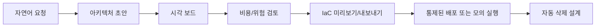

# 제품 방향

SketchCatch는 AWS 입문자가 자연어로 실습용 아키텍처를 만들고, 시각적으로 이해하고, 비용과 위험을 확인한 뒤, 승인된 IaC만 안전하게 다루도록 돕는 학습형 IaC 플랫폼이다.

## 문제 정의

AWS 초보자는 리소스 관계, 비용 발생 구조, 네트워크 연결, 삭제 책임을 한 번에 이해하기 어렵다.

- 어떤 리소스가 서로 연결되는지 시각적으로 이해하기 어렵다.
- 실습용으로 만든 리소스를 삭제하지 않아 비용 사고가 날 수 있다.
- Terraform 같은 IaC 도구를 처음부터 쓰기 어렵다.
- 콘솔에서 클릭으로 만든 리소스를 나중에 재현하거나 리뷰하기 어렵다.
- AI가 제안한 구조가 비용, 보안, 학습 목적에 맞는지 판단하기 어렵다.

## 핵심 가치

SketchCatch의 핵심 가치는 AWS 초보자가 비용 사고를 피하면서 아키텍처를 눈으로 배우고, IaC 기반의 안전한 실습 흐름을 익히게 하는 것이다.

## 대상 사용자

- AWS 입문자
- 클라우드 수업/부트캠프 학습자
- 안전한 실습 환경이 필요한 팀

## 제품 포지셔닝

초기에는 "AI 아키텍처 그림판"처럼 보일 수 있지만, 장기적으로는 IaC 생성, 검증, 배포, 버전 관리, 롤백까지 포함하는 안전한 실습 플랫폼으로 가는 것이 더 강하다.

- 시각화 도구만이 아니라 IaC 생성/검증 플랫폼
- AWS 콘솔 대체가 아니라 학습용 안전 레이어
- 무제한 배포 도구가 아니라 제한된 실습 배포 도구
- AI 생성 결과를 그대로 실행하는 도구가 아니라 리뷰와 승인 과정을 거치는 도구

## 3주 MVP 범위

팀은 3주차 안에 구현을 끝내는 것을 목표로 한다. 따라서 기능은 압축된 MVP 기준으로 관리한다.

| 주차 | 목표 |
| --- | --- |
| 1주차 | 공통 데이터 모델, 프로젝트 API, 아키텍처 JSON 스키마, 정적 보드 상태 확정 |
| 2주차 | 수정 가능한 아키텍처 보드 저장, asset 메타데이터, Terraform artifact 내보내기 저장, 비용/위험 모의 규칙 구현 |
| 3주차 | 통제된/모의 배포 기록, 템플릿 공유 기본 기능, API/프론트 통합, QA, 발표용 polish |

실제 AWS apply, 장기 보관 AWS 자격 증명, 제한 없는 배포 자동화는 안전장치와 함께 명시적으로 승인되기 전까지 범위에서 제외한다.

## MVP 우선순위

1. 아키텍처 JSON 저장과 시각 보드
2. 프로젝트 생성/조회와 아키텍처 스냅샷 저장
3. PNG/SVG 내보내기와 S3 저장
4. 자연어 입력 기반 architecture JSON 모의 생성
5. 리소스 타입 기반 비용/위험 규칙 엔진
6. Terraform 미리보기/내보내기
7. 제한된 배포 기록 또는 mock 실행 이력

초기 MVP의 기본 IaC 방향은 Terraform이다. CloudFormation은 AWS 학습 참고 자료나 향후 호환 대상으로 검토할 수 있지만, 구현 우선순위는 Terraform 미리보기/내보내기와 안전 검증에 둔다.

## 지금 만들지 말아야 하는 것

- 인증부터 무겁게 시작하기
- 실제 AWS 배포를 검증 없이 열기
- AI가 만든 Terraform을 바로 apply하기
- 비용 계산을 실제 청구 수준으로 과도하게 구현하기
- 모든 AWS 리소스를 처음부터 지원하기
- 디자인 시스템을 제품보다 먼저 크게 만들기

## 후순위 구현

| 항목 | 추가 시점 | 미루는 이유 |
| --- | --- | --- |
| 실제 AWS SDK 배포 호출 | 안전한 백엔드/워커 실행 경로를 설계한 뒤 | 잘못 쓰면 실제 리소스와 비용 사고가 발생할 수 있음 |
| Terraform CLI 실행 | 배포 안전장치와 자동 정리 설계 뒤 | 자동 배포를 너무 일찍 열면 위험함 |
| 장기 보관 AWS 자격 증명 | 인증/권한/암호화 저장 정책 확정 뒤 | 비밀값 관리와 권한 분리가 먼저 필요함 |
| Monaco Editor | Terraform 편집 UX가 실제 워크플로가 된 뒤 | 미리보기/내보내기 단계에서는 과한 의존성 |
| 워커 앱 | 자동 삭제 정책과 재시도 정책이 정해진 뒤 | 백그라운드 실행은 실패/중복 처리 설계가 필요함 |
| Husky/lint-staged | 팀이 로컬 pre-commit 강제를 원할 때 | 초기에는 CI 필수 체크로 충분함 |

## 주요 리스크

| 리스크 | 영향 | 대응 방향 |
| --- | --- | --- |
| AI가 잘못된 아키텍처 생성 | 잘못된 학습, 위험한 배포 | 규칙 엔진, 사람 승인, 제한된 리소스만 지원 |
| 실제 AWS 배포 비용 사고 | 사용자 비용 손실 | 예산 경고, 시간 제한, 자동 삭제, 허용 리소스 whitelist |
| DB schema 변경 실수 | 데이터 손상 | 수동 migration 워크플로, 백업, 리뷰 |
| S3 presigned URL 오남용 | 원치 않는 파일 업로드 | 콘텐츠 타입, key prefix, 만료 시간, 파일 크기 제한 |
| EC2 단일 장애점 | 서비스 중단 | 추후 ECS/ASG/RDS Multi-AZ 검토 |
| IAM 권한 과다 | 보안 위험 | 리소스 ARN 제한, 권한 주기적 축소 |

## 보안 원칙

- 프론트엔드 컴포넌트에서 AWS SDK를 직접 호출하지 않는다.
- AWS SDK 호출은 백엔드 API 또는 별도 워커에서만 한다.
- 실제 cloud 자격 증명은 저장소에 넣지 않는다.
- GitHub Actions는 OIDC Role ARN 방식을 사용한다.
- `.env`는 커밋하지 않고 `.env.example`만 유지한다.
- presigned URL은 짧은 만료 시간과 제한된 object key prefix를 사용한다.
