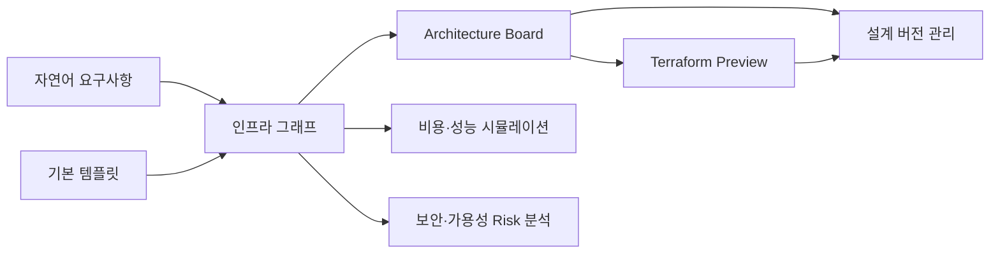

# 제품 방향

SketchCatch는 자연어와 시각적 다이어그램으로 클라우드 인프라를 설계하고, Terraform 코드 생성, 버전 관리, 비용·성능 시뮬레이션까지 지원하는 AI 기반 인프라 설계 플랫폼이다.

학습은 부가 가치로 유지하되, 제품의 중심 포지션은 "AWS 입문자용 학습 서비스"가 아니라 "초기 인프라 설계와 검토를 빠르게 반복할 수 있는 전문 보조 도구"로 둔다.

## 문제 정의

클라우드 인프라 설계는 리소스 간 의존성, 비용, 성능, 보안 조건을 동시에 고려해야 하므로 초기 설계 난이도가 높다.

- 자연어 요구사항을 AWS Resource와 연결 관계로 구조화하기 어렵다.
- VPC, Subnet, EC2, RDS, Security Group 같은 Resource를 어떤 기준으로 선택해야 하는지 판단하기 어렵다.
- 다이어그램과 Terraform 코드가 따로 움직이면 실제 설계 상태를 신뢰하기 어렵다.
- 설계 변경이 비용, 성능, 보안에 어떤 영향을 주는지 빠르게 비교하기 어렵다.
- 기존 콘솔이나 IaC 도구는 강력하지만, 여러 설계안을 시각적으로 실험하고 비교하기에는 무겁다.

## 핵심 가치

SketchCatch의 핵심 가치는 사용자의 요구사항을 인프라 그래프로 구조화하고, 그 그래프를 다이어그램·Terraform 코드·비용/성능 분석 결과로 일관되게 연결하는 것이다.

## 대상 사용자

- 인프라 지식은 어느 정도 있지만 초기 설계와 검토를 빠르게 하고 싶은 개발자
- 비용, 성능, 보안 조건을 함께 비교해야 하는 초기 스타트업 팀
- Terraform으로 관리 가능한 클라우드 구조를 시각적으로 실험하고 싶은 팀
- 클라우드 아키텍처 리뷰나 설계안 비교를 빠르게 하고 싶은 팀

완전한 AWS 입문자나 학습 전용 사용자는 주 타겟이 아니다. 그런 사용자는 Vercel, Firebase, Render, Railway, Lightsail 같은 더 단순한 배포 서비스를 선택할 가능성이 높다.

## 제품 포지셔닝

초기에는 "AI 아키텍처 그림판"처럼 보일 수 있지만, 장기적으로는 인프라 설계 그래프, Terraform 코드, 버전 관리, 시뮬레이션, 위험 분석을 연결하는 설계 플랫폼으로 가는 것이 더 강하다.

- 학습형 AWS 실습 도구가 아니라 AI 기반 인프라 설계·수정·시뮬레이션 플랫폼
- AWS 콘솔 대체가 아니라 설계 초안 생성과 검토를 빠르게 하는 보조 도구
- 단순 AI 리뷰가 아니라 비용·성능·보안 조건을 반영한 인프라 위험 분석 도구
- 단순 GitHub 코드 분석기가 아니라 자연어 요구사항을 인프라 그래프로 변환하는 도구
- 무제한 배포 도구가 아니라 승인된 IaC와 안전장치를 전제로 하는 운영 보조 도구

## 기술적 챌린지

발표에서는 아래 세 가지를 핵심 기술적 챌린지로 압축한다.

1. 자연어 요구사항을 인프라 그래프로 변환
   - 사용자의 모호한 요구사항을 AWS Resource, 연결 관계, 설정값, 제약 조건으로 구조화한다.
2. 인프라 그래프와 Terraform 코드의 동기화
   - 다이어그램 변경 사항과 Terraform Preview가 같은 원천 그래프를 바라보게 한다.
3. 비용·성능 시뮬레이션과 설계 버전 비교
   - 설계된 인프라 그래프를 기반으로 요청 흐름, 병목, 예상 비용, 변경점을 분석한다.

AWS API 호출, CI/CD 연결, 단순 AI 리뷰는 팀 입장에서는 구현 부담이 있어도 객관적인 기술적 챌린지로 보이기 약하므로 핵심 발표 포인트에서 내린다.

## 3주 MVP 범위

팀은 3주차 안에 구현을 끝내는 것을 목표로 한다. 따라서 MVP는 "실제 운영 배포"보다 "설계 그래프를 만들고 검토하는 흐름"에 집중한다.

| 주차 | 목표 |
| --- | --- |
| 1주차 | 공통 데이터 모델, 프로젝트 API, ArchitectureJson 스키마, 정적 보드 상태 확정 |
| 2주차 | 수정 가능한 Architecture Board 저장, 기본 템플릿, Terraform Preview 저장, 비용/위험 rule engine 구현 |
| 3주차 | 자연어 요구사항 기반 초안 생성, 비용·성능 시뮬레이션 최소 모델, 버전/이력 비교, API/프론트 통합, QA |

실제 AWS apply, 장기 보관 AWS 자격 증명, 제한 없는 배포 자동화는 안전장치와 함께 명시적으로 승인되기 전까지 범위에서 제외한다.

## MVP 우선순위

1. 자연어 요구사항 기반 인프라 초안 생성
2. Architecture Board 편집
3. 기본 템플릿 제공
4. ArchitectureJson 기반 Terraform Preview 생성
5. 비용 추정과 간단한 위험 분석
6. 비용·트래픽 시뮬레이션의 최소 모델
7. 설계 버전 기록과 변경점 비교

초기 MVP의 기본 IaC 방향은 Terraform이다. CloudFormation은 AWS 참고 자료나 향후 호환 대상으로 검토할 수 있지만, 구현 우선순위는 Terraform Preview와 그래프 동기화에 둔다.

## 지금 만들지 말아야 하는 것

- 인증부터 무겁게 시작하기
- 실제 AWS 배포를 검증 없이 열기
- AI가 만든 Terraform을 바로 apply하기
- GitHub 코드만 보고 "정답 인프라"를 자동 추천한다고 주장하기
- 단순 AI 튜터나 학습 모드를 제품 중심 기능으로 두기
- 협업 편집, CI/CD 엔진, 템플릿 마켓플레이스를 MVP 핵심으로 넣기
- 모든 AWS Resource를 처음부터 지원하기

## 후순위 구현

| 항목 | 추가 시점 | 미루는 이유 |
| --- | --- | --- |
| 실제 AWS SDK 배포 호출 | 안전한 백엔드/워커 실행 경로를 설계한 뒤 | 잘못 쓰면 실제 리소스와 비용 사고가 발생할 수 있음 |
| Terraform CLI 실행 | 배포 안전장치와 자동 정리 설계 뒤 | 자동 배포를 너무 일찍 열면 위험함 |
| GitHub 링크 기반 인프라 초안 생성 | 자연어 요구사항 기반 생성이 안정화된 뒤 | 소스 코드만으로 배포 방식의 정답을 판단하기 어렵다 |
| 실시간 협업 편집 | 설계 리뷰/공유 수요가 확인된 뒤 | 인프라 설계를 동시에 편집하는 사용 사례가 핵심 가치와 멀 수 있음 |
| CI/CD 엔진 | 설계·검토·승인 흐름이 안정화된 뒤 | 기존 서비스를 연결하는 성격이 강해 기술적 챌린지로 약함 |
| 템플릿 마켓플레이스 | 기본 템플릿 사용성이 검증된 뒤 | MVP에서는 기본 제공 템플릿만으로 충분함 |

## 주요 리스크

| 리스크 | 영향 | 대응 방향 |
| --- | --- | --- |
| AI가 잘못된 아키텍처 생성 | 잘못된 설계안과 위험한 Terraform Preview | 규칙 엔진, 사람 승인, 제한된 Resource set, deterministic fallback |
| 자연어 요구사항 과해석 | 사용자가 의도하지 않은 Resource 생성 | 제약 조건을 구조화하고, confidence와 assumptions를 표시 |
| 비용·성능 시뮬레이션 과신 | 실제 운영 성능이나 청구액 오해 | 시뮬레이션 가정과 한계를 명확히 표시 |
| 실제 AWS 배포 비용 사고 | 사용자 비용 손실 | 예산 경고, 시간 제한, 자동 삭제, 허용 리소스 whitelist |
| DB schema 변경 실수 | 데이터 손상 | 수동 migration 워크플로, 백업, 리뷰 |
| IAM 권한 과다 | 보안 위험 | 리소스 ARN 제한, 권한 주기적 축소 |

## 보안 원칙

- 프론트엔드 컴포넌트에서 AWS SDK를 직접 호출하지 않는다.
- AWS SDK 호출은 백엔드 API 또는 별도 워커에서만 한다.
- 실제 cloud 자격 증명은 저장소에 넣지 않는다.
- GitHub Actions는 OIDC Role ARN 방식을 사용한다.
- `.env`는 커밋하지 않고 `.env.example`만 유지한다.
- presigned URL은 짧은 만료 시간과 제한된 object key prefix를 사용한다.
