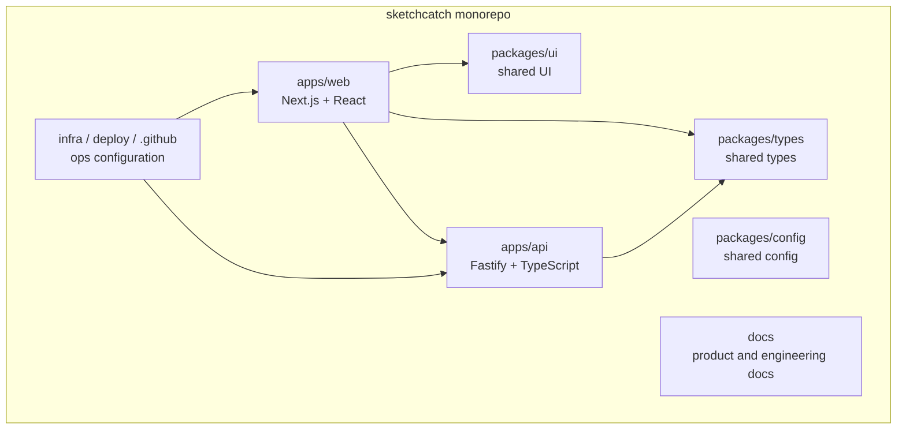
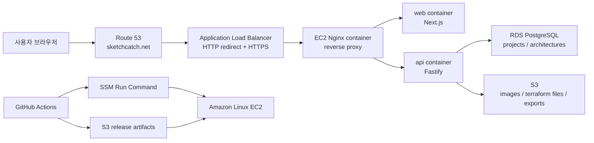

# 아키텍처와 기술 스택

## 전체 구조

SketchCatch는 pnpm workspace와 Turborepo 기반 모노레포입니다. 프론트엔드, 백엔드, 공유 타입, 공유 UI, 설정 패키지를 분리해 5인 팀이 동시에 작업해도 충돌을 줄이는 구조를 목표로 합니다.

## 운영 배포 구조

현재 운영 배포는 Docker Compose가 아니라 Docker image + EC2 + SSM + Nginx + GitHub Actions 방식입니다. HTTPS는 ALB, ACM, Route 53 조합을 기준으로 준비되어 있습니다.

## 기술 스택

| 영역                | 선택한 기술                  | 선택 이유                                               |
| ------------------- | ---------------------------- | ------------------------------------------------------- |
| 패키지 관리         | pnpm workspace               | 빠른 설치, 모노레포 패키지 연결, 디스크 효율            |
| 빌드 오케스트레이션 | Turborepo                    | 앱/패키지 빌드 순서와 캐시 관리                         |
| 프론트엔드          | Next.js, React, TypeScript   | 라우팅, React 생태계, 타입 안정성                       |
| API 서버            | Fastify, TypeScript          | 빠른 Node API 서버, 스키마 검증과 플러그인 구조에 유리  |
| DB                  | RDS PostgreSQL               | 관계형 데이터, 프로젝트/아키텍처 JSON 저장, 운영 안정성 |
| ORM                 | Drizzle ORM, drizzle-kit     | SQL에 가까운 타입 안전 ORM, 마이그레이션 관리           |
| 파일 저장           | S3 presigned upload          | 이미지, IaC 파일, export zip 저장에 적합                |
| 배포                | Docker, EC2, SSM, Nginx      | 서버 제어권 확보, 운영 구조 학습, SSH 없는 배포         |
| HTTPS               | ALB, ACM, Route 53           | AWS 정석 방식의 인증서/로드밸런싱/도메인 관리           |
| CI/CD               | GitHub Actions, OIDC         | 장기 AWS Access Key 없이 배포 권한 위임                 |
| 코드 품질           | ESLint, Prettier, TypeScript | 팀 코드 스타일 통일, 타입 오류 조기 발견                |

## 왜 이 구조를 골랐나

SketchCatch의 핵심은 단순 화면 구현이 아니라, AI 생성, 시각 편집, 비용/위험 검증, IaC 생성, 제한된 AWS 배포, 자동 삭제까지 이어지는 흐름입니다. 그래서 처음부터 프론트엔드와 백엔드, 공유 타입, 인프라 설정을 분리한 구조가 필요합니다.

모노레포를 선택한 이유는 프론트엔드와 백엔드가 같은 도메인 타입을 공유해야 하기 때문입니다. `ArchitectureNode`, `ArchitectureEdge`, `BudgetLimit`, `PracticeSession` 같은 타입은 API와 UI 양쪽에서 함께 바뀝니다. 별도 저장소로 나누면 초반 팀 속도보다 동기화 비용이 더 커집니다.

RDS와 S3를 함께 쓰는 이유는 역할이 다르기 때문입니다. 프로젝트 정보, 아키텍처 JSON, 배포 이력, 비용 분석 결과는 조회와 관계가 중요하므로 RDS가 맞습니다. 반대로 PNG/SVG 다이어그램, Terraform 파일, export zip은 파일 객체이므로 S3가 맞습니다.

## 대안과 차이점

| 대안                     | 장점                              | 이번에 선택하지 않은 이유                                            |
| ------------------------ | --------------------------------- | -------------------------------------------------------------------- |
| Vercel 단독 배포         | Next.js 배포가 매우 쉬움          | API, RDS, S3, AWS 운영 학습, EC2 기반 제어가 약함                    |
| Docker Compose 운영 배포 | 한 서버에서 빠르게 묶어 실행 가능 | 운영 배포에서는 Compose를 쓰지 않기로 결정                           |
| ECS/Fargate              | 컨테이너 운영 정석에 가까움       | 초기 설정과 비용/학습 부담이 EC2보다 큼                              |
| Lambda/API Gateway       | 서버 관리 부담이 작음             | Docker 기반 일관성, Nginx 라우팅 학습에는 덜 적합                    |
| Prisma                   | 사용성이 좋고 생태계가 큼         | Drizzle이 SQL에 더 가깝고 가벼워 현재 저장 기반에 적합               |
| MongoDB                  | JSON 저장이 편함                  | 프로젝트/배포/자산/세션 관계 모델과 트랜잭션에는 PostgreSQL이 안정적 |

## 장점과 단점

장점:

- 팀원이 앱, API, 타입, 인프라를 명확히 나누어 작업할 수 있습니다.
- TypeScript와 공유 타입으로 프론트엔드/백엔드 계약이 깨지는 일을 줄입니다.
- RDS와 S3의 책임이 분리되어 데이터 모델이 명확합니다.
- OIDC 기반 GitHub Actions라 장기 AWS Access Key를 저장하지 않습니다.
- SSM 기반 배포라 GitHub Actions에서 EC2 SSH 접속을 직접 열 필요가 없습니다.

단점:

- Vercel 같은 완전 관리형 배포보다 운영 설정이 많습니다.
- ALB, RDS, EC2는 항상 비용이 발생할 수 있습니다.
- EC2 단일 인스턴스 구조라 고가용성은 아직 부족합니다.
- 마이그레이션을 수동 승인으로 실행하기 때문에 운영 절차를 팀이 지켜야 합니다.

## 앞으로 추가할 수 있는 것

- CloudWatch Logs와 알람을 실제 운영 기준으로 정리
- ALB target health, API latency, DB connection 알람 추가
- RDS 백업, 스냅샷, 파라미터 그룹, 접근 제한 정리
- S3 lifecycle policy로 임시 실습 파일 자동 만료
- GitHub branch protection과 PR 필수 체크
- dev/staging/prod 환경 분리
- Terraform 또는 CDK로 인프라 전체를 코드화
