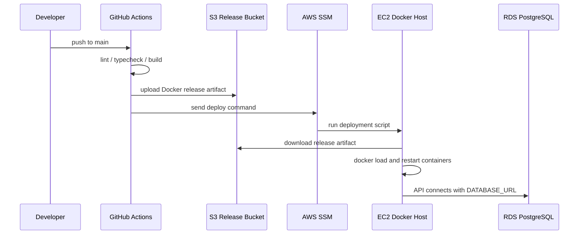

# 현재 환경 구축 상태

## 요약

현재 SketchCatch는 제품 기능을 만들기 전, 개발과 배포를 시작할 수 있는 기반 환경이 구축된 상태입니다. 빈 페이지 접속, API health check, RDS 연결 확인, 기본 프로젝트 저장, S3 presigned upload 준비, GitHub Actions CI/CD, EC2 Docker 배포 흐름이 준비되어 있습니다.

## 완료된 항목

| 구분            | 상태      | 내용                                          |
| --------------- | --------- | --------------------------------------------- |
| 모노레포        | 완료      | pnpm workspace, Turborepo, TypeScript         |
| 웹 앱           | 완료      | Next.js 기본 페이지와 workspace placeholder   |
| API 앱          | 완료      | Fastify 기반 API, `/health`, `/health/db`     |
| RDS 연결        | 완료      | PostgreSQL RDS 연결 및 dedicated DB/user 사용 |
| DB 마이그레이션 | 준비 완료 | Drizzle 기반 수동 migration workflow          |
| S3 업로드 기반  | 완료      | presigned upload URL API와 CORS 설정 파일     |
| Docker 배포     | 완료      | API/Web/Nginx 컨테이너 배포                   |
| CI              | 완료      | lint, typecheck, build                        |
| CD              | 완료      | main push 기준 EC2 배포                       |
| SSM 배포        | 완료      | SSH 대신 SSM Run Command 기반                 |
| 도메인/HTTPS    | 준비됨    | Route 53, ALB, ACM workflow와 보안그룹 정리   |
| 모니터링        | 준비됨    | CloudWatch/SNS workflow와 로그 설정 옵션      |

## 현재 런타임 흐름



## 구현된 API 범위

- `GET /health`
- `GET /health/db`
- `POST /api/projects`
- `GET /api/projects/:id`
- `POST /api/projects/:id/architectures`
- `POST /api/projects/:id/assets/presigned-upload`

이 API들은 실제 제품 UI를 만들기 위한 기초 저장 기반입니다. 인증, AI 생성, Terraform 실행, 실제 AWS 배포 기능은 아직 구현하지 않았습니다.

## 아직 구현하지 않은 것

- 로그인과 사용자 계정
- React Flow 기반 아키텍처 보드
- AI prompt-to-architecture 생성
- 비용 계산 엔진
- 보안 위험 분석 엔진
- Terraform 또는 CloudFormation 코드 생성
- 실제 AWS 리소스 생성
- 자동 삭제 세션 스케줄러
- 배포 이력/롤백 UI
- IaC 코드 에디터

## 운영상 확인해야 하는 것

- `https://sketchcatch.net` 접속 확인
- ALB target group health check 확인
- EC2 security group에서 public `0.0.0.0/0:80` 제거 확인
- SNS 이메일 구독 확인
- CloudWatch Logs 활성화 여부 결정
- GitHub branch protection 설정
- dev 브랜치 기준 PR flow 적용

## 환경 변수 원칙

실제 값은 GitHub Secrets, GitHub Variables, EC2 `/etc/sketchcatch/*.env`에서 관리합니다. 저장소에는 `.env.example`만 둡니다.

```text
DATABASE_URL
DATABASE_SSL
RDS_ENDPOINT
AWS_REGION
S3_BUCKET_NAME
NEXT_PUBLIC_API_BASE_URL
CLOUDWATCH_LOGS_ENABLED
CLOUDWATCH_LOG_GROUP_PREFIX
```

실제 DB 비밀번호, AWS Access Key, `.env`, private key는 저장소에 커밋하지 않습니다.
