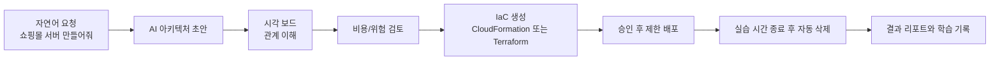

# 제품 전략과 MVP 방향

## 제품 한 줄 정의

SketchCatch는 AWS 입문자가 자연어로 실습용 아키텍처를 만들고, 시각적으로 이해하고, 비용과 위험을 확인한 뒤, 승인된 IaC만 안전하게 배포하고 자동 삭제할 수 있게 돕는 학습형 IaC 플랫폼입니다.

## 문제 정의

AWS 초보자는 리소스 관계, 비용 발생 구조, 네트워크 연결, 삭제 책임을 한 번에 이해하기 어렵습니다.

- 어떤 리소스가 서로 연결되는지 시각적으로 이해하기 어렵습니다.
- 실습용으로 만든 리소스를 삭제하지 않아 비용 사고가 납니다.
- Terraform이나 CloudFormation을 처음부터 쓰기 어렵습니다.
- 콘솔에서 클릭으로 만든 리소스를 나중에 재현하거나 리뷰하기 어렵습니다.
- AI가 제안한 구조가 비용, 보안, 학습 목적에 맞는지 판단하기 어렵습니다.

## 핵심 가치

SketchCatch의 핵심 가치는 AWS 초보자가 비용 사고를 피하면서 아키텍처를 눈으로 배우고, IaC 기반의 안전한 실습 흐름을 익히게 하는 것입니다.

## 제품 포지셔닝

초기에는 "AI 아키텍처 그림판"으로 보일 수 있지만, 장기적으로는 IaC 생성, 검증, 배포, 버전 관리, 롤백까지 포함하는 안전한 실습 플랫폼으로 가는 것이 더 강합니다.

- 시각화 도구만이 아니라 IaC 생성/검증 플랫폼
- AWS 콘솔 대체가 아니라 학습용 안전 레이어
- 무제한 배포 도구가 아니라 제한된 실습 배포 도구
- AI 생성 결과를 그대로 실행하는 도구가 아니라 리뷰와 승인 과정을 거치는 도구

## 참고 제품과 차이점

| 제품                     | 배울 점                              | SketchCatch와의 차이                            |
| ------------------------ | ------------------------------------ | ----------------------------------------------- |
| Brainboard               | 클라우드 아키텍처 시각화와 IaC 연결  | AWS 초보자 학습과 비용 사고 방지에 더 집중      |
| ArchFormation            | CloudFormation 기반 시각화/생성 방향 | AI 설명, 실습 세션, 자동 삭제까지 포함          |
| Massdriver               | 인프라 패키징과 운영 추상화          | 엔터프라이즈 운영보다 초보자 실습 경험이 우선   |
| AWS Application Composer | AWS 공식 시각 설계 경험              | 학습 가이드, 위험 설명, 시간 제한 실습이 차별점 |

## 추천 MVP 우선순위

1. 아키텍처 JSON 저장과 React Flow 보드
2. PNG/SVG export와 S3 저장
3. 자연어 입력 기반 architecture JSON mock 생성
4. 리소스 타입 기반 비용/위험 rule engine
5. CloudFormation 또는 Terraform preview/export
6. 제한된 배포와 자동 삭제 설계

초기 MVP에서는 CloudFormation을 먼저 고려할 수 있습니다. AWS 초보자에게 AWS 리소스 모델을 설명하기 쉽고, AWS 공식 서비스와의 연결이 자연스럽기 때문입니다. Terraform은 이후 멀티 클라우드와 실무 확장을 위해 추가하는 방향이 좋습니다.

## 지금 만들지 말아야 하는 것

- 인증부터 무겁게 시작하기
- 실제 AWS 배포를 검증 없이 열기
- AI가 만든 Terraform을 바로 apply하기
- 비용 계산을 실제 청구 수준으로 과도하게 구현하기
- 모든 AWS 리소스를 처음부터 지원하기
- 디자인 시스템을 제품보다 먼저 크게 만들기

## 장기 기능 방향

- CloudFormation/Terraform editor
- 코드에서 시각 보드로 변환
- 시각 보드에서 IaC로 변환
- 배포 이력과 rollback
- AI 코드 리뷰
- 비용/보안 rule engine
- GitOps 연동
- 팀별 workspace
- 실습 세션 자동 삭제
- 학습 리포트와 실습 결과 공유
