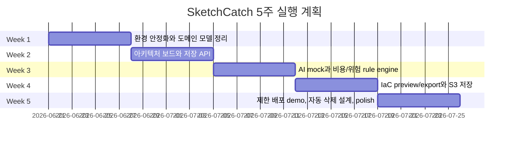

# 5주 팀 개발 계획

## 전제

팀은 5명이고, AI 도구를 적극 활용합니다. 목표는 모든 AWS 기능을 지원하는 것이 아니라, "AWS 입문자가 안전하게 아키텍처를 만들고 이해하는 핵심 경험"을 완성도 있게 보여주는 것입니다.

## 추천 역할 분담

| 역할               | 담당 영역                                            |
| ------------------ | ---------------------------------------------------- |
| Frontend Lead      | Next.js 화면, React Flow 보드, export UX             |
| Backend Lead       | Fastify API, RDS schema, project/architecture API    |
| IaC/Cloud Lead     | CloudFormation/Terraform preview, AWS 제한 배포 설계 |
| AI/Rules Lead      | prompt-to-architecture, cost/risk rule engine        |
| Ops/QA/Polish Lead | CI/CD, HTTPS, CloudWatch, QA, 발표 자료              |

## 전체 일정

## Week 1: 기반 안정화

- dev 브랜치와 PR flow 정착
- HTTPS 접속 확인
- CloudWatch 알람 이메일 확인
- 현재 API/RDS/S3 smoke test 문서화
- 아키텍처 JSON schema 초안 합의

완료 조건:

- `pnpm lint`, `pnpm typecheck`, `pnpm build` 통과
- `https://sketchcatch.net/health` 확인
- `https://sketchcatch.net/health/db` 확인
- 프로젝트 생성 API smoke test 통과
- 팀 코드 컨벤션과 PR 템플릿 정리

## Week 2: 시각 보드 MVP

- React Flow 기반 static architecture board
- ArchitectureNode/ArchitectureEdge 타입 확정
- 저장된 architecture JSON 조회/수정
- PNG/SVG export UX 초안

## Week 3: AI mock과 비용/위험 rule engine

- 자연어 입력에서 architecture JSON 생성 mock
- 리소스 타입 기반 비용/위험 rule engine
- 위험 수준 `low`, `medium`, `high` 표시
- 위험 이유와 수정 가이드 표시

예시 rule:

- public inbound `0.0.0.0/0`는 경고
- NAT Gateway는 비용 주의
- RDS는 삭제 누락 주의
- ALB는 고정 비용 주의
- S3 public access는 위험

## Week 4: IaC preview와 export

- CloudFormation 또는 Terraform preview 생성
- 생성 파일 S3 저장
- 다운로드 링크 제공
- 버전별 architecture snapshot 저장

추천은 CloudFormation 먼저 검토하고 Terraform은 파일 export 수준부터 시작하는 것입니다. apply 실행은 아직 막아두거나 admin-only demo로 제한합니다.

## Week 5: 제한 배포와 발표 완성

- 안전 장치가 있는 제한 배포 demo 결정
- 자동 삭제 설계 또는 mock worker 구현
- 발표용 시나리오 완성
- UI polish와 오류 상태 정리
- 비용 사고 방지 메시지 강화

발표 시나리오:

1. 사용자가 "쇼핑몰 서버 만들어줘" 입력
2. AI가 아키텍처 초안 생성
3. 보드에서 리소스 관계 확인
4. 비용/위험 경고 확인
5. IaC preview 확인
6. export 또는 제한 배포
7. 실습 종료 후 삭제 계획 확인

## AI 활용 방식

좋은 사용처:

- 타입 초안 생성
- 테스트 케이스 생성
- rule engine 시나리오 확장
- UI 문구 다듬기
- PR 리뷰 보조
- AWS 문서 요약

주의할 점:

- AI가 만든 AWS 권한을 그대로 붙이지 않습니다.
- AI가 만든 Terraform을 그대로 apply하지 않습니다.
- 비용과 보안 관련 판단은 사람이 리뷰합니다.
- 실제 secret은 AI 도구에 붙여넣지 않습니다.
