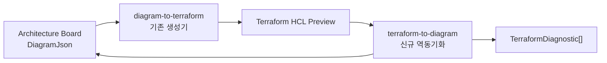
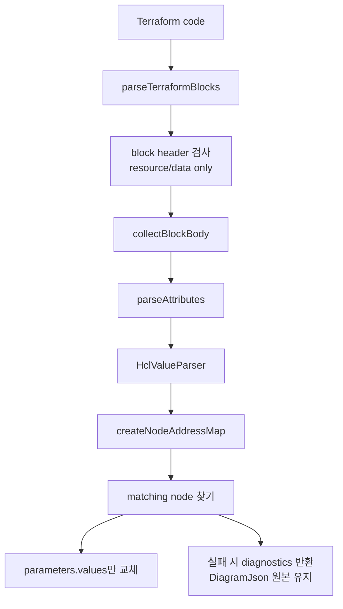
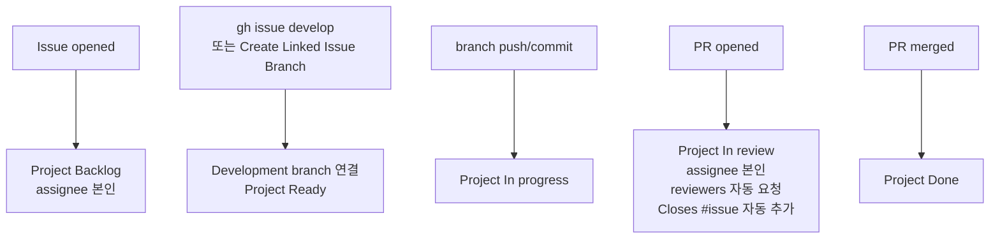

# Terraform 동기화 구조 설명

이 문서는 이슈 #29 `Terraform 코드 수정 사항을 DiagramJson에 반영` 작업의 구조, 설계 의도, 기술 선택 이유를 설명한다.

## 전체 목표

이번 작업의 목표는 사용자가 Terraform Preview를 수정했을 때 그 변경 사항을 기존 `DiagramJson.nodes[].parameters.values`에 안전하게 되돌리는 것이다.

핵심 흐름은 아래와 같다.



`DiagramJson`과 Terraform 중 하나를 유일한 원본으로 보지 않는다. 둘 다 사용자가 만질 수 있는 편집 표면이고, 실제 동기화는 같은 리소스 identity를 기준으로 이뤄진다.

## 동기화 기준

Terraform block과 `DiagramJson` node는 아래 identity로 매칭한다.

```text
terraformBlockType + resourceType + resourceName
```

예시는 아래와 같다.

```text
resource.aws_vpc.main
data.aws_ami.ubuntu
```

이 기준을 쓰는 이유는 `resourceType`, `resourceName`만으로는 `resource`와 `data` block이 충돌할 수 있기 때문이다.

## 구현 구조

신규 service는 아래 파일에 둔다.

```text
apps/api/src/services/terraform/terraform-to-diagram.ts
```

공개 함수는 하나다.

```ts
syncTerraformToDiagramJson(diagramJson, terraformCode)
```

내부 흐름은 아래와 같다.



## 기술 선택 이유

전체 HCL parser를 붙이지 않고 작은 parser를 직접 둔 이유는 이 기능이 모든 Terraform을 해석하려는 기능이 아니기 때문이다.

이번 범위는 SketchCatch 생성기가 만든 제한된 HCL subset을 다시 읽는 것이다. 그래서 dependency를 추가하기보다 지원 범위를 좁히고, 지원하지 않는 표현은 mutation 대신 diagnostic으로 거절하는 쪽을 선택했다.

이 선택은 MVP에 맞다.

- 동작 범위가 예측 가능하다.
- 테스트해야 할 표면이 작다.
- 보드 상태를 실수로 망가뜨릴 위험이 낮다.
- Terraform 실행, AWS SDK, S3, DB 없이 순수 함수로 검증할 수 있다.

## 지원 범위

지원하는 Terraform subset은 아래와 같다.

- `resource` block
- `data` block
- top-level attribute
- string
- number
- boolean
- null
- list
- map/object
- Terraform reference 문자열

지원하지 않는 입력은 diagnostic으로 반환한다.

- `module`, `provider`, `variable`, `output`, `locals`
- function call
- interpolation
- ternary
- for expression
- nested block
- heredoc
- 같은 Terraform address 중복
- 기존 node와 매칭되지 않는 block
- 값 뒤에 남은 알 수 없는 trailing token

## trailing token 처리

아래 입력은 사람이 보기에는 `filter_values` list처럼 보이지만, `]` 뒤에 `asdfasdf`가 남아 있으므로 안전하게 거절해야 한다.

```hcl
data "aws_ami" "ami" {
  owners = [
    "",
  ]
  filter_name = "cxzv"
  filter_values = [
    "",
  ]asdfasdf
}
```

이 경우 `terraform.sync.trailing_tokens` diagnostic을 반환한다.

같은 규칙은 아래에도 적용한다.

```hcl
cidr_block = "10.0.0.0/16"abc
enabled = true???
tags = { Name = "main" }tail
```

허용되는 trailing token은 공백과 line comment뿐이다.

```hcl
cidr_block = "10.0.0.0/16" # ok
enabled = true // ok
```

## 안전성 규칙

가장 중요한 규칙은 실패 시 partial update를 하지 않는 것이다.

아래 상황에서는 입력 `DiagramJson`을 그대로 반환한다.

- 파싱 오류가 있다.
- block이 기존 node와 매칭되지 않는다.
- duplicate address가 있다.
- 지원하지 않는 expression이 있다.
- trailing token이 있다.

성공할 때만 새 `DiagramJson` 객체를 만들고 아래 필드만 바꾼다.

```text
node.parameters.values
```

유지하는 값은 아래와 같다.

- `node.id`
- `node.position`
- `node.size`
- `node.locked`
- `node.zIndex`
- `node.style`
- `node.parameters.resourceType`
- `node.parameters.resourceName`
- `node.parameters.fileName`
- `edges`
- `viewport`

자동으로 하지 않는 것도 명확히 둔다.

- 새 node 생성
- edge 생성
- node 삭제
- `resourceName` rename 추론
- Terraform reference를 edge로 변환

## 공유 타입

`packages/types/src/index.ts`에는 API 계약용 타입을 둔다.

```ts
export type TerraformSyncToDiagramRequest = {
  diagramJson: DiagramJson;
  terraformCode: string;
};

export type TerraformSyncToDiagramResponse = {
  diagramJson: DiagramJson;
  diagnostics: TerraformDiagnostic[];
};
```

응답이 `diagramJson`과 `diagnostics`를 함께 가지는 이유는 UI가 성공과 실패를 같은 응답 구조로 처리할 수 있게 하기 위해서다.

실패하면 `diagramJson`은 입력과 같은 객체를 그대로 반환한다.

## 테스트 전략

테스트 파일은 아래에 둔다.

```text
apps/api/src/services/terraform/terraform-to-diagram.test.ts
```

기존 `diagram-to-terraform.test.ts`와 같은 방식으로 `node:test`, `assert`를 쓴다. 새 테스트 dependency를 추가하지 않고 repo의 기존 테스트 스타일을 따른다.

테스트가 보장하는 것은 아래와 같다.

- resource block 값 갱신
- data block 값 갱신
- unmatched block 거절
- unsupported expression 거절
- trailing token 거절
- duplicate address 거절
- Terraform reference를 string value로 보존
- `edges`와 `viewport` 유지

## API 연결 범위

service와 shared type은 준비되어 있고, API route는 아래 형태로 연결한다.

```text
POST /terraform/sync-to-diagram
```

요청:

```ts
type TerraformSyncToDiagramRequest = {
  diagramJson: DiagramJson;
  terraformCode: string;
};
```

응답:

```ts
type TerraformSyncToDiagramResponse = {
  diagramJson: DiagramJson;
  diagnostics: TerraformDiagnostic[];
};
```

route도 기존 `/terraform/generate`, `/terraform/validate`처럼 `requireActiveUserId`를 먼저 호출한다.

## GitHub 자동화 구조

작업 관리 자동화는 아래 흐름을 따른다.



`Project Automation` workflow는 issue, branch, push, PR 이벤트를 받아 Project status를 바꾼다.

`Create Linked Issue Branch` workflow는 내부에서 `gh issue develop`을 실행한다. 이 방식을 쓰면 GitHub issue의 `Development` 섹션에 branch가 공식 연결된다.

## 팀 작업 규약

이슈 작업을 시작할 때는 아래 방식 중 하나를 사용한다.

```bash
gh issue develop <issue-number> \
  --repo NearthYou/SketchCatch \
  --name feature/<name>/<issue-number>-<task-name> \
  --base dev \
  --checkout
```

또는 GitHub Actions에서 `Create Linked Issue Branch`를 실행한다.

그냥 `git checkout -b`로 issue branch를 만들면 Project 상태 자동화는 일부 동작할 수 있지만, GitHub issue의 `Development` 연결은 보장되지 않는다.

## 정리

이번 작업의 핵심은 두 가지다.

첫째, Terraform 편집과 `DiagramJson` 편집을 같은 리소스 identity 위에서 안전하게 양방향 동기화하는 기반을 만든다.

둘째, 팀원이 Codex와 GitHub를 써도 Issue, Branch, Commit, PR, Merge 상태가 Project에 자동 반영되는 협업 흐름을 만든다.

이 구조 덕분에 SketchCatch는 단순한 다이어그램 도구가 아니라 Terraform-first IaC 편집/검증 플랫폼 방향으로 이어질 수 있다.
