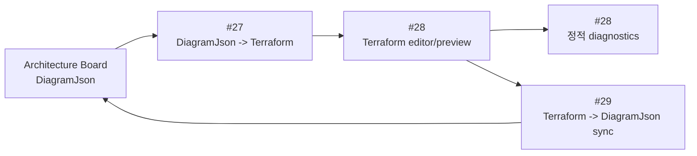
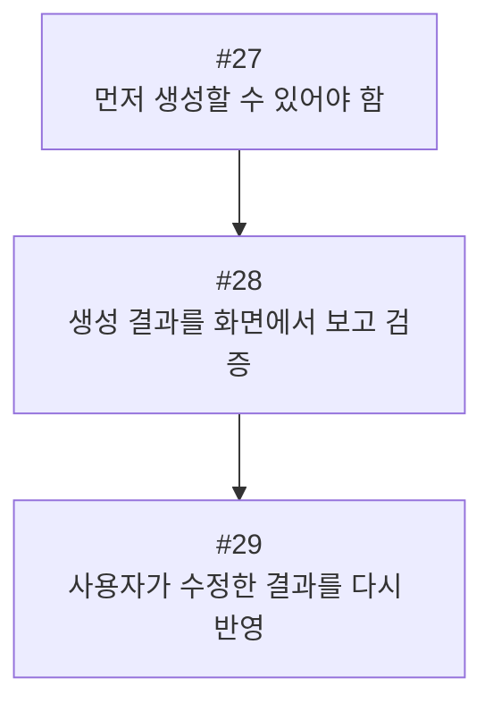
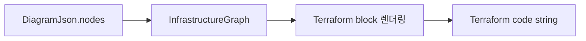
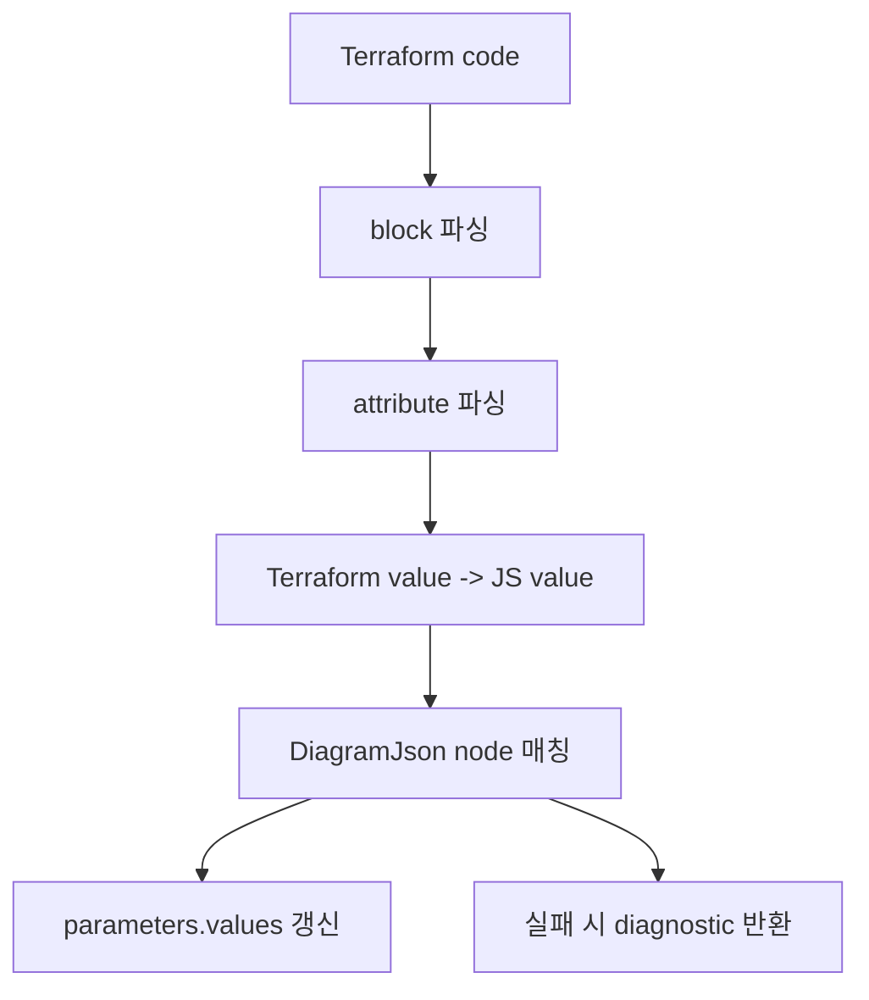
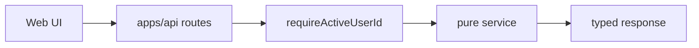
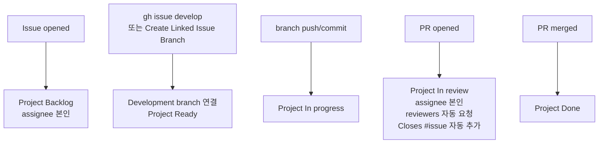

# Terraform 변환/검증/동기화 구조 설명

이 문서는 이슈 #27, #28, #29에서 만든 Terraform 관련 작업을 한 번에 이해할 수 있도록 정리한 설명서다.

처음 읽는 사람은 “다이어그램을 Terraform으로 만들고, 사용자가 Terraform을 수정하면 다시 다이어그램에 반영한다”는 큰 흐름을 잡으면 된다. 조금 더 깊게 보는 사람은 왜 전체 Terraform parser나 Terraform CLI를 바로 붙이지 않고, 제한된 subset과 순수 함수 중심으로 설계했는지를 보면 된다.

## 한 줄 요약

SketchCatch의 Terraform 흐름은 아래 세 단계로 나뉜다.

```text
#27 DiagramJson -> Terraform 생성
#28 Terraform 코드 표시/정적 검증
#29 수정된 Terraform -> DiagramJson 값 동기화
```

그림으로 보면 이렇게 이어진다.



중요한 점은 `DiagramJson`과 Terraform 중 하나만 절대 원본으로 보지 않는다는 것이다. 둘 다 사용자가 만지는 편집 표면이고, 같은 리소스 identity를 기준으로 서로 맞춘다.

## 빠르게 이해하는 비유

`DiagramJson`은 화면에 그려진 클라우드 설계도다.

Terraform은 그 설계도를 실제 인프라 코드로 적은 문서다.

이슈 #27은 “설계도를 보고 Terraform 문서를 작성하는 기능”이다.

이슈 #28은 “작성된 Terraform 문서를 화면에서 보고, 문법상 이상한 부분을 알려주는 기능”이다.

이슈 #29는 “사용자가 Terraform 문서를 고치면, 그 변경을 다시 설계도 속 리소스 설정값에 반영하는 기능”이다.

즉, 사용자는 다이어그램과 Terraform 중 편한 쪽을 볼 수 있고, 둘은 같은 설계를 바라보게 된다.

## 왜 이 순서로 만들었나

이 세 이슈는 순서가 중요하다.



#27 없이 #28을 만들면 화면에 보여줄 Terraform이 없다.

#28 없이 #29를 만들면 사용자가 Terraform을 수정하고 확인할 UI/API 흐름이 없다.

#29 없이 끝나면 Terraform은 단순 preview가 되고, 사용자가 코드를 고친 내용이 보드로 돌아오지 못한다.

그래서 #27, #28, #29는 “생성 -> 검증 -> 역동기화” 순서로 하나의 기능을 완성한다.

## #27 DiagramJson 기반 Terraform Preview 생성 흐름

#27의 목표는 `DiagramJson` 객체를 받아 Terraform 코드 문자열을 만드는 것이다. 현재 구현은 API용 orchestration과 HCL 렌더링 책임을 분리한다.

API에서 호출하는 공개 함수는 아래 service에 있다.

```text
apps/api/src/services/terraform/terraform-preview.ts
```

HCL 문자열 렌더러는 아래 service에 있다.

```text
apps/api/src/services/terraform/diagram-to-terraform.ts
```

공개 함수는 하나다.

```ts
generateTerraformFromDiagramJson(diagramJson): string
```

입력은 보드 상태인 `DiagramJson`이고, 출력은 Terraform HCL 문자열이다. 중간에 `InfrastructureGraph`를 만들어 Terraform에 필요한 IaC identity와 config만 정규화한다.



## #27에서 처리하는 규칙

변환기는 모든 node를 Terraform으로 만들지 않는다.

아래 조건을 만족하는 node만 출력한다.

- `kind === "resource"`
- `parameters`가 있음

`parameters.invalid === true`여도 Terraform Preview skeleton은 유지한다. 이 값은 파라미터 패널과 리소스 목록의 경고 상태로 사용하고, Preview block 자체를 숨기는 조건으로 쓰지 않는다.

`parameters.terraformBlockType`이 없으면 기본값은 `resource`다.

예를 들어 `DiagramJson` 값이 이렇게 있으면:

```ts
{
  resourceType: "aws_vpc",
  resourceName: "main",
  values: {
    cidrBlock: "10.0.0.0/16",
    enableDnsSupport: true
  }
}
```

Terraform은 이렇게 나온다.

```hcl
resource "aws_vpc" "main" {
  cidr_block = "10.0.0.0/16"
  enable_dns_support = true
}
```

여기서 `cidrBlock`이 `cidr_block`으로 바뀌는 이유는 TypeScript/프론트 상태는 `camelCase`, Terraform attribute는 `snake_case`를 쓰기 때문이다.

## #27의 기술 선택 이유

이 변환기는 DB, S3, filesystem, Terraform CLI, AWS SDK를 모른다.

순수 함수로 둔 이유는 명확하다.

- 입력과 출력이 예측 가능하다.
- 테스트가 쉽다.
- API, worker, 프론트 어디서 호출해도 부작용이 없다.
- 실제 AWS 변경과 완전히 분리된다.

Terraform reference는 문자열이어도 따옴표 없이 출력한다.

```ts
{ vpcId: "aws_vpc.main.id" }
```

위 값은 아래처럼 나온다.

```hcl
vpc_id = aws_vpc.main.id
```

반대로 일반 문자열은 JSON string처럼 안전하게 quote한다.

## #28 Terraform editor와 diagnostics

#28의 초기 목표는 #27에서 만든 Terraform을 웹에서 확인하고, 실제 Terraform CLI 없이 기본적인 문제를 알려주는 것이었다. 현재 canonical 계약은 `docs/data-models.md`의 `Terraform 생성과 Editor 검증 DTO`를 따른다.

API route는 아래 파일에 있다.

```text
apps/api/src/routes/terraform.ts
```

주요 endpoint는 두 개다.

```text
POST /terraform/generate
POST /terraform/validate
```

`/terraform/generate`는 `DiagramJson`을 받아 #27의 `generateTerraformFromDiagramJson`을 호출한다.

`/terraform/validate`는 Terraform CLI를 실행하지 않는 static-only diagnostics를 반환한다. 여러 파일이 있으면 `terraformFiles`를 함께 보내고, API는 파일별 문자열을 검사해 `sourceFileName`이 붙은 diagnostics를 반환한다.

정적 diagnostics service는 아래 파일에 있다.

```text
apps/api/src/services/terraform/terraform-diagnostics.ts
```

## #28에서 검사하는 것

정적 diagnostics는 Terraform을 실제로 실행하지 않는다.

대신 아래처럼 빠르고 안전하게 확인 가능한 것만 본다.

- 코드가 비어 있는지
- `{}`, `[]`, `()` 균형이 맞는지
- 문자열 따옴표가 닫혔는지
- block header가 `resource/data "type" "name" {` 형식인지
- 같은 resource/data address가 중복되는지
- block 내부 줄이 `attribute = value` 또는 `nested_block {` 형식인지
- `route = {}`처럼 nested block이어야 하는 값을 attribute처럼 쓰지 않았는지
- Terraform reference가 실수로 문자열 quote 안에 들어갔는지
- 선언되지 않은 local Terraform resource를 참조하지 않았는지
- shared `ResourceDefinition`에 없는 AWS Terraform block인지

`{}`, `[]`, `()` 또는 문자열 따옴표 같은 구조 오류가 있으면 같은 파일의 body/reference 검사는 중단한다. 구조가 깨진 상태에서는 다음 `resource`도 이전 block 내부 줄처럼 보일 수 있어서, 실제 원인이 아닌 뒤쪽 줄에 파생 오류를 붙이지 않기 위해서다.

예를 들어 아래 코드는 경고 대상이다.

```hcl
resource "aws_subnet" "public" {
  vpc_id = "aws_vpc.main.id"
}
```

`aws_vpc.main.id`는 Terraform reference이므로 문자열이 아니라 아래처럼 나와야 한다.

```hcl
vpc_id = aws_vpc.main.id
```

## #28의 기술 선택 이유와 현재 경계

초기에는 Terraform CLI를 바로 실행하지 않았다. 이유는 안전성과 책임 분리 때문이다.

Terraform CLI는 provider download, backend, credential, state, plan 같은 실행 맥락을 가진다. 사용자가 단순히 편집 중인 코드에 대해 “이상한 문법이 있는지”만 보려는 단계에서 CLI를 실행하면 너무 무겁고 위험하다.

현재 editor validation은 이 원칙을 유지해 static-only 검증만 수행한다. 프론트엔드는 Terraform CLI를 직접 실행하지 않고, API도 editor 저장 검증을 위해 `terraform init` 또는 `terraform validate`를 실행하지 않는다.

`terraform validate`, `plan`, `apply`, `destroy`는 Deployment 흐름에서 별도 승인과 로그, secret masking을 갖춘 뒤 처리한다. Editor validation diagnostics는 실제 cloud mutation이 아니며 Deployment stage와 섞지 않는다.

프론트에서도 같은 원칙을 지킨다.

```text
apps/web/app/workspace/AiWorkspaceClient.tsx
apps/web/app/workspace/TerraformPreviewPanel.tsx
```

프론트는 AWS SDK, Terraform CLI, S3 upload, RDS persistence를 직접 실행하지 않는다. 버튼을 누르면 API에 요청하고, 결과를 textarea와 diagnostics UI에 보여준다.

## #29 Terraform 수정 사항을 DiagramJson에 반영

#29의 목표는 사용자가 Terraform editor에서 값을 수정했을 때, 그 변경을 기존 `DiagramJson.nodes[].parameters.values`에 반영하는 것이다.

신규 service는 아래 파일에 둔다.

```text
apps/api/src/services/terraform/terraform-to-diagram.ts
```

공개 함수는 하나다.

```ts
syncTerraformToDiagramJson(diagramJson, terraformCode)
```

큰 흐름은 아래와 같다.



## #29의 매칭 기준

Terraform block과 `DiagramJson` node는 아래 identity로 매칭한다.

```text
terraformBlockType + resourceType + resourceName
```

예시는 아래와 같다.

```text
resource.aws_vpc.main
data.aws_ami.ubuntu
```

이슈 본문에는 `(resourceType, resourceName)` 기준이라고 되어 있지만, 실제 내부 key에는 `terraformBlockType`까지 포함하는 것이 더 안전하다. `resource`와 `data`가 같은 type/name을 가질 수 있기 때문이다.

## #29에서 바꾸는 것과 안 바꾸는 것

성공하면 딱 하나만 바꾼다.

```text
node.parameters.values
```

유지하는 값은 아래와 같다.

- `node.id`
- `node.position`
- `node.size`
- `node.locked`
- `node.zIndex`
- `node.style`
- `node.parameters.resourceType`
- `node.parameters.resourceName`
- `node.parameters.fileName`
- `edges`
- `viewport`

자동으로 하지 않는 것도 명확히 둔다.

- 새 node 생성
- edge 생성
- node 삭제
- `resourceName` rename 추론
- Terraform reference를 edge로 변환

사용자 관점에서는 “코드 값만 바꾸고 그림의 구조는 건드리지 않는다”로 이해하면 된다.

구현 관점에서는 mutation scope를 `parameters.values`로 제한해서 graph topology와 resource identity를 보호하는 선택이다.

## #29의 parser 범위

지원하는 Terraform subset은 제한적이다.

지원한다:

- `resource` block
- `data` block
- top-level attribute
- 허용 목록에 있는 top-level nested block
- 허용된 nested block 내부의 하위 nested block 값 보존
- string
- number
- boolean
- null
- list
- map/object
- Terraform reference 문자열

지원하지 않는다:

- `module`, `provider`, `variable`, `output`, `locals`
- function call
- interpolation
- ternary
- for expression
- 허용 목록 밖의 nested block
- heredoc
- 같은 Terraform address 중복
- shared `ResourceDefinition`에 없는 AWS block
- 값 뒤에 남은 알 수 없는 trailing token

현재 Web catalog에서 생성할 수 있는 shared Terraform resource/data definition은 모두 Terraform Preview와 Terraform Sync 대상이다. 다만 Sync parser는 provider schema 전체를 검증하지 않고, 생성기 output round-trip에 필요한 deterministic subset만 `parameters.values`로 반영한다.

## 왜 전체 HCL parser를 안 붙였나

이 기능의 목적은 “세상의 모든 Terraform을 import”하는 것이 아니다.

목적은 SketchCatch 생성기가 만든 제한된 Terraform HCL subset을 사용자가 조금 수정했을 때, 그 값을 안전하게 `DiagramJson`에 되돌리는 것이다.

그래서 전체 HCL parser dependency를 붙이는 대신 작은 parser를 직접 두었다.

이 선택의 장점은 아래와 같다.

- 지원 범위가 명확하다.
- 예상하지 못한 HCL을 조용히 잘못 해석하지 않는다.
- 실패하면 diagnostic으로 설명하고 원본 `DiagramJson`을 유지한다.
- 테스트 표면이 작다.
- MVP에서 빠르게 검증 가능하다.

구현 관점에서 이 parser는 일반 HCL parser가 아니라 “생성기 output round-trip을 위한 bounded parser”다.

## trailing token을 막는 이유

아래 입력은 겉보기에는 list가 끝난 것 같지만, `]` 뒤에 `asdfasdf`가 붙어 있다.

```hcl
data "aws_ami" "ami" {
  owners = [
    "",
  ]
  filter_name = "cxzv"
  filter_values = [
    "",
  ]asdfasdf
}
```

이걸 그냥 받아들이면 사용자는 잘못된 Terraform을 썼는데도 시스템은 성공한 것처럼 `DiagramJson`을 바꿔버린다.

그래서 값 하나를 파싱한 뒤에는 남은 토큰이 있는지 확인한다.

아래는 실패한다.

```hcl
cidr_block = "10.0.0.0/16"abc
enabled = true???
tags = { Name = "main" }tail
```

아래는 허용한다.

```hcl
cidr_block = "10.0.0.0/16" # comment
enabled = true // comment
```

이 문제는 `terraform.sync.trailing_tokens` diagnostic으로 반환한다.

## 실패 시 원본 유지

#29에서 가장 중요한 안전 규칙은 all-or-nothing이다.

아래 문제가 하나라도 있으면 `DiagramJson`을 변경하지 않는다.

- 파싱 오류
- unsupported expression
- duplicate address
- unmatched block
- trailing token
- nested block

왜냐하면 일부 block만 반영하면 보드와 Terraform이 서로 다른 설계를 바라보게 될 수 있기 때문이다.

따라서 실패 시 응답은 이렇게 된다.

```ts
{
  diagramJson: originalDiagramJson,
  diagnostics: [...]
}
```

성공 시에만 새 `DiagramJson`을 반환한다.

## 공유 타입

Terraform 관련 공유 타입은 `packages/types/src/index.ts`에 둔다.

#27에서 중요한 타입:

```ts
DiagramJson
DiagramNode
DiagramEdge
DiagramNodeParameters
TerraformBlockType
TerraformGenerateRequest
TerraformGenerateResponse
```

#28에서 중요한 타입:

```ts
TerraformDiagnostic
TerraformValidateRequest
TerraformValidateResponse
```

#29에서 추가된 타입:

```ts
TerraformSyncToDiagramRequest
TerraformSyncToDiagramResponse
```

요청/응답 타입을 shared package에 두는 이유는 API, 프론트, 테스트가 같은 계약을 보게 하기 위해서다. 한쪽에서만 임의 필드를 만들면 팀원이 서로 다른 JSON 구조를 구현하게 된다.

## API 흐름

현재 Terraform API는 다음 역할을 가진다.



route handler는 validation, auth, response shaping만 담당한다.

실제 변환/검증/동기화 로직은 service에 둔다.

이렇게 나누면 API layer가 얇아지고, 핵심 로직은 request 없이도 테스트할 수 있다.

## 테스트 전략

테스트는 세 층으로 생각하면 쉽다.

첫째, #27 생성기 테스트:

- resource node가 Terraform block으로 렌더링되는지
- invalid/missing parameter node는 제외되는지
- `camelCase`가 `snake_case`로 바뀌는지
- string, number, boolean, null, object, array가 HCL로 출력되는지
- Terraform reference는 unquoted로 나오는지

둘째, #28 diagnostics 테스트:

- 빈 코드
- brace/list 균형 오류
- block header 오류
- duplicate address
- quoted reference
- comment 안의 기호 무시

셋째, #29 sync 테스트:

- matching resource block 값 갱신
- data block 값 갱신
- Terraform-only block create proposal
- Diagram-only block delete proposal
- rename proposal
- shared definition 밖 block 거절
- unsupported expression 거절
- 허용된 nested block round-trip
- trailing token 거절
- duplicate address 거절
- reference를 string value로 보존
- `edges`와 `viewport` 유지

테스트 도구는 repo 기존 패턴에 맞춰 `node:test`와 `assert`를 쓴다. 새 test framework를 추가하지 않는 것이 의도다.

## 전체 설계가 주는 이점

사용자 관점에서는 흐름이 단순하다.

```text
그림을 코드로 만든다.
코드를 검사한다.
수정한 코드를 다시 그림 값으로 반영한다.
```

구현 관점에서는 각 단계의 책임이 분리되어 있다.

- generator는 순수 렌더러다.
- diagnostics는 실행 없는 정적 검사다.
- sync는 제한된 parser와 all-or-nothing patcher다.
- route는 auth/validation/response만 담당한다.
- 실제 Terraform CLI와 AWS mutation은 Deployment 경계 밖으로 새지 않는다.

이 구조는 Terraform-first 방향과도 맞다. Terraform은 MVP의 IaC target이지만, UI 컴포넌트나 preview 기능이 곧바로 실제 인프라 변경 권한을 갖지는 않는다.

## GitHub 자동화 구조

개발 흐름 자동화는 별도 workflow로 관리한다.



핵심은 이슈 작업 시작 시 `gh issue develop`을 쓰는 것이다.

```bash
gh issue develop <issue-number> \
  --repo NearthYou/SketchCatch \
  --name feature/<name>/<issue-number>-<task-name> \
  --base dev \
  --checkout
```

이 명령은 GitHub issue의 `Development` 섹션에 branch를 공식 연결한다.

그냥 `git checkout -b`로 branch를 만들면 Project 상태 자동화는 일부 동작할 수 있지만, `Development` 연결은 보장되지 않는다.

## 정리

#27은 `DiagramJson`을 Terraform으로 만든다.

#28은 그 Terraform을 사용자가 보고 검증할 수 있게 한다.

#29는 사용자가 수정한 Terraform을 다시 `DiagramJson.parameters.values`로 되돌린다.

세 작업을 합치면 SketchCatch는 단순히 그림을 그리는 도구가 아니라, 다이어그램과 Terraform preview가 서로 같은 설계를 바라보는 Terraform-first IaC 편집 기반을 갖게 된다.
