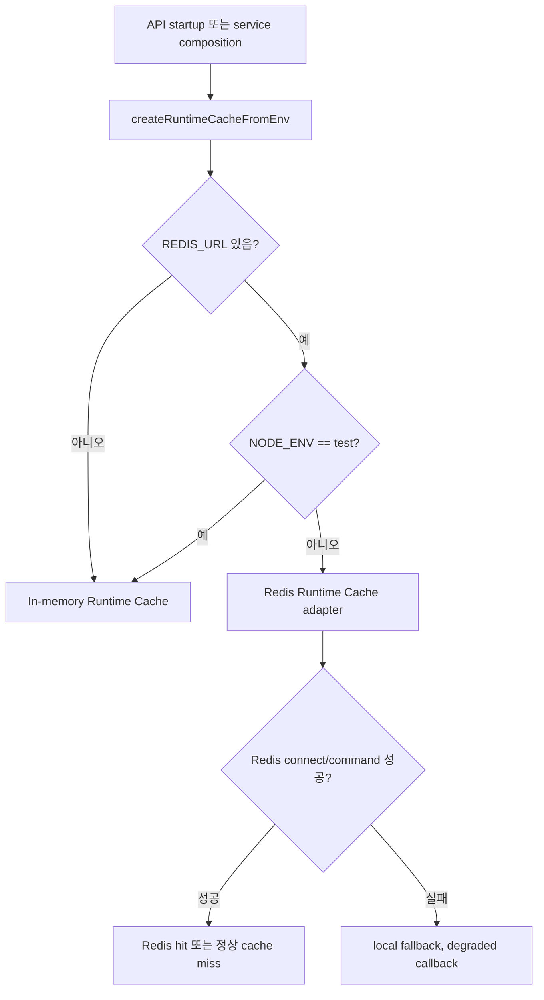

# Redis Runtime Cache adapter 가이드

## 목적

이 문서는 #131에서 만든 `RuntimeCache` 추상화 위에 Redis adapter를 붙이는 방법을 설명한다. Runtime Cache는 Deployment, Reverse Engineering, Git/CI/CD handoff처럼 오래 걸리는 작업의 임시 상태와 polling 보조 정보를 다루며, 원천 기록은 계속 RDS/S3에 둔다.

## 선택 정책



정책은 단순하다.

- `REDIS_URL`이 없으면 memory fallback을 사용한다.
- `NODE_ENV=test`에서는 `REDIS_URL`이 있어도 memory fallback을 사용한다.
- Redis 연결이나 명령 실패는 cache degraded 상태로 취급하고 API 요청 자체를 실패시키지 않는다.
- Redis cache miss는 정상 miss로 `null`을 반환하고, 장애가 있어도 최종 기록은 RDS/S3에서 확인한다.

## 코드 구조

| 파일 | 책임 |
| --- | --- |
| `runtime-cache.ts` | `RuntimeCache` interface와 JSON value 계약 |
| `in-memory-runtime-cache.ts` | 로컬/test fallback 구현 |
| `redis-runtime-cache.ts` | Redis key 변환, lazy connection, TTL set, command failure fallback |
| `runtime-cache-factory.ts` | `REDIS_URL`/`NODE_ENV` 기반 adapter 선택 |
| `config/env.ts` | `REDIS_URL`을 runtime env로 노출 |

## Redis key 규칙

물리 key는 아래 형태다.

```text
sketchcatch:runtime-cache:{encoded namespace}:{encoded key}
```

예시:

```text
sketchcatch:runtime-cache:deployment.status:deployment%3A123
```

namespace와 key segment는 `encodeURIComponent`로 escape한다. raw user input을 물리 key에 직접 붙이지 않고, 가능한 workflow id를 사용한다.

## Failure handling

Redis adapter는 `set` 시 local fallback에도 같은 값을 기록한다. 같은 API process 안에서는 Redis가 중간에 내려가도 최근에 쓴 값은 fallback에서 읽을 수 있다. 이 fallback은 내구 저장소가 아니며 process 재시작 후에는 사라진다.

Redis failure가 발생하면 `onDegraded(error)` callback을 호출할 수 있다. 이 callback은 logging/metric 용도로만 사용하고, Deployment 원천 상태를 바꾸지 않는다.

## 클론 코딩 순서

1. `RuntimeCache` interface를 먼저 읽는다.
2. Redis client dependency를 `apps/api/package.json`과 `pnpm-lock.yaml`에 추가한다.
3. `redis-runtime-cache.ts`에 `createRedisRuntimeCache`를 만든다.
4. Redis client 생성은 adapter 내부로 숨기고, 테스트에서는 fake client를 주입한다.
5. `set`은 `PX` millisecond TTL을 사용한다.
6. `get`은 Redis hit면 JSON parse 결과를 반환하고, 정상 miss면 `null`, Redis failure면 fallback을 조회한다.
7. `delete`는 Redis와 fallback 양쪽에서 삭제한다.
8. `runtime-cache-factory.ts`에서 `REDIS_URL`과 `NODE_ENV` 기반 선택 정책을 둔다.
9. `.env.example`, `docs/data-models.md`, `docs/deployment.md`에 환경 변수와 fallback 정책을 적는다.
10. Redis 서버 없이 fake client로 성공/연결 실패/명령 실패 테스트를 작성한다.

## 검증 포인트

- Redis set은 JSON 문자열과 `PX` TTL로 저장된다.
- namespace/key는 물리 Redis key에서 segment 단위로 escape된다.
- Redis 연결 실패 시 `set/get/delete`가 throw하지 않고 memory fallback을 사용한다.
- Redis 명령 실패 시 degraded callback이 호출되고 memory fallback을 사용한다.
- Redis가 정상 응답한 cache miss에서는 stale memory fallback을 반환하지 않는다.
- `REDIS_URL`이 없거나 `NODE_ENV=test`이면 Redis client를 만들지 않는다.

## 운영 주의

Runtime Cache는 API 재시작과 polling UX를 부드럽게 만들기 위한 내부 인프라다. Redis를 사용자 Architecture Board Resource로 노출하지 않는다. Redis 장애가 발생해도 Deployment History, Plan artifact, Terraform state/output artifact는 RDS/S3를 기준으로 복구하고 확인한다.
