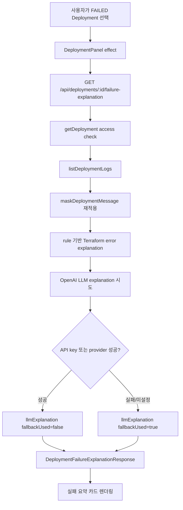
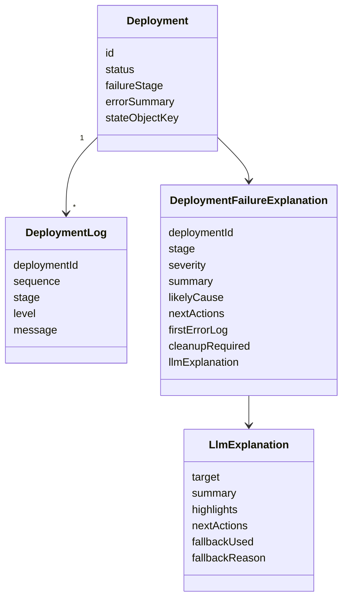

# Direct Deployment 실패 설명 가이드

## 목적

Direct Deployment는 실제 Terraform 실행과 연결되므로 실패했을 때 사용자가 바로 판단할 정보가 필요하다. 이 slice는 실패한 Deployment의 `failureStage`, `errorSummary`, `deployment_logs`를 읽어 안전하게 마스킹된 실패 요약과 다음 행동을 제공한다.

핵심 완료 조건은 아래 네 가지다.

- shared type/API 응답에 실패 설명 DTO가 있다.
- 원문 로그의 secret, token, password가 응답에 노출되지 않는다.
- fallback 설명이 실패 stage, 첫 오류 로그, cleanup 필요 여부를 포함한다.
- DeploymentPanel에서 실패 요약과 다음 행동을 확인할 수 있다.

## 전체 흐름

## 관계도

## 의사결정

1. 새 DB table을 만들지 않는다.
   실패 설명은 실행 상태의 원천 기록이 아니라 읽기용 projection이다. 원천은 `deployments`와 `deployment_logs`다.

2. 로그는 저장 시점과 응답 시점에 모두 마스킹한다.
   로그 저장 경로가 이미 `maskDeploymentMessage`를 사용하더라도 실패 설명은 raw-ish 입력을 다시 다루므로 한 번 더 방어한다.

3. 첫 오류 로그를 우선한다.
   `ERROR` level 로그를 `sequence` 오름차순으로 정렬해 첫 번째 메시지를 고른다. 없으면 `errorSummary`를 사용한다.

4. cleanup 판단은 보수적으로 한다.
   `FAILED` 상태에서 `apply`, `destroy`, 또는 `stateObjectKey`가 있으면 실제 리소스가 일부 남았을 가능성이 있으므로 `cleanupRequired: true`로 둔다.

5. LLM은 보조 설명이다.
   `summary`, `likelyCause`, `nextActions`의 구조화된 핵심 정보는 rule 기반으로 먼저 만든다. OpenAI 호출이 실패하거나 API key가 없으면 `llmExplanation.fallbackUsed`와 `fallbackReason`으로 알려준다.

## 클론 코딩 순서

1. `packages/types/src/index.ts`에 `DeploymentFailureExplanation`과 `DeploymentFailureExplanationResponse`를 추가한다.
2. API에 `deployment-failure-explanation.ts` 같은 계산 서비스를 만든다.
3. 서비스에서 `DeploymentRecord`, `DeploymentLogRecord`, `CreateLlmExplanation`을 입력으로 받는다.
4. 첫 `ERROR` 로그를 고르고 `maskDeploymentMessage`로 정규화한다.
5. 기존 `explainTerraformError`를 호출해 원인 후보와 다음 행동의 기본값을 얻는다.
6. cleanup 필요 여부와 실패 stage를 포함해 최종 summary와 nextActions를 만든다.
7. `createConfiguredOpenAiExplanation()`을 route option 기본값으로 두고, 테스트에서는 fake `createLlmExplanation`을 주입한다.
8. `GET /api/deployments/:deploymentId/failure-explanation` route를 추가하고 `FAILED`가 아니면 409로 거절한다.
9. 웹 API helper에 `getDeploymentFailureExplanation`을 추가한다.
10. `DeploymentPanel`에서 선택된 Deployment가 `FAILED`일 때만 endpoint를 호출하고 실패 설명 카드를 렌더링한다.

## 테스트 포인트

- API route는 `FAILED` deployment에서 200과 `DeploymentFailureExplanationResponse`를 반환한다.
- secret이 들어간 ERROR 로그는 `firstErrorLog`와 `summary`에 그대로 남지 않는다.
- API key missing fallback은 `llmExplanation.fallbackUsed: true`, `fallbackReason: "missing_api_key"`로 내려온다.
- `PENDING` 또는 `RUNNING` deployment는 실패 설명 endpoint에서 409를 반환한다.
- 웹 API helper는 `/api/deployments/:id/failure-explanation`을 인증 요청으로 호출한다.

## 운영 관점

이 기능은 실패 원인 분석을 돕지만 배포 상태의 원천 기록을 바꾸지 않는다. 사용자가 실제 cleanup을 해야 하는지 최종 판단할 때는 AWS 콘솔, Terraform state, Deployment logs를 함께 확인해야 한다. Direct Deployment 실행, cleanup destroy, Git/CI/CD handoff 같은 행동은 계속 명시적인 사용자 승인 뒤에만 진행한다.
