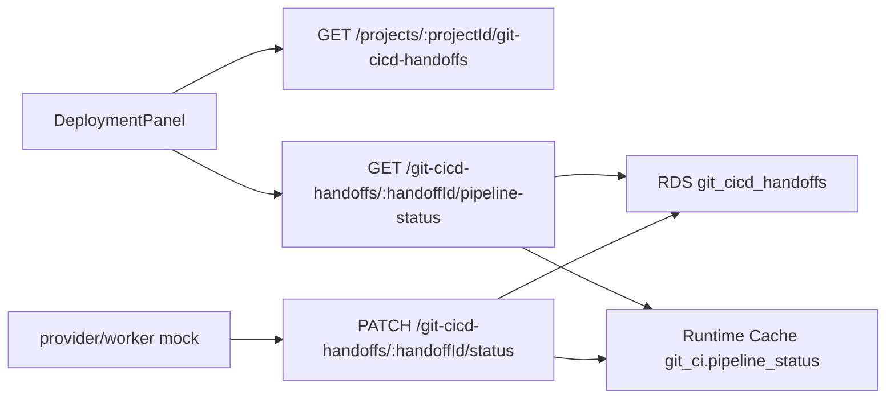

# Git/CI/CD Pipeline Status 클론 코딩 가이드

## 목표

Git/CI/CD handoff 이후 사용자가 PR과 pipeline 상태를 Direct Deployment 기록과 혼동하지 않고 확인하게 만든다. 이 slice는 실제 GitHub API polling을 구현하지 않는다. 외부 provider나 worker가 갱신한 handoff status를 API와 UI가 일관되게 보여주는 최소 vertical slice다.

## 관계도

## 구현 흐름

1. shared type에 `GitCicdHandoffPipelineStatus`와 response DTO를 추가한다.
2. API는 `pipeline-status` 조회 endpoint를 제공한다.
3. 조회 endpoint는 Runtime Cache를 먼저 읽고, cache miss면 RDS handoff record로 fallback한다.
4. status PATCH는 RDS record를 갱신한 뒤 best-effort로 Runtime Cache snapshot을 갱신한다.
5. UI는 handoff list와 pipeline status를 Direct Deployment records와 별도 섹션으로 표시한다.
6. UI polling은 `pr_created`, `pipeline_running` 상태에서만 수행한다.

## 의사결정

- RDS가 source of truth다. Runtime Cache는 polling 응답 안정화와 재시작 이후 조회 부하 완화용이다.
- `pipeline-status` DTO는 secret, token, provider credential을 절대 포함하지 않는다.
- Direct Deployment의 Terraform apply/destroy 상태와 Git/CI/CD handoff 상태는 서로 다른 실행 경로다. UI label도 `Direct Deployment records`, `Git/CI/CD handoff`로 분리한다.
- 실제 GitHub Actions polling은 후속 worker/provider slice에서 다룬다. 이번 slice는 mock 또는 승인된 외부 actor가 PATCH한 상태를 보여준다.

## 클론 코딩 체크리스트

- `packages/types/src/index.ts`에 pipeline status DTO를 추가한다.
- `apps/api/src/git-cicd/git-cicd-handoff-runtime-cache.ts`에 cache key, TTL, read/write helper를 만든다.
- `apps/api/src/routes/git-cicd-handoffs.ts`에서 `GET /pipeline-status`를 등록하고 status PATCH 이후 cache를 갱신한다.
- `apps/web/features/workspace/api.ts`에 list/status client 함수를 추가한다.
- `DeploymentPanel`에서 handoff 목록, PR URL, pipeline URL, status source를 표시한다.
- API route test는 cache miss -> RDS, second read -> Runtime Cache를 검증한다.
- UI helper test는 Git/CI/CD polling 조건이 Direct Deployment polling과 분리되어 있음을 검증한다.
