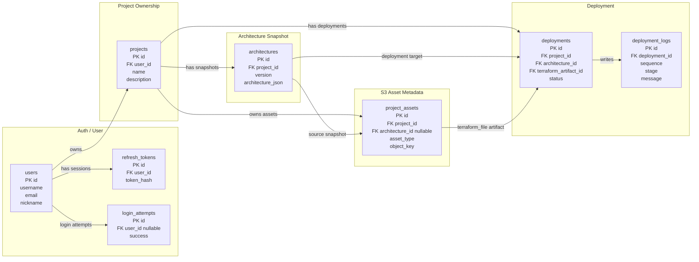
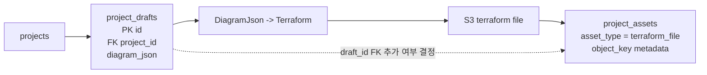

# DB 연결 관계도

이 문서는 Google Sheets DB 초안과 `dev` 병합 이후 현재 코드 기준을 함께 정리한 관계도다. 현재 구현에는 `project_drafts`가 없으므로, Terraform 변환 기능은 우선 `DiagramJson` 순수 변환기와 API 입력값 기준으로 만들고 저장 연동은 후속 단계에서 결정한다.

## 현재 구현 기준

## Terraform 변환 현재 흐름

```mermaid
flowchart LR
  user["로그인 사용자"] -->|"owns"| project["project"]
  project -->|"현재 저장 구조"| architecture["ArchitectureJson<br/>architectures.architecture_json"]
  sample["샘플 DiagramJson<br/>또는 후속 draft JSON"] --> converter["generateTerraformFromDiagramJson"]
  architecture -.->|"adapter 필요 시"| sample
  converter --> code["Terraform code string"]
  code --> api["POST /api/terraform/generate"]
  api --> editor["Terraform editor / preview"]
```

## 후속 draft 구조가 들어올 경우

## 구현 시 주의할 점

- 익명 workspace는 사용하지 않는다. 모든 프로젝트는 로그인한 `users.id` 기준으로 소유된다.
- 현재 DB에는 `project_drafts`가 없으므로 구현 코드에서 바로 조회하면 안 된다.
- 현재 저장된 그래프는 `ArchitectureJson`이며, `DiagramJson`과 필드 구조가 다르다.
- `ArchitectureJson`을 Terraform 변환에 쓰려면 별도 adapter가 필요하다.
- Terraform 원문은 RDS에 저장하지 않고 S3에 저장한다.
- RDS에는 `project_assets.object_key`, `file_name`, `content_type`, `byte_size` 같은 metadata만 둔다.
- 현재 `project_assets`는 `architecture_id`를 갖고 `draft_id`는 없다.
- draft 기반 저장이 확정되면 `project_assets.draft_id` 추가 여부를 migration으로 결정한다.
- `approved_by`는 현재 문자열 컬럼이다. 회원 FK가 필요하면 `approved_by_user_id -> users.id`로 별도 개선한다.
- `deployment_logs`는 `UNIQUE(deployment_id, sequence)` 추가를 검토하면 로그 순서 중복을 줄일 수 있다.
