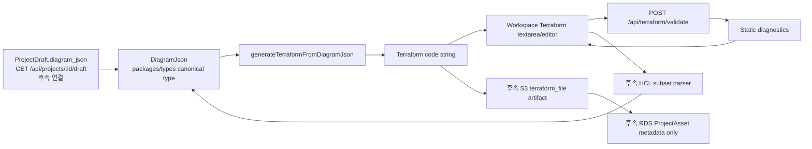

# SW Terraform 변환 스펙

## 목적

SW 파트는 `DiagramJson`을 입력으로 받아 Terraform 코드를 만들고, 사용자가 생성된 코드를 확인/수정/검증한 뒤 다시 다이어그램에 반영할 수 있는 흐름을 맡는다.

현재 #27 `Feat: DiagramJson 기반 Terraform 순수 변환기 구현`은 완료된 기반 작업으로 본다. 따라서 #28의 중심은 생성 API를 새로 만드는 것이 아니라, 이미 구현된 Terraform textarea/editor 위에 정적 diagnostics를 연결하는 것이다.

문서는 아래처럼 나눈다.

- 스펙: `docs/sw/spec.md`
- 구현 계획: `docs/sw/plan.md`
- 사람이 따라 칠 수 있는 클론 코딩 가이드: `docs/sw/001_테라폼변환구현가이드_sw.md`

클론 코딩 가이드는 실제 작업을 돕기 위한 문서지만, GitHub 이슈 본문에는 긴 구현 가이드를 넣지 않는다.

## 현재 이슈 상태

1. `Feat: DiagramJson 기반 Terraform 순수 변환기 구현`
   - 상태: 완료된 기반 작업
   - 포함 내용: shared `DiagramJson` 타입, `generateTerraformFromDiagramJson`, `/api/terraform/generate`, workspace 샘플 변환 UI
2. `Feat: Terraform 코드 에디터와 정적 문법 검증 연결`
   - 상태: 현재 작업
   - 브랜치: `feature/sw/28-terraform-editor-validation`
   - 포함 내용: Terraform code textarea 유지, 수동 문법 점검 버튼, 정적 diagnostics API/UI, 관련 테스트
3. `Feat: Terraform 코드 수정 사항을 DiagramJson에 반영`
   - 상태: 후속 작업
   - 포함 내용: 생성기가 만든 제한된 HCL subset만 파싱하고 `(resourceType, resourceName)` 기준으로 기존 node의 `parameters.values` 갱신

## 입력 계약

핵심 입력 타입은 `DiagramJson`이다. 실제 canonical source는 `packages/types/src/index.ts`의 exported type이며, 문서의 예시는 개념 이해용이다.

현재 구현된 `DiagramJson`은 사용자 최초 제안보다 rich type이다. 노드에는 `position`, `size`, `locked`, `zIndex`, `style`, `iconUrl` 같은 화면용 필드가 있을 수 있고, 엣지에는 handle/type/style 정보가 있을 수 있다. Terraform 변환과 정적 검증에서 중요한 값은 여전히 아래 4개다.

- `node.parameters.terraformBlockType`
- `node.parameters.resourceType`
- `node.parameters.resourceName`
- `node.parameters.values`

`edges`는 화면 연결 정보로만 보고, Terraform 참조는 우선 `values` 안의 `aws_xxx.name.id` 같은 문자열을 기준으로 처리한다.

최신 `dev` 기준으로 `ProjectDraft`와 `project_drafts.diagram_json` 저장 구조는 구현되어 있다. 다만 #28의 정적 diagnostics는 사용자가 textarea에서 편집 중인 `terraformCode` 문자열만 검증하므로 draft DB를 직접 읽지 않는다. 저장된 다이어그램을 불러와 변환하는 흐름은 후속 연결 작업에서 `GET /api/projects/:id/draft`와 연결한다.

## 변환 규칙

`generateTerraformFromDiagramJson(diagramJson): string`은 아래 규칙을 따른다.

1. `diagramJson.nodes`를 순회한다.
2. `node.kind !== "resource"`인 노드는 Terraform 변환에서 제외한다.
3. `node.parameters`가 없는 노드는 제외한다.
4. `node.parameters.invalid === true`인 노드는 제외한다.
5. `terraformBlockType`이 없으면 기본값은 `"resource"`로 본다.
6. `resourceType`은 Terraform resource/data type으로 사용한다. 예: `aws_vpc`, `aws_instance`
7. `resourceName`은 Terraform local name으로 사용한다. 예: `main`, `web_server`
8. `values` 안의 top-level key는 Terraform attribute로 변환한다.
9. attribute key는 `camelCase`에서 `snake_case`로 변환한다.
10. Terraform reference 문자열은 따옴표 없이 출력한다. 예: `aws_vpc.main.id`
11. 일반 문자열은 따옴표로 감싼다.
12. boolean, number, null, object, array는 HCL 값으로 재귀 변환한다.

예시:

```hcl
resource "aws_vpc" "main" {
  cidr_block           = "10.0.0.0/16"
  enable_dns_support   = true
  enable_dns_hostnames = true

  tags = {
    Name = "main-vpc"
  }
}

resource "aws_subnet" "public" {
  vpc_id                  = aws_vpc.main.id
  cidr_block              = "10.0.1.0/24"
  availability_zone       = "ap-northeast-2a"
  map_public_ip_on_launch = true

  tags = {
    Name = "public-subnet"
  }
}
```

## #28 정적 diagnostics 규칙

#28은 실제 Terraform CLI를 실행하지 않고, 사용자가 편집한 Terraform 문자열을 정적으로 점검한다.

새 API 계약:

```ts
export type TerraformDiagnosticSeverity = "info" | "warning" | "error";

export type TerraformDiagnostic = {
  severity: TerraformDiagnosticSeverity;
  message: string;
  code?: string | undefined;
  line?: number | undefined;
  resourceAddress?: string | undefined;
  nodeId?: string | undefined;
};

export type TerraformValidateRequest = {
  terraformCode: string;
};

export type TerraformValidateResponse = {
  diagnostics: TerraformDiagnostic[];
};
```

새 endpoint:

- `POST /api/terraform/validate`
- request body: `{ terraformCode: string }`
- response body: `{ diagnostics: TerraformDiagnostic[] }`
- 인증: 기존 `/terraform/generate`와 같이 `requireActiveUserId` 사용
- service: `createTerraformDiagnostics(terraformCode): TerraformDiagnostic[]`

정적 diagnostics v1은 아래 항목만 다룬다.

- 빈 코드 error
- `{}`, `[]`, `"` 균형 error
- top-level `resource`/`data` block header 형식 error
- 중복 resource/data address warning 또는 error
- 따옴표로 감싼 Terraform reference 의심 warning
- block body 비어 있음 warning

이 diagnostics는 사용자가 편집 중인 Terraform 문자열에 대한 빠른 피드백이다. deployment의 `init`, `validate`, `plan`, `apply` stage와 섞지 않는다.

## 범위 분리

#28에서는 아래를 구현하지 않는다.

- DB에서 `project_drafts.diagram_json`을 조회해 자동 변환하는 코드
- 생성된 Terraform 파일을 S3에 업로드하는 코드
- RDS에 `terraform_file` asset metadata를 저장하는 코드
- 실제 `terraform init`, `terraform validate`, `terraform plan`, `terraform apply`, `terraform destroy` 실행
- provider 다운로드, 임시 Terraform workspace 생성, AWS SDK 호출
- 코드 수정 사항을 `DiagramJson`에 반영하는 parser

현재 `dev`에는 deployment init/terraform-runner 관련 변경과 project draft 저장 구조가 들어와 있다. deployment 흐름은 배포 실행 준비 기능이며, #28의 정적 diagnostics와 별개다. 실제 Terraform CLI 검증은 후속 backend/worker 이슈에서 임시 디렉터리, state, credential, log masking 정책을 갖춘 뒤 연결한다.

Terraform 원문은 최종적으로 RDS에 저장하지 않고 S3에 저장하며, RDS에는 asset metadata만 저장한다. 이 저장 연결은 저장/불러오기 PR 이후 후속 이슈에서 다룬다.

## 전체 구조


