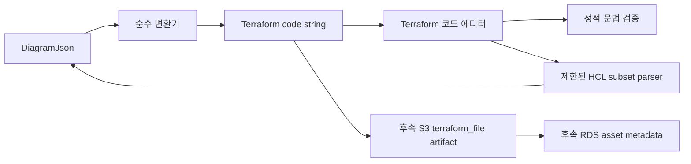

# SW Terraform 변환 스펙

## 목적

SW 파트는 다이어그램 JSON을 입력으로 받아 Terraform 코드 문자열을 생성하는 변환 흐름을 먼저 만든다. 현재 저장/불러오기 변경사항이 팀원 로컬에 없을 수 있으므로, DB 조회나 S3 저장과 분리된 순수 변환기를 1차 목표로 둔다.

문서는 사용자가 지정한 경로에 맞춰 `docs/sw/spec.md`에 스펙을 두고, 실제 구현 순서는 `docs/sw/plan.md`에 둔다. 사람이 따라 구현할 수 있는 clone-coding 가이드는 `docs/sw/001_테라폼변환구현가이드_sw.md`에 따로 둔다.

이번 스펙은 GitHub 이슈를 3개로 나눠 진행한다.

1. `Feat: DiagramJson 기반 Terraform 순수 변환기 구현`
2. `Feat: Terraform 코드 에디터와 정적 문법 검증 연결`
3. `Feat: Terraform 코드 수정 사항을 DiagramJson에 반영`

## 이슈 운영

첫 이슈만 바로 작업 가능한 상태로 둔다.

- 담당자: `NearthYou`
- 라벨: `enhancement`, `ready-for-agent`
- GitHub Project 상태: `In progress`
- 첫 작업 브랜치: `feature/sw/{issue-number}-diagram-json-terraform-converter`

이슈별 범위:

1. `Feat: DiagramJson 기반 Terraform 순수 변환기 구현`
   - `DiagramJson` 타입 추가
   - `generateTerraformFromDiagramJson(diagramJson): string` 구현
   - 샘플 변환 테스트 추가
2. `Feat: Terraform 코드 에디터와 정적 문법 검증 연결`
   - API wrapper 연결
   - workspace textarea 기반 editor 연결
   - 실제 Terraform CLI 없이 block, brace, reference 중심 정적 diagnostics 표시
3. `Feat: Terraform 코드 수정 사항을 DiagramJson에 반영`
   - 생성기가 만든 HCL subset만 파싱
   - `(resourceType, resourceName)` 기준으로 기존 node의 `parameters.values` 갱신
   - 불확실한 입력은 mutation 대신 diagnostic 반환

## 입력 계약

핵심 입력 타입은 `DiagramJson`이다.

```ts
type DiagramJson = {
  nodes: DiagramNode[];
  edges: DiagramEdge[];
  viewport: {
    x: number;
    y: number;
    zoom: number;
  };
};

type DiagramNode = {
  id: string;
  type: string;
  kind: "resource" | "design";
  label: string;
  parameters?: {
    terraformBlockType?: "resource" | "data";
    resourceType: string;
    resourceName: string;
    fileName: string;
    values: Record<string, unknown>;
    invalid?: boolean;
  };
};

type DiagramEdge = {
  id: string;
  sourceNodeId: string;
  targetNodeId: string;
  label?: string;
};
```

Terraform 변환에서 실제로 사용하는 값은 아래 4개다.

- `node.parameters.terraformBlockType`
- `node.parameters.resourceType`
- `node.parameters.resourceName`
- `node.parameters.values`

`edges`는 화면 연결 정보로만 보고, Terraform 참조는 우선 `values` 안의 `aws_xxx.name.id` 같은 문자열을 기준으로 처리한다.

## 변환 규칙

1. `diagramJson.nodes`를 순회한다.
2. `node.kind !== "resource"`인 노드는 Terraform 변환에서 제외한다.
3. `node.parameters`가 없는 노드는 제외한다.
4. `node.parameters.invalid === true`인 노드는 제외한다.
5. `terraformBlockType`이 없으면 기본값은 `"resource"`로 본다.
6. `resourceType`은 Terraform resource type으로 사용한다. 예: `aws_vpc`, `aws_instance`
7. `resourceName`은 Terraform local name으로 사용한다. 예: `main`, `web_server`
8. `values` 안의 key는 Terraform attribute로 변환한다.
9. attribute key는 `camelCase`에서 `snake_case`로 변환한다.
10. Terraform reference 문자열은 따옴표 없이 출력한다. 예: `aws_vpc.main.id`
11. 일반 문자열은 따옴표로 감싼다.
12. boolean, number, object, array는 HCL 값으로 재귀 변환한다.

예시:

```hcl
resource "aws_vpc" "main" {
  cidr_block           = "10.0.0.0/16"
  enable_dns_support   = true
  enable_dns_hostnames = true

  tags = {
    Name = "main-vpc"
  }
}

resource "aws_subnet" "public" {
  vpc_id                  = aws_vpc.main.id
  cidr_block              = "10.0.1.0/24"
  availability_zone       = "ap-northeast-2a"
  map_public_ip_on_launch = true

  tags = {
    Name = "public-subnet"
  }
}
```

## 범위 분리

이번 순수 변환기 이슈에서는 아래를 구현하지 않는다.

- clone-coding 가이드 문서는 별도로 유지하되, GitHub 이슈 작업 내역에는 넣지 않는다.
- DB에서 `project_drafts.diagram_json`을 조회하는 코드
- 생성된 Terraform 파일을 S3에 업로드하는 코드
- RDS에 `terraform_file` asset metadata를 저장하는 코드
- 실제 `terraform init`, `terraform validate`, `terraform plan`, `terraform apply`, `terraform destroy` 실행
- AWS SDK 호출

위 항목은 저장/불러오기 코드와 배포 안전장치가 준비된 뒤 후속 이슈에서 연결한다. Terraform 원문은 최종적으로 RDS에 저장하지 않고 S3에 저장하며, RDS에는 asset metadata만 저장한다.

## 전체 구조


