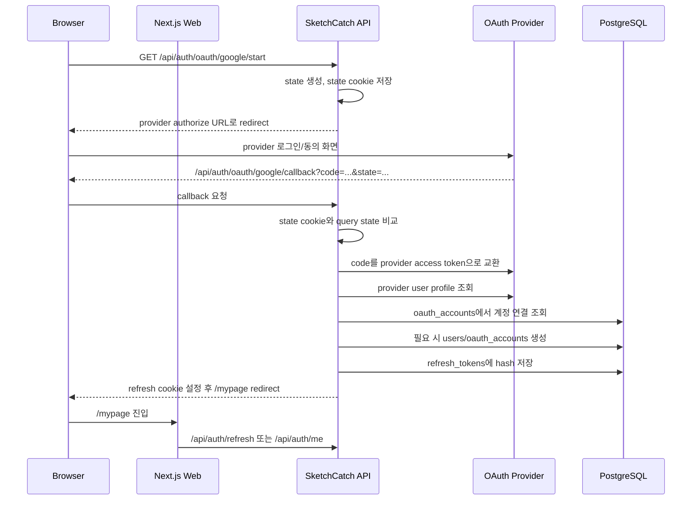

# 소셜 로그인 구현 가이드

이 문서는 소셜 로그인을 처음 구현하는 사람을 기준으로, SketchCatch의 현재 인증 구조에 Google, Kakao, Naver, GitHub 로그인을 붙이는 방법을 설명한다.

목표는 "소셜 provider에서 사용자 신원을 확인한 뒤, SketchCatch의 기존 세션 구조로 로그인시키는 것"이다. 프론트가 Google/Kakao/Naver/GitHub access token을 직접 들고 다니는 구조가 아니다.

## 1. 먼저 알아야 할 말

| 용어 | 뜻 | 이 프로젝트에서의 의미 |
| --- | --- | --- |
| OAuth provider | 로그인을 대신 확인해주는 외부 서비스 | Google, Kakao, Naver, GitHub |
| Client ID | provider가 우리 앱을 식별하는 공개 id | 프론트/백엔드 URL 생성에 들어갈 수 있음 |
| Client Secret | provider가 우리 서버를 신뢰하기 위한 비밀값 | 반드시 API 서버 `.env`에만 둔다 |
| Redirect URI | provider 로그인이 끝난 뒤 돌아올 API 주소 | `/api/auth/oauth/:provider/callback` |
| Authorization Code | provider가 callback으로 잠깐 넘겨주는 1회용 코드 | API 서버가 provider token으로 교환한다 |
| Provider Access Token | Google/Kakao/Naver/GitHub API 호출용 토큰 | 사용자 정보 조회 후 버린다. DB 저장하지 않는다 |
| SketchCatch Access Token | 우리 API 인증용 JWT | 기존 `createAuthSession()`에서 만든다 |
| Refresh Token | 세션 연장용 토큰 | 원문은 HttpOnly cookie, DB에는 hash만 저장한다 |
| State | OAuth 요청과 응답이 같은 흐름인지 확인하는 임의 문자열 | CSRF 방지용. start에서 만들고 callback에서 검증한다 |
| Scope | provider에게 요청할 사용자 정보 범위 | 처음에는 email/profile 최소 범위만 쓴다 |

## 2. SketchCatch 현재 인증 구조

현재 인증 흐름은 다음과 같다.

1. `POST /api/auth/login` 또는 `POST /api/auth/signup`이 성공한다.
2. API가 `createAuthSession()`으로 SketchCatch 세션을 만든다.
3. 응답 body에는 짧게 사는 JWT `accessToken`만 내려간다.
4. refresh token 원문은 `sketchcatch_refresh_token` HttpOnly cookie로만 내려간다.
5. DB `refresh_tokens.token_hash`에는 refresh token hash만 저장한다.
6. 프론트는 access token을 `localStorage`에 저장하지 않고 메모리에만 보관한다.
7. 새로고침 후 메모리가 비면 `/api/auth/refresh`가 cookie 기반으로 새 access token을 복구한다.

소셜 로그인도 이 구조를 그대로 써야 한다. 달라지는 것은 "비밀번호 검증" 대신 "OAuth provider 사용자 확인"을 한다는 점뿐이다.

## 3. 전체 흐름



## 4. 구현 우선순위

처음부터 네 provider를 한 번에 붙이면 디버깅이 어렵다. 아래 순서로 한다.

1. Google 하나만 성공시킨다.
2. Google 흐름을 공통 provider 구조로 정리한다.
3. Kakao를 추가한다.
4. Naver를 추가한다.
5. GitHub는 마지막에 추가한다. GitHub는 이메일이 비공개일 수 있어 `user:email` scope와 `/user/emails` 조회가 필요할 수 있다.

## 5. provider 콘솔에서 먼저 해야 할 일

각 provider 개발자 콘솔에서 앱을 만들고 callback URL을 등록해야 한다.

로컬 개발 기준 callback URL은 다음처럼 통일한다.

```text
http://localhost:3000/api/auth/oauth/google/callback
http://localhost:3000/api/auth/oauth/kakao/callback
http://localhost:3000/api/auth/oauth/naver/callback
http://localhost:3000/api/auth/oauth/github/callback
```

왜 `localhost:3000`인가?

- 브라우저는 Next.js 웹 서버인 `localhost:3000`을 보고 있다.
- 현재 web은 `/api/:path*` 요청을 API 서버로 proxy한다.
- 사용자가 provider에서 돌아올 때도 브라우저 기준 URL인 `localhost:3000`으로 돌아오는 편이 자연스럽다.

운영에서는 `https://실제도메인/api/auth/oauth/:provider/callback`을 추가로 등록해야 한다.

## 6. `.env.example`에 추가할 값

실제 secret 값은 절대 커밋하지 않는다. `.env.example`에는 빈 값만 추가한다.

```env
OAUTH_REDIRECT_BASE_URL=http://localhost:3000

GOOGLE_OAUTH_CLIENT_ID=
GOOGLE_OAUTH_CLIENT_SECRET=

KAKAO_OAUTH_CLIENT_ID=
KAKAO_OAUTH_CLIENT_SECRET=

NAVER_OAUTH_CLIENT_ID=
NAVER_OAUTH_CLIENT_SECRET=

GITHUB_OAUTH_CLIENT_ID=
GITHUB_OAUTH_CLIENT_SECRET=
```

`OAUTH_REDIRECT_BASE_URL`은 callback URL을 만들 때 쓰는 기준 주소다. 로컬에서는 `http://localhost:3000`, 운영에서는 실제 HTTPS 도메인으로 둔다.

## 7. DB 구조 추가

현재 구현된 인증 테이블은 `users`, `refresh_tokens`, `login_attempts`다. 소셜 로그인에는 `oauth_accounts`가 추가로 필요하다.

### 7.1 `users.password_hash` nullable 전환

현재 `users.password_hash`는 필수값이다. 소셜 로그인만으로 가입한 사용자는 비밀번호가 없을 수 있으므로 nullable로 바꾸는 것이 좋다.

```ts
passwordHash: text("password_hash")
```

대신 일반 비밀번호 로그인에서는 `passwordHash`가 없으면 로그인 실패로 처리한다.

```ts
if (!user.passwordHash) {
  return sendUnauthorized(reply, "아이디 또는 비밀번호가 올바르지 않습니다.");
}
```

### 7.2 `oauth_accounts` 테이블

`apps/api/src/db/schema.ts`에 provider enum과 테이블을 추가한다.

```ts
export const oauthProviderEnum = pgEnum("oauth_provider", [
  "google",
  "kakao",
  "naver",
  "github"
]);

export const oauthAccounts = pgTable(
  "oauth_accounts",
  {
    id: varchar("id", { length: 36 }).primaryKey(),
    userId: varchar("user_id", { length: 36 })
      .notNull()
      .references(() => users.id, { onDelete: "cascade" }),
    provider: oauthProviderEnum("provider").notNull(),
    providerUserId: varchar("provider_user_id", { length: 255 }).notNull(),
    email: varchar("email", { length: 255 }),
    displayName: varchar("display_name", { length: 120 }),
    profileImageUrl: text("profile_image_url"),
    createdAt: timestamp("created_at", { withTimezone: true }).notNull().defaultNow(),
    updatedAt: timestamp("updated_at", { withTimezone: true }).notNull().defaultNow()
  },
  (table) => [
    uniqueIndex("oauth_accounts_provider_user_unique").on(table.provider, table.providerUserId),
    index("oauth_accounts_user_id_idx").on(table.userId)
  ]
);
```

관계도 추가한다.

```ts
export const usersRelations = relations(users, ({ many }) => ({
  projects: many(projects),
  refreshTokens: many(refreshTokens),
  loginAttempts: many(loginAttempts),
  oauthAccounts: many(oauthAccounts)
}));

export const oauthAccountsRelations = relations(oauthAccounts, ({ one }) => ({
  user: one(users, {
    fields: [oauthAccounts.userId],
    references: [users.id]
  })
}));
```

마이그레이션은 schema 수정 뒤 다음 순서로 만든다.

```bash
npm exec --package=pnpm@11.8.0 -- pnpm --filter @sketchcatch/api db:generate
npm exec --package=pnpm@11.8.0 -- pnpm --filter @sketchcatch/api db:migrate
```

## 8. shared type 추가

공유 타입은 `packages/types/src/index.ts`에 둔다.

```ts
export type OAuthProvider = "google" | "kakao" | "naver" | "github";
```

API 응답 DTO를 새로 만들 필요는 적다. 최종 로그인 성공은 기존 `AuthResponse`와 `AuthSession` 구조를 재사용하기 때문이다.

## 9. API env 읽기

`apps/api/src/config/env.ts`에 OAuth env를 추가한다.

```ts
export type RuntimeEnv = {
  awsRegion: string;
  authTokenSecret: string | undefined;
  databaseUrl: string | undefined;
  databaseSsl: boolean;
  s3BucketName: string | undefined;
  oauthRedirectBaseUrl: string | undefined;
  googleOauthClientId: string | undefined;
  googleOauthClientSecret: string | undefined;
  kakaoOauthClientId: string | undefined;
  kakaoOauthClientSecret: string | undefined;
  naverOauthClientId: string | undefined;
  naverOauthClientSecret: string | undefined;
  githubOauthClientId: string | undefined;
  githubOauthClientSecret: string | undefined;
};
```

그리고 `getRuntimeEnv()`에 매핑한다.

```ts
oauthRedirectBaseUrl: process.env.OAUTH_REDIRECT_BASE_URL,
googleOauthClientId: process.env.GOOGLE_OAUTH_CLIENT_ID,
googleOauthClientSecret: process.env.GOOGLE_OAUTH_CLIENT_SECRET,
```

provider별 client id/secret이 없으면 start route에서 `500` 대신 명확한 설정 오류를 내도록 helper를 만든다.

```ts
function requireOAuthProviderConfig(provider: OAuthProvider): OAuthProviderRuntimeConfig {
  // provider별 clientId/clientSecret/redirectBaseUrl 확인
}
```

## 10. provider 설정 파일 만들기

새 파일을 만든다.

```text
apps/api/src/auth/oauth-providers.ts
```

처음에는 provider별 endpoint와 scope만 둔다.

```ts
import type { OAuthProvider } from "@sketchcatch/types";

export type OAuthProviderStaticConfig = {
  authorizationUrl: string;
  tokenUrl: string;
  profileUrl: string;
  scopes: string[];
};

export const oauthProviderConfigs = {
  google: {
    authorizationUrl: "https://accounts.google.com/o/oauth2/v2/auth",
    tokenUrl: "https://oauth2.googleapis.com/token",
    profileUrl: "https://www.googleapis.com/oauth2/v3/userinfo",
    scopes: ["openid", "email", "profile"]
  },
  kakao: {
    authorizationUrl: "https://kauth.kakao.com/oauth/authorize",
    tokenUrl: "https://kauth.kakao.com/oauth/token",
    profileUrl: "https://kapi.kakao.com/v2/user/me",
    scopes: ["account_email", "profile_nickname"]
  },
  naver: {
    authorizationUrl: "https://nid.naver.com/oauth2.0/authorize",
    tokenUrl: "https://nid.naver.com/oauth2.0/token",
    profileUrl: "https://openapi.naver.com/v1/nid/me",
    scopes: []
  },
  github: {
    authorizationUrl: "https://github.com/login/oauth/authorize",
    tokenUrl: "https://github.com/login/oauth/access_token",
    profileUrl: "https://api.github.com/user",
    scopes: ["read:user", "user:email"]
  }
} satisfies Record<OAuthProvider, OAuthProviderStaticConfig>;
```

주의: Google/Kakao/GitHub는 scope를 공백으로 join한다. provider마다 구분 방식이 다르면 helper에서 처리한다.

## 11. OAuth state cookie

`state`는 "내가 시작한 로그인 요청이 맞는지" 확인하는 값이다. 꼭 필요하다.

권장 구조:

```text
cookie name: sketchcatch_oauth_state
path: /api/auth/oauth
HttpOnly: true
SameSite=Lax
Max-Age: 300
```

start route:

1. random state 생성
2. provider 정보와 함께 cookie에 저장
3. provider authorization URL에 같은 state를 넣는다

callback route:

1. query state 읽기
2. cookie state 읽기
3. 둘이 다르면 중단
4. 성공/실패와 상관없이 state cookie 삭제

provider도 state를 권장한다. Google은 state가 CSRF 위험을 줄인다고 설명하고, Kakao도 state를 CSRF 방지용으로 설명한다.

## 12. API route 설계

기존 `apps/api/src/routes/auth.ts`에 바로 붙이면 파일이 너무 커진다. 가능하면 아래처럼 분리한다.

```text
apps/api/src/routes/auth.ts
apps/api/src/routes/oauth.ts
apps/api/src/auth/oauth-providers.ts
apps/api/src/auth/oauth-profile.ts
```

그리고 `apps/api/src/app.ts`에서 route 등록을 추가한다.

```ts
await app.register(registerAuthRoutes, { prefix: "/api" });
await app.register(registerOAuthRoutes, { prefix: "/api/auth/oauth" });
```

이미 auth route가 `/auth/login`처럼 등록되는 구조라면 prefix를 현재 app 등록 방식에 맞춘다. 최종 브라우저 URL은 다음이 되어야 한다.

```text
/api/auth/oauth/:provider/start
/api/auth/oauth/:provider/callback
```

## 13. start route 구현 흐름

의사코드:

```ts
app.get("/:provider/start", async (request, reply) => {
  const provider = parseProvider(request.params.provider);
  const runtime = requireOAuthProviderConfig(provider);
  const staticConfig = oauthProviderConfigs[provider];
  const state = createOAuthState();
  const redirectUri = `${runtime.redirectBaseUrl}/api/auth/oauth/${provider}/callback`;

  setOAuthStateCookie(reply, { provider, state });

  const authorizationUrl = new URL(staticConfig.authorizationUrl);
  authorizationUrl.searchParams.set("response_type", "code");
  authorizationUrl.searchParams.set("client_id", runtime.clientId);
  authorizationUrl.searchParams.set("redirect_uri", redirectUri);
  authorizationUrl.searchParams.set("state", state);

  if (staticConfig.scopes.length > 0) {
    authorizationUrl.searchParams.set("scope", staticConfig.scopes.join(" "));
  }

  return reply.redirect(authorizationUrl.toString());
});
```

Naver는 scope가 필수가 아니고, Kakao는 앱 동의항목 설정에 따라 scope를 생략해도 된다. 처음 구현이 막히면 scope 없이 provider 기본 동의항목으로 먼저 통과시키고, 이후 필요한 scope를 명시한다.

## 14. callback route 구현 흐름

의사코드:

```ts
app.get("/:provider/callback", async (request, reply) => {
  const provider = parseProvider(request.params.provider);
  const query = oauthCallbackQuerySchema.parse(request.query);

  if (query.error) {
    clearOAuthStateCookie(reply);
    return reply.redirect("/login?oauthError=cancelled");
  }

  const stateCookie = readOAuthStateCookie(request);

  if (!stateCookie || stateCookie.provider !== provider || stateCookie.state !== query.state) {
    clearOAuthStateCookie(reply);
    return reply.redirect("/login?oauthError=state_mismatch");
  }

  clearOAuthStateCookie(reply);

  const providerToken = await exchangeCodeForProviderToken(provider, query.code);
  const profile = await fetchOAuthProfile(provider, providerToken.accessToken);
  const user = await findOrCreateOAuthUser(db, profile);
  const session = await createAuthSession(db, user.id, request, reply);

  return reply.redirect("/mypage");
});
```

중요한 점:

- provider access token을 프론트에 내려주지 않는다.
- provider access token을 DB에 저장하지 않는다.
- 최종 세션은 기존 `createAuthSession()`만 사용한다.
- callback 실패를 JSON으로 보여주기보다 `/login?oauthError=...`로 보내면 프론트 처리가 쉽다.

## 15. provider token 교환

공통적으로 `code`를 provider token endpoint로 보낸다.

대부분 form 방식이다.

```ts
const body = new URLSearchParams({
  grant_type: "authorization_code",
  client_id: runtime.clientId,
  client_secret: runtime.clientSecret,
  redirect_uri: redirectUri,
  code
});

const response = await fetch(staticConfig.tokenUrl, {
  method: "POST",
  headers: {
    Accept: "application/json",
    "Content-Type": "application/x-www-form-urlencoded"
  },
  body
});
```

GitHub는 `Accept: application/json`을 넣어야 JSON 응답을 받기 쉽다.

Naver 공식 예시는 token 요청을 GET으로 보여주지만, 구현에서는 provider 응답을 확인하면서 맞춘다. 처음에는 공식 예시와 같은 query 방식으로 시작해도 된다.

## 16. provider profile 정규화

provider마다 응답 모양이 다르므로 우리 앱 내부에서는 하나의 모양으로 바꾼다.

```ts
export type NormalizedOAuthProfile = {
  provider: OAuthProvider;
  providerUserId: string;
  email: string | null;
  emailVerified: boolean;
  displayName: string;
  profileImageUrl: string | null;
};
```

provider별 매핑 예시:

| Provider | id 위치 | email 위치 | 이름 위치 |
| --- | --- | --- | --- |
| Google | `sub` | `email` | `name` |
| Kakao | `id` | `kakao_account.email` | `kakao_account.profile.nickname` |
| Naver | `response.id` | `response.email` | `response.nickname` |
| GitHub | `id` | `/user.email` 또는 `/user/emails` | `login` 또는 `name` |

GitHub는 사용자가 이메일을 숨기면 `/user`의 email이 `null`일 수 있다. 이 경우 `user:email` scope로 `/user/emails`를 호출하고, `primary && verified`인 이메일을 고른다.

## 17. user 생성/연결 정책

처음 구현에서는 아래 정책을 추천한다.

1. `oauth_accounts.provider + provider_user_id`가 있으면 해당 user로 로그인한다.
2. 없고 profile email이 있으며 email이 검증되어 있으면 `users.email`로 기존 user를 찾는다.
3. 기존 user가 있으면 `oauth_accounts`만 새로 연결한다.
4. 기존 user가 없으면 새 `users`와 `oauth_accounts`를 만든다.
5. profile email이 없거나 검증되지 않았으면 로그인 실패로 보낸다.
6. `deletedAt`이 있는 user면 로그인 실패로 보낸다.

새 user 생성 시 username은 provider와 provider id를 섞어서 충돌 가능성을 줄인다.

```ts
const username = `${profile.provider}_${profile.providerUserId}`.slice(0, 30);
```

단, 현재 username 정규식은 영문/숫자/underscore/hyphen만 허용한다. provider id에 이상한 문자가 있으면 정리해야 한다.

```ts
function createSocialUsername(provider: OAuthProvider, providerUserId: string): string {
  const safeId = providerUserId.replace(/[^A-Za-z0-9_-]/g, "").slice(0, 20);
  return `${provider}_${safeId}`.slice(0, 30).toLowerCase();
}
```

nickname은 provider display name을 쓰고, 없으면 provider 이름으로 만든다.

## 18. 프론트 로그인 버튼

`apps/web/app/login/login-form.tsx`에 소셜 로그인 링크를 추가한다.

```tsx
<div className="authSocialLogin" aria-label="소셜 로그인">
  <a className="authSocialButton" href="/api/auth/oauth/google/start">
    Google로 계속하기
  </a>
  <a className="authSocialButton" href="/api/auth/oauth/kakao/start">
    Kakao로 계속하기
  </a>
  <a className="authSocialButton" href="/api/auth/oauth/naver/start">
    Naver로 계속하기
  </a>
  <a className="authSocialButton" href="/api/auth/oauth/github/start">
    GitHub로 계속하기
  </a>
</div>
```

왜 `fetch`가 아니라 `<a href>`인가?

- OAuth는 브라우저가 provider 로그인 화면으로 이동해야 한다.
- redirect 흐름이므로 버튼 클릭 시 페이지 이동이 자연스럽다.
- API callback에서 refresh cookie를 설정하고 `/mypage`로 redirect하면 된다.

로그인 실패 처리는 query string을 읽어 표시한다.

```tsx
const searchParams = useSearchParams();

useEffect(() => {
  const oauthError = searchParams.get("oauthError");

  if (oauthError) {
    setErrorMessage("소셜 로그인에 실패했습니다. 다시 시도해주세요.");
  }
}, [searchParams]);
```

`useSearchParams`를 쓰면 해당 컴포넌트는 client component여야 한다. 현재 `LoginForm`은 이미 `"use client"`라 괜찮다.

## 19. CSS 추가

`apps/web/app/globals.css`에 인증 화면 스타일을 추가한다.

```css
.authSocialLogin {
  display: grid;
  gap: 10px;
  margin-top: 10px;
}

.authSocialButton {
  display: inline-flex;
  min-height: 44px;
  align-items: center;
  justify-content: center;
  border-radius: 8px;
  border: 1px solid rgba(255, 255, 255, 0.14);
  background: rgba(255, 255, 255, 0.08);
  color: #ffffff;
  font-weight: 800;
}

.authSocialButton:hover {
  transform: translateY(-2px);
  border-color: rgba(125, 211, 252, 0.38);
}
```

브랜드별 색상은 나중에 넣어도 된다. 처음에는 기능 검증이 우선이다.

## 20. 테스트 계획

### API 단위 테스트

`apps/api/src/routes/auth.scenarios.test.ts` 또는 새 oauth test 파일에서 다음을 확인한다.

- provider start가 state cookie를 설정하고 provider URL로 redirect한다.
- callback에서 state가 다르면 실패한다.
- provider token 교환 실패 시 `/login?oauthError=...`로 redirect한다.
- 기존 `oauth_accounts`가 있으면 해당 user로 세션을 만든다.
- 기존 email user가 있으면 oauth account를 연결한다.
- deleted user는 로그인되지 않는다.
- 성공 시 refresh cookie가 설정된다.

외부 provider API는 실제 호출하지 말고 mock 함수로 대체한다.

### 수동 smoke test

로컬에서 한 provider씩 확인한다.

1. API 서버와 web 서버를 켠다.
2. provider 콘솔에 callback URL이 정확히 들어갔는지 확인한다.
3. `/login`에서 provider 버튼을 누른다.
4. provider 동의 화면이 뜨는지 확인한다.
5. 성공 후 `/mypage`로 이동하는지 확인한다.
6. 새로고침 후에도 로그인 상태가 유지되는지 확인한다.
7. DB에서 `oauth_accounts`와 `refresh_tokens`가 생겼는지 확인한다.
8. 로그아웃 후 같은 provider로 다시 로그인되는지 확인한다.

## 21. 자주 나는 오류

### `redirect_uri_mismatch`

provider 콘솔에 등록한 callback URL과 코드에서 보낸 `redirect_uri`가 한 글자라도 다르면 난다.

확인할 것:

- `http` vs `https`
- `localhost:3000` vs `localhost:4000`
- `/api/auth/oauth/google/callback` 경로 오타
- 마지막 slash 유무

### `state_mismatch`

start에서 만든 state cookie와 callback query state가 다르다는 뜻이다.

확인할 것:

- state cookie path가 `/api/auth/oauth`인지
- callback이 같은 host로 돌아오는지
- 브라우저가 cookie를 막고 있지 않은지
- callback에서 cookie를 너무 일찍 삭제하지 않았는지

### 로그인 후 `/mypage`에서 다시 로그인 화면으로 튕김

SketchCatch refresh cookie 또는 CSRF cookie가 제대로 설정되지 않았을 수 있다.

확인할 것:

- callback에서 기존 `createAuthSession()`을 호출했는지
- `Set-Cookie`가 응답에 포함되는지
- production에서 `Secure` cookie인데 local `http`로 테스트하고 있지 않은지
- `/api/auth/refresh` 응답 body를 직접 확인했는지

### GitHub email이 없음

GitHub 사용자는 이메일을 비공개로 둘 수 있다. `read:user`만으로는 부족할 수 있으니 `user:email` scope를 요청하고 `/user/emails`에서 verified primary email을 찾아야 한다.

## 22. 구현 체크리스트

### 1단계: Google만 먼저

- [ ] provider 콘솔에 Google OAuth 앱 생성
- [ ] Google callback URL 등록
- [ ] `.env.example`에 Google env 추가
- [ ] 실제 `.env`에 Google client id/secret 입력
- [ ] `OAuthProvider` shared type 추가
- [ ] `oauth_accounts` schema 추가
- [ ] migration 생성/적용
- [ ] `/api/auth/oauth/google/start` 구현
- [ ] `/api/auth/oauth/google/callback` 구현
- [ ] Google profile 정규화 구현
- [ ] 로그인 화면 Google 버튼 추가
- [ ] 성공 후 `/mypage` 이동 확인

### 2단계: 공통화

- [ ] provider별 endpoint 설정 분리
- [ ] token 교환 함수 공통화
- [ ] profile 정규화 함수 provider별 분리
- [ ] user 생성/연결 함수 분리
- [ ] state cookie helper 분리

### 3단계: Kakao/Naver/GitHub 추가

- [ ] Kakao provider 설정 추가
- [ ] Kakao profile 정규화 추가
- [ ] Kakao 버튼 추가
- [ ] Naver provider 설정 추가
- [ ] Naver profile 정규화 추가
- [ ] Naver 버튼 추가
- [ ] GitHub provider 설정 추가
- [ ] GitHub `/user/emails` 처리 추가
- [ ] GitHub 버튼 추가

### 4단계: 검증

- [ ] `pnpm lint`
- [ ] `pnpm typecheck`
- [ ] `pnpm build`
- [ ] Google smoke test
- [ ] Kakao smoke test
- [ ] Naver smoke test
- [ ] GitHub smoke test

## 23. 처음 구현할 때의 현실적인 목표

처음 PR에서 네 provider를 모두 완벽하게 넣으려고 하면 오래 걸린다. 가장 좋은 진행 방식은 다음이다.

1. 첫 PR: DB 구조와 Google OAuth 성공
2. 두 번째 PR: Kakao/Naver 추가
3. 세 번째 PR: GitHub와 이메일 비공개 케이스 처리
4. 네 번째 PR: 계정 연결 관리 UI

소셜 로그인의 핵심은 provider 버튼이 아니라 "provider user id를 우리 user id와 안전하게 연결하는 것"이다. 이 기준을 놓치지 않으면 구현 방향이 흔들리지 않는다.

## 24. 참고 공식 문서

- Google OAuth Web Server flow: https://developers.google.com/identity/protocols/oauth2/web-server
- Kakao Login REST API: https://developers.kakao.com/docs/ko/kakaologin/rest-api
- Naver Login API: https://developers.naver.com/docs/login/api/api.md
- GitHub OAuth web application flow: https://docs.github.com/en/apps/oauth-apps/building-oauth-apps/authorizing-oauth-apps
- GitHub user emails API: https://docs.github.com/en/rest/users/emails
